<!--
====================================================================================
同期影響レポート (Sync Impact Report)
====================================================================================

バージョン変更: なし → 1.0.0

変更概要:
- 新規制定: プロジェクト憲法を新規作成
- 追加された原則:
  1. テスト駆動開発の徹底
  2. セキュリティファーストの原則
  3. パフォーマンス定量化の原則
- 追加されたセクション:
  - 制約事項
  - ガバナンス規則
  - ブランチ戦略
  - 開発方針

テンプレート更新状況:
- ✅ plan-template.md: Constitution Checkセクションと整合性確認済み
- ✅ spec-template.md: テスト要件とユーザーシナリオ整合性確認済み
- ✅ tasks-template.md: テスト駆動開発タスク構造と整合性確認済み

フォローアップ TODO:
- なし（全プレースホルダが具体値で置換済み）

制定理由:
- React+TypeScript Todoアプリケーションの品質基準を明確化
- テスト駆動開発、セキュリティ、パフォーマンスを重視した開発文化の確立
- 仕様と実装の乖離防止、再現性のある開発環境の構築

====================================================================================
-->

# Todo App プロジェクト憲法

## 核となる原則

### I. テスト駆動開発の徹底

**原則**: すべての機能開発はテストファーストで行い、仕様に対する検証を必須とする。

**規則**:
- テストコードを先に作成し、ユーザー承認を得てから実装を開始する（Red-Green-Refactorサイクル）
- すべての機能要件に対して対応するテストケースが存在しなければならない
- テストが失敗する状態を確認してから実装コードを書く
- 統合テストとユニットテストの両方を適切に組み合わせる
- テストカバレッジは単なる数値ではなく、仕様の検証度合いを示す指標とする

**理由**: テスト駆動開発により、仕様と実装の乖離を防ぎ、リファクタリング時の安全性を確保し、ドキュメントとしても機能するテストコードを維持できる。特に教育目的のプロジェクトにおいて、正しい開発プロセスを学ぶことは技術的成果物以上に重要である。

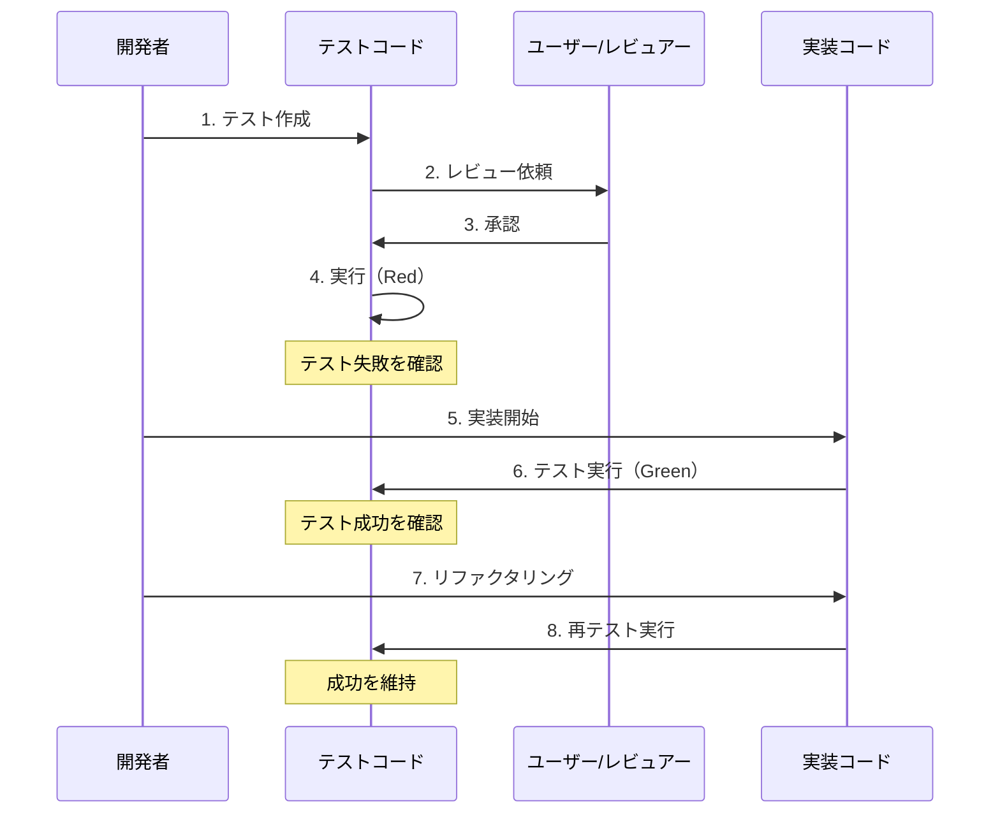

### II. セキュリティファーストの原則

**原則**: セキュリティ要件は機能要件よりも常に優先される。

**規則**:
- 機密データ（パスワード、個人情報、トークンなど）の平文保存を禁止する
- 暗号化が必要なデータは適切なアルゴリズムで暗号化する
- パスワードは必ずハッシュ化して保存する（bcrypt、Argon2などの推奨アルゴリズムを使用）
- 外部入力は必ずバリデーションとサニタイゼーションを行う
- XSS、CSRF、SQLインジェクションなどの一般的な脆弱性対策を実装する
- セキュリティレビューを機能追加時の必須工程とする

**理由**: セキュリティは後から追加できない基盤要件である。特にWebアプリケーションでは、初期段階からセキュアな設計を組み込むことで、後の重大な脆弱性や手戻りを防ぐ。学習段階から正しいセキュリティ意識を身につけることは、プロフェッショナルな開発者として必須である。

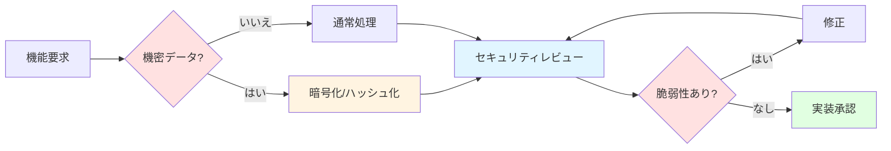

### III. パフォーマンス定量化の原則

**原則**: パフォーマンス要件を定量的な閾値として定義し、受入基準に組み込む。

**規則**:
- 主要な操作（ページ読み込み、タスク追加、フィルタリングなど）の応答時間を計測可能にする
- 受け入れ基準に具体的な数値目標を設定する（例: 初期ロード < 2秒、操作応答 < 100ms）
- パフォーマンステストを自動化し、リグレッションを検知する
- メモリ使用量、レンダリング時間、バンドルサイズなどの指標を継続的に監視する
- パフォーマンス劣化はバグとして扱い、優先的に修正する
- パフォーマンス最適化の前後で定量的な効果を測定する

**理由**: 「速い」「遅い」という主観的な評価ではなく、定量的な基準を設けることで、客観的な品質管理が可能になる。ユーザー体験の質はパフォーマンスに直結するため、初期段階から計測可能な形で管理することが重要である。

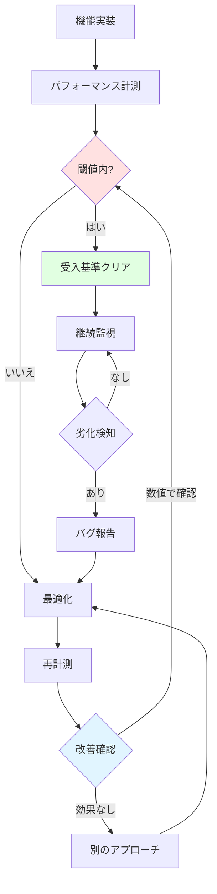

## 制約事項

### データセキュリティ制約

- **CS-001**: 機密データの平文保存を完全に禁止する（暗号化またはハッシュ化が必須）
- **CS-002**: localStorageに保存するデータは暗号化を検討する（機密性に応じて）
- **CS-003**: ユーザー入力は必ずバリデーションを通過しなければならない
- **CS-004**: エラーメッセージに機密情報（スタックトレース、内部パスなど）を含めない

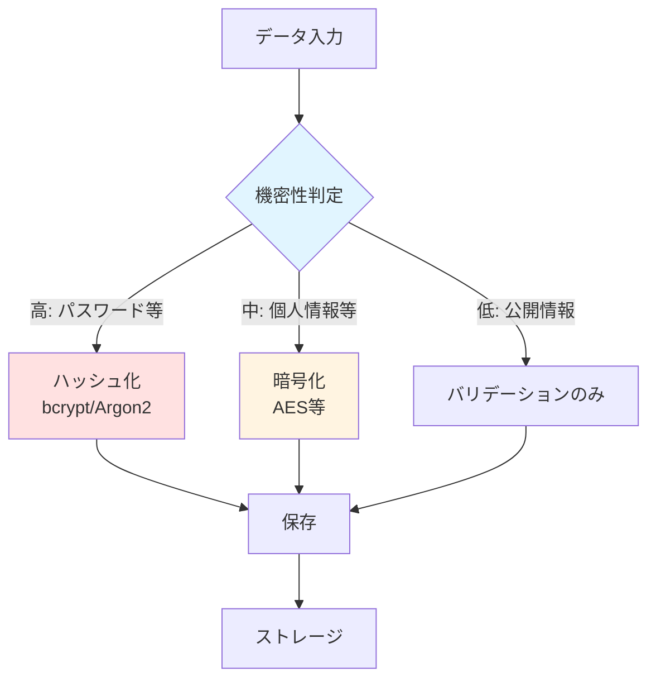

### 依存性管理制約

- **CS-005**: 外部依存関係はバージョン固定により再現性を確保する（package.jsonでexact version指定）
- **CS-006**: 新規依存関係の追加は必要性と代替案を検討した上で承認を得る
- **CS-007**: 脆弱性が報告された依存関係は速やかに更新する
- **CS-008**: 使用していない依存関係は定期的に削除する

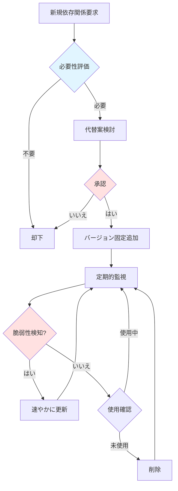

### コード品質制約

- **CS-009**: 仕様と実装の乖離をコードレビューで検知・是正する
- **CS-010**: TypeScript strictモードを有効にし、型安全性を確保する
- **CS-011**: ESLintルール違反はビルドエラーとして扱う
- **CS-012**: デッドコード（使用されていない関数、変数）は削除する

## ガバナンス規則

### 開発プロセス

**必須作業順序**:
1. **憲法**: プロジェクト憲法の確認・更新
2. **仕様**: 機能仕様書の作成（spec.md）
3. **計画**: 実装計画の策定（plan.md）
4. **タスク**: タスク分解（tasks.md）
5. **検証**: テストコードの作成とレビュー
6. **実装**: 機能の実装
7. **レビュー**: コードレビューと承認

この順序は厳守され、逆行してはならない。各フェーズの成果物が承認されてから次に進む。

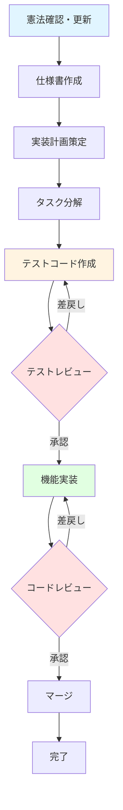

### ブランチ戦略

**ブランチフロー図**:

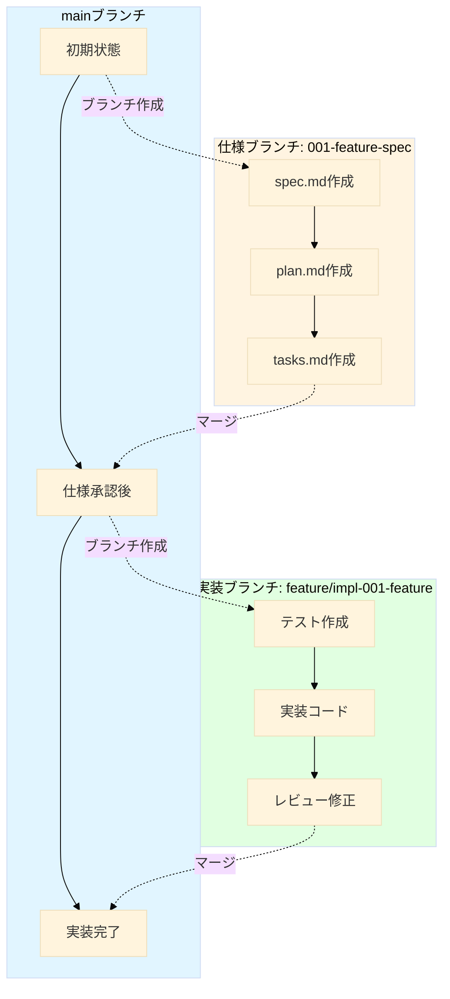

**代替案（シンプル版）**:


#### 仕様ブランチ
```bash
# mainブランチから派生
git checkout main
git checkout -b <番号>-<短い名前>

# 例: 001-task-deletion-spec
```

**目的**: 仕様ドキュメント（spec.md, plan.md, tasks.md）の作成とレビュー

**マージ条件**: 仕様レビュー承認後にmainへマージ

#### 実装ブランチ
```bash
# 対応する仕様ブランチから派生
git checkout <番号>-<topic>
git checkout -b feature/impl-<番号>-<短い名前>

# 例: feature/impl-001-task-deletion
```

**目的**: 実装コードとテストコードの開発

**マージ条件**: 
- すべてのテストが通過
- コードレビュー承認
- 仕様との整合性確認

### レビュー要件

- **重大変更の定義**: API変更、データモデル変更、セキュリティ関連、パフォーマンス影響大
- **重大変更の承認**: 最低1名のレビュアー承認が必須
- **通常変更**: セルフレビュー可、ただしテスト通過は必須
- **レビュー観点**:
  - 憲法の原則遵守
  - 仕様との整合性
  - テストカバレッジ
  - セキュリティ考慮
  - パフォーマンス影響

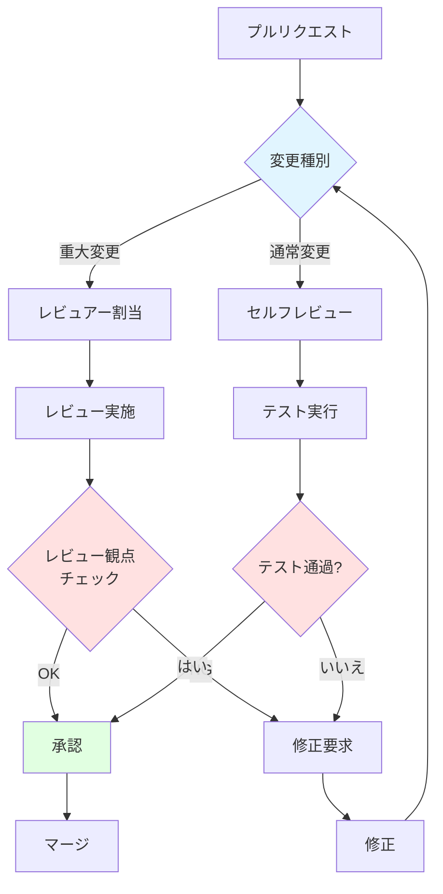

### 憲法の改定

- **改定プロセス**: 改定提案 → レビュー → 承認 → マイグレーション計画 → 実施
- **バージョニング**: セマンティックバージョニング（MAJOR.MINOR.PATCH）を使用
  - **MAJOR**: 後方互換性のない原則削除・再定義
  - **MINOR**: 新原則追加または実質的な拡張
  - **PATCH**: 明確化、文言修正、非意味的な改善
- **影響範囲の評価**: テンプレートファイル、既存仕様、実装コードへの影響を文書化
- **移行計画**: 既存コードを新原則に適合させる具体的な手順を策定

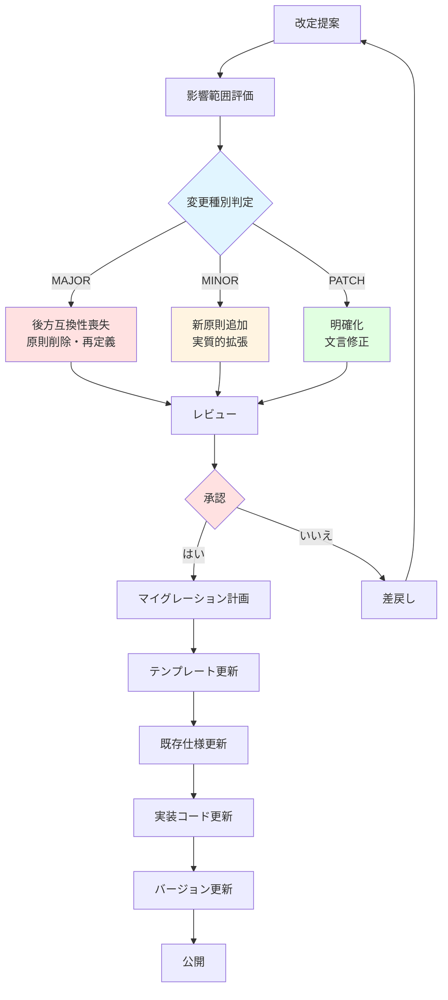

### コンプライアンス検証

- **すべてのPR**: 憲法遵守を確認
- **複雑性の正当化**: 憲法違反が必要な場合、その理由と代替案を文書化
- **定期レビュー**: 月次で憲法と実態の乖離をチェック

## 開発方針

### フルスタック同時起動

- フロントエンドとバックエンドを同時に起動するスクリプトを提供する
- `start.ps1` によるワンコマンド起動を実現
- 開発サーバーの自動起動、ヘルスチェック、ブラウザオープンを自動化

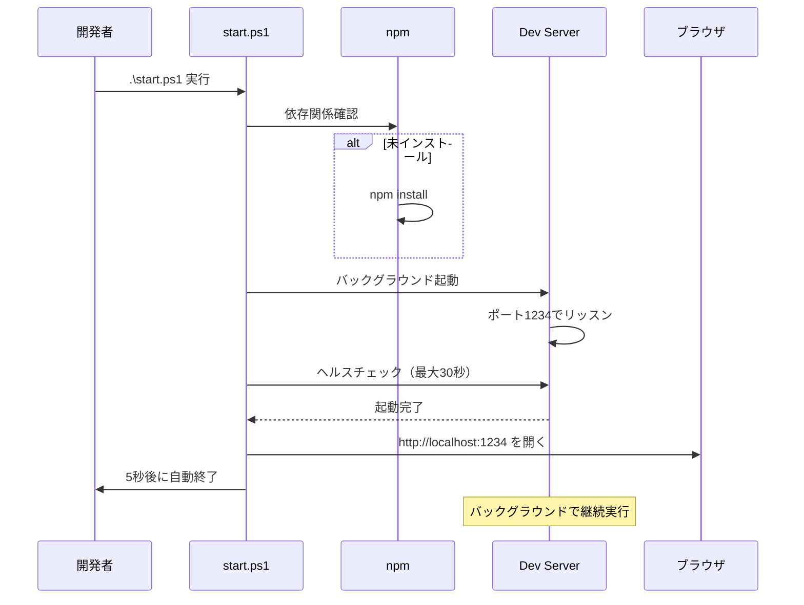

### 品質保証

- **動作確認の徹底**: 正常に動作するまで検証を繰り返す
- **エラー修正の完了**: エラーが解消されるまで次の作業に進まない
- **継続的な改善**: トークン制限まで生成ドキュメントを繰り返しブラッシュアップする
- **簡略化の禁止**: トークン制限を理由に品質を低下させない

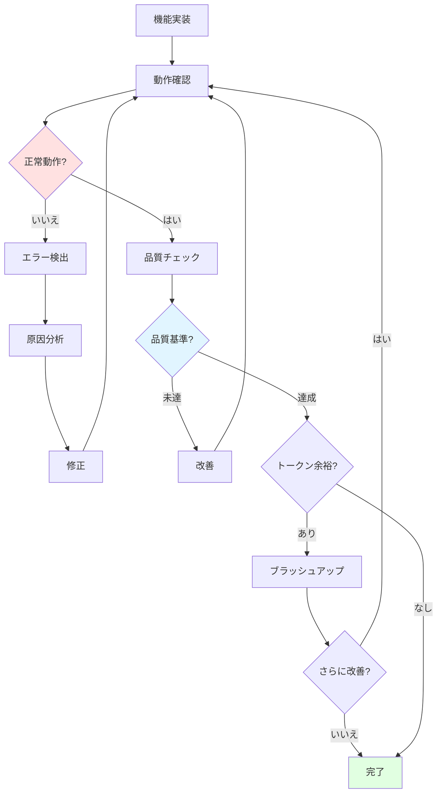

### ドキュメンテーション

- **Mermaid図の活用**: フローチャート、シーケンス図などを適切に挿入
- **視覚的な説明**: 複雑なロジックは図解で補完
- **コメントの充実**: コードの意図を明確に記述
- **仕様書の保守**: 実装変更時は必ず仕様書も更新

### ファイルエンコーディング

- **UTF-8必須**: すべてのファイルはUTF-8エンコーディングで保存
- **文字化け防止**: 日本語ドキュメントは特に注意してエンコーディングを確認

---

**バージョン**: 1.0.0 | **制定日**: 2025-11-13 | **最終改定日**: 2025-11-13
