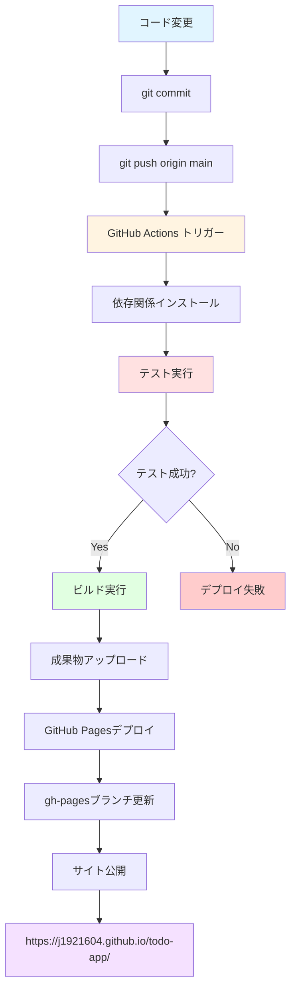

# GitHub Pages デプロイ手順

**プロジェクト**: Todo App  
**リポジトリ**: https://github.com/J1921604/todo-app  
**デプロイURL**: https://j1921604.github.io/todo-app/  
**最終更新**: 2025年11月13日

---

## 📋 目次

1. [自動デプロイ（推奨）](#自動デプロイ推奨)
2. [手動デプロイ](#手動デプロイ)
3. [GitHub Pages設定](#github-pages設定)
4. [トラブルシューティング](#トラブルシューティング)
5. [デプロイ確認](#デプロイ確認)

---

## 自動デプロイ（推奨）

GitHub Actionsを使用した自動デプロイです。**mainブランチにプッシュするだけ**でデプロイされます。

### 前提条件

- ✅ `.github/workflows/deploy.yml` が存在する
- ✅ `gh-pages` ブランチが存在する
- ✅ GitHub Pagesの設定が完了している

### デプロイ手順

```powershell
# 1. 変更をコミット
git add .
git commit -m "feat: 新機能を追加"

# 2. mainブランチにプッシュ
git push origin main

# 3. GitHub Actionsが自動実行される（約2-3分）
# https://github.com/J1921604/todo-app/actions で進捗確認

# 4. デプロイ完了後、URLにアクセス
# https://j1921604.github.io/todo-app/
```

### GitHub Actionsワークフローの動作

```yaml
トリガー: mainブランチへのプッシュ
↓
1. Checkout（コード取得）
↓
2. Node.js 18セットアップ
↓
3. npm ci（依存関係インストール）
↓
4. npm test（テスト実行）
↓
5. npm run build（ビルド実行）
↓
6. Upload artifact（成果物アップロード）
↓
7. Deploy to GitHub Pages（GitHub Actions経由でデプロイ）
```

### デプロイ状況の確認

1. GitHubリポジトリにアクセス: https://github.com/J1921604/todo-app
2. **Actions** タブをクリック
3. 最新のワークフロー実行を確認
4. ✅ 緑色のチェックマーク = デプロイ成功
5. ❌ 赤色のXマーク = デプロイ失敗（ログを確認）

---

## 手動デプロイ

自動デプロイが利用できない場合の手動デプロイ手順です。

### 方法1: GitHub CLIを使用（簡単）

```powershell
# 1. ビルド実行
npm run build

# 2. distフォルダをgh-pagesブランチにデプロイ
npx gh-pages -d dist -b gh-pages

# 3. 完了（約1分で反映）
```

### 方法2: 手動でgh-pagesブランチを更新（詳細）

```powershell
# 1. ビルド実行
npm run build

# 2. 現在のブランチを保存
git stash

# 3. gh-pagesブランチに切り替え
git checkout gh-pages

# 4. distフォルダの内容をコピー
Copy-Item -Path dist\* -Destination . -Recurse -Force

# 5. コミット
git add .
git commit -m "deploy: 手動デプロイ $(Get-Date -Format 'yyyy-MM-dd HH:mm:ss')"

# 6. プッシュ
git push origin gh-pages

# 7. mainブランチに戻る
git checkout main
git stash pop
```

---

## GitHub Pages設定

初回デプロイ時、または設定を変更する場合の手順です。

### 設定手順

1. **GitHubリポジトリにアクセス**  
   https://github.com/J1921604/todo-app

2. **Settings タブをクリック**

3. **左サイドバーから Pages を選択**

4. **Source（ソース）を設定**
   - **Source**: Deploy from a branch
   - **Branch**: `gh-pages`
   - **Folder**: `/ (root)`
   - **Save** をクリック

5. **設定完了確認**
   - 数分後、ページ上部に以下のメッセージが表示されます：
   - ✅ "Your site is live at https://j1921604.github.io/todo-app/"

### カスタムドメイン設定（オプション）

独自ドメインを使用する場合：

1. **Custom domain** 欄に独自ドメインを入力
2. **Save** をクリック
3. DNSレコードを設定（A/CNAMEレコード）
4. **Enforce HTTPS** にチェック

---

## トラブルシューティング

### 問題1: GitHub Actionsが失敗する

**症状**: Actionsタブで赤いXマークが表示される

**原因と解決策**:

```powershell
# テストが失敗している場合
npm test -- --run

# ビルドが失敗している場合
npm run build

# エラーメッセージを確認して修正
```

### 問題2: デプロイ後404エラー

**症状**: https://j1921604.github.io/todo-app/ にアクセスすると404エラー

**原因**: GitHub Pages設定が正しくない、またはビルドファイルがない

**解決策**:
1. Settings > Pages で `gh-pages` ブランチが選択されているか確認
2. `gh-pages` ブランチに `index.html` が存在するか確認
3. 数分待ってから再アクセス（反映に時間がかかる場合あり）

### 問題3: ページは表示されるがルーティングが動作しない

**症状**: ホームページは表示されるが、直接URL入力すると404エラー

**原因**: SPAのクライアントサイドルーティング対応が必要

**解決策**:

`vite.config.ts` で `base` パスが正しく設定されているか確認：

```typescript
export default defineConfig({
  base: process.env.NODE_ENV === 'production' ? '/todo-app/' : '/',
  // ...
})
```

### 問題4: CSSやJSが読み込まれない

**症状**: ページは表示されるがスタイルが適用されない

**原因**: `base` パスの設定ミス

**解決策**:
1. `vite.config.ts` の `base` を確認
2. ビルドを再実行: `npm run build`
3. 再デプロイ: `git push origin main`

### 問題5: 権限エラー（Permission denied）

**症状**: GitHub Actionsで `permission denied` エラー

**解決策**:
1. Settings > Actions > General
2. **Workflow permissions** を **Read and write permissions** に変更
3. **Save** をクリック

---

## デプロイ確認

デプロイが正常に完了したか確認する手順です。

### 確認チェックリスト

- [ ] GitHub Actionsのワークフローが成功（✅緑色）
- [ ] https://j1921604.github.io/todo-app/ にアクセス可能
- [ ] ホームページが正しく表示される
- [ ] サイドバーのナビゲーションが動作する
- [ ] Todoページでタスクの追加・削除・完了切り替えが動作する
- [ ] ページリロード後もデータが保持される（LocalStorage）
- [ ] レスポンシブデザインが正しく表示される（モバイル対応）

### 動作確認コマンド

```powershell
# ローカルでプロダクションビルドをプレビュー
npm run build
npm run preview

# ブラウザで http://localhost:4173 にアクセス
# 本番環境と同じ動作を確認できます
```

### パフォーマンス確認

Chrome DevToolsでパフォーマンスを測定：

1. `F12` でDevToolsを開く
2. **Lighthouse** タブを選択
3. **Generate report** をクリック
4. 目標値：
   - Performance: > 90
   - Accessibility: > 90
   - Best Practices: > 90
   - SEO: > 80

---

## デプロイフロー全体図



---

## よくある質問（FAQ）

### Q1: デプロイにどれくらい時間がかかりますか？

**A**: GitHub Actionsのワークフロー実行は約2-3分、GitHub Pagesへの反映は追加で1-2分かかります。合計で3-5分程度です。

### Q2: mainブランチ以外からデプロイできますか？

**A**: はい。`.github/workflows/deploy.yml` で `branches` に追加すればデプロイ可能です：

```yaml
on:
  push:
    branches:
      - main
      - deploy  # 追加
      - develop # 追加
```

### Q3: デプロイを一時的に無効化できますか？

**A**: はい。以下の方法があります：

1. **ワークフローを無効化**: Settings > Actions > Workflows > deploy.yml > Disable workflow
2. **ブランチ保護**: Settings > Branches > Add rule で main を保護
3. **ファイル削除**: `.github/workflows/deploy.yml` を一時的に削除

### Q4: 複数の環境（staging、production）にデプロイできますか？

**A**: はい。ブランチごとに異なるワークフローを作成することで可能です：

- `main` → 本番環境（https://j1921604.github.io/todo-app/）
- `staging` → ステージング環境（別のGitHub Pagesまたは他のホスティング）

### Q5: デプロイ履歴を確認できますか？

**A**: はい。以下の方法で確認できます：

1. **GitHub Actions**: Actions タブで全デプロイ履歴を確認
2. **gh-pagesブランチ**: コミット履歴でデプロイ日時を確認
3. **GitHub Pages**: Settings > Pages でデプロイ状況を確認

---

## まとめ

### 推奨デプロイフロー

**日常の開発**:
1. 機能を実装
2. テストを書く
3. `git commit` & `git push origin main`
4. 自動デプロイを待つ（3-5分）
5. https://j1921604.github.io/todo-app/ で動作確認

**緊急時（自動デプロイ失敗）**:
1. `npm run build`
2. `npx gh-pages -d dist`
3. 手動デプロイ完了

### サポート

問題が発生した場合：

1. **GitHub Actions ログ**: https://github.com/J1921604/todo-app/actions
2. **Issues**: https://github.com/J1921604/todo-app/issues
3. **ローカルで再現**: `npm run build && npm run preview`

---

**作成日**: 2025年11月13日  
**バージョン**: 1.0.0  
**ステータス**: ✅ Production Ready
