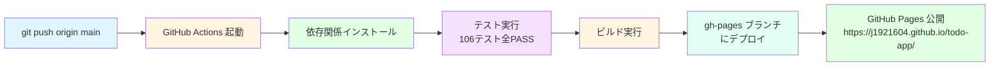

# GitHub Pages デプロイ手順書

**プロジェクト**: Todo App  
**リポジトリ**: https://github.com/J1921604/todo-app  
**デプロイURL**: https://j1921604.github.io/todo-app/  
**最終更新**: 2025年11月13日

---

## 📋 目次

1. [自動デプロイ](#自動デプロイ)
2. [手動デプロイ](#手動デプロイ)
3. [トラブルシューティング](#トラブルシューティング)
4. [GitHub Pages設定確認](#github-pages設定確認)

---

## 自動デプロイ

### 概要

GitHub Actions ワークフロー（`.github/workflows/deploy.yml`）により、`main` ブランチへの `push` または `workflow_dispatch` トリガーで自動デプロイが実行されます。

### 実行フロー



### 自動デプロイの実行

1. **ローカルで修正・テスト**
```bash
npm run test -- --run  # テスト実行
npm run build          # ビルド実行
npm run preview        # プレビュー確認
```

2. **コミットして push**
```bash
git add -A
git commit -m "feat: [説明]"
git push origin main
```

3. **GitHub Actions の実行を確認**
   - https://github.com/J1921604/todo-app/actions にアクセス
   - 最新ワークフロー実行を確認
   - ステータスが `✓ passed` になるまで待機（通常2-3分）

4. **デプロイ完了の確認**
   - https://j1921604.github.io/todo-app/ にアクセス
   - アプリケーションが正常に表示されることを確認

### ワークフロー詳細

```yaml
name: Deploy to GitHub Pages

on:
  push:
    branches:
      - main
  workflow_dispatch:

permissions:
  contents: write

jobs:
  deploy:
    runs-on: ubuntu-latest

    steps:
      - name: Checkout
        uses: actions/checkout@v4

      - name: Setup Node.js
        uses: actions/setup-node@v4
        with:
          node-version: '18'
          cache: 'npm'

      - name: Install dependencies
        run: npm ci

      - name: Run tests
        run: npm test -- --run

      - name: Build
        run: npm run build

      - name: Deploy to GitHub Pages
        uses: peaceiris/actions-gh-pages@v3
        with:
          github_token: ${{ secrets.GITHUB_TOKEN }}
          publish_dir: ./dist
          publish_branch: gh-pages
```

---

## 手動デプロイ

### 前提条件

- Node.js 18以上がインストールされている
- `gh-pages` パッケージがインストールされている（`npm install` で自動）
- GitHub リポジトリへの `push` 権限がある
- `.git/config` に正しいリモートURLが設定されている

### 手動デプロイ手順

#### 方法1：npm deploy スクリプト使用（推奨）

```bash
npm run deploy
```

このコマンドは以下の処理を自動実行します：
1. `npm run build` - プロダクションビルド実行
2. `npx gh-pages -d dist` - `dist/` ディレクトリを `gh-pages` ブランチにデプロイ

#### 方法2：手動で実行

```bash
# ステップ1: ビルド
npm run build

# ステップ2: gh-pages へデプロイ
npx gh-pages -d dist

# または、詳細ログ付き
npx gh-pages -d dist -v
```

#### 方法3：git で手動デプロイ

```bash
# ステップ1: gh-pages ブランチが存在しない場合は作成
git symbolic-ref refs/remotes/origin/HEAD refs/remotes/origin/main

# ステップ2: dist ディレクトリをビルド
npm run build

# ステップ3: dist ディレクトリの内容を gh-pages ブランチにコミット
cd dist
git init
git add -A
git commit -m "Deploy to GitHub Pages"
git branch -M gh-pages
git remote add origin https://github.com/J1921604/todo-app.git
git push -u origin gh-pages
cd ..
```

---

## トラブルシューティング

### 問題1: デプロイ後、ページが真っ白で表示されない

**原因**：React Router の `basename` 設定がGitHub Pagesのパスと一致していない

**解決方法**：
```typescript
// src/main.tsx で確認
const basename = import.meta.env.MODE === 'production' ? '/todo-app/' : '/'
//                                                          ↑ リポジトリ名と一致している必要があります
```

**確認手順**：
1. リポジトリ名が `todo-app` であることを確認
2. vite.config.ts の base が `/todo-app/` に設定されていることを確認
3. 修正後、再度デプロイ

### 問題2: GitHub Actions でテストが失敗する

**原因**：ローカルではパスしているが、CI環境で異なる環境変数やタイミングの問題

**解決方法**：
```bash
# ローカルで、本番モードでビルドしてテスト
NODE_ENV=production npm run test -- --run
npm run build
npm run preview
```

### 問題3: `npm run deploy` でエラー：`gh-pages`コマンドが見つからない

**原因**：`gh-pages` パッケージがグローバルにインストールされていない

**解決方法**：
```bash
# 依存関係を再インストール
npm install

# または、グローバルに gh-pages をインストール
npm install -g gh-pages

# その後、デプロイ
npm run deploy
```

### 問題4: GitHub Actions が失敗：`github_token` エラー

**原因**：GitHub Actions の権限設定が不足している

**解決方法**：
1. GitHub リポジトリ → Settings → Actions → General
2. **Workflow permissions** を確認
3. 以下に設定：
   - **Read and write permissions**: ON
   - **Allow GitHub Actions to create and approve pull requests**: ON（オプション）
4. `.github/workflows/deploy.yml` に以下が含まれていることを確認：
   ```yaml
   permissions:
     contents: write
   ```

### 問題5: `git push` で 403 Forbidden エラー

**原因**：Git リモートURLが HTTPS なのにクレデンシャルが設定されていない、または SSH キーが登録されていない

**解決方法**：

**HTTPS の場合**：
```bash
# クレデンシャルヘルパーで PAT を保存
git config --global credential.helper store

# または、GitHub の Personal Access Token（PAT）を使用
git remote set-url origin https://<PAT>@github.com/J1921604/todo-app.git
git push origin main
```

**SSH の場合**：
```bash
# SSH キーペアを生成（未生成の場合）
ssh-keygen -t ed25519 -C "your-email@example.com"

# SSH キーを GitHub に登録
# https://github.com/settings/keys で「New SSH key」から登録

# リモートを SSH に変更
git remote set-url origin git@github.com:J1921604/todo-app.git
git push origin main
```

---

## GitHub Pages 設定確認

### 1. リポジトリの設定確認

1. GitHub リポジトリ → **Settings** → **Pages**
2. 以下を確認：

| 項目 | 期待値 |
|------|--------|
| **Source** | Deploy from a branch |
| **Branch** | gh-pages / (root) |
| **Custom domain** | （設定不要） |

### 2. 公開URL の確認

- 期待URL：`https://j1921604.github.io/todo-app/`
- 実際のURL：https://j1921604.github.io/todo-app/

### 3. デプロイ履歴の確認

1. GitHub リポジトリ → **deployments**
2. 最新デプロイのステータスと履歴を確認

### 4. `gh-pages` ブランチの確認

1. GitHub リポジトリ → **Branches**
2. `gh-pages` ブランチが存在し、最新コミットが最近のものであることを確認

---

## 確認チェックリスト

デプロイ前に以下を確認してください：

- [ ] `npm run test -- --run` が全テストPASSする
- [ ] `npm run build` がエラーなく完了する
- [ ] `npm run preview` で http://localhost:4174/todo-app/ が正常に表示される
- [ ] vite.config.ts の `base` が `/todo-app/` に設定されている
- [ ] src/main.tsx の `basename` が `/todo-app/` に設定されている
- [ ] `.github/workflows/deploy.yml` が存在する
- [ ] `gh-pages` ブランチが git に存在する
- [ ] GitHub リポジトリの Settings > Pages が正しく設定されている

---

## デプロイ後の検証

### 1. ページのアクセス確認

```bash
curl -I https://j1921604.github.io/todo-app/
# 期待される応答：HTTP/2 200
```

### 2. ブラウザでの動作確認

1. https://j1921604.github.io/todo-app/ にアクセス
2. ホームページが表示されることを確認
3. サイドバーが表示されることを確認
4. テストユーザーページにアクセス可能であることを確認
5. タスク追加・完了・削除が正常に動作することを確認

### 3. LocalStorage の動作確認

1. Developer Tools（F12）を開く
2. タスクを追加
3. ページをリロード
4. タスクが復元されることを確認

### 4. パフォーマンス確認

```bash
# Lighthouse でパフォーマンス計測
# Chrome DevTools > Lighthouse
# URL: https://j1921604.github.io/todo-app/
```

---

## まとめ

### 日常的なデプロイフロー

```bash
# 1. 開発・修正
npm run dev

# 2. テスト実行
npm run test -- --run

# 3. ローカルプレビュー
npm run preview

# 4. コミット
git add -A
git commit -m "feat: [説明]"

# 5. 自動デプロイ（GitHub Actions）
git push origin main

# 6. GitHub Pages で確認
# https://j1921604.github.io/todo-app/
```

### 手動デプロイが必要な場合

```bash
npm run deploy
# または
npm run build && npx gh-pages -d dist
```

---

## 参考リンク

- [GitHub Pages 公式ドキュメント](https://docs.github.com/en/pages)
- [GitHub Actions 公式ドキュメント](https://docs.github.com/en/actions)
- [gh-pages npm パッケージ](https://www.npmjs.com/package/gh-pages)
- [Vite 公式ドキュメント - GitHub Pages](https://vitejs.dev/guide/static-deploy.html#github-pages)
- [React Router バージョン 6 - basename](https://reactrouter.com/en/main/start/overview)

