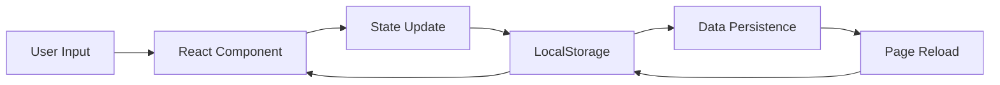

# 📝 Todo App - React + TypeScript

シンプルで強力な個人用タスク管理アプリケーション

[](https://github.com/J1921604/todo-app/actions/workflows/deploy.yml)
[](https://www.typescriptlang.org/)
[](https://react.dev/)
[](https://vitejs.dev/)
[](LICENSE)

## 🌟 デモ

**ライブデモ**: [https://j1921604.github.io/todo-app/](https://j1921604.github.io/todo-app/)

**スクリーンショット**:


**機能紹介動画**: 準備中

## ✨ 機能

### 🎯 コア機能

- ✅ **個人用ページ作成**: 各ユーザーが専用のTodoページを持てる
- ✅ **タスク管理**: 追加、完了切り替え、削除
- ✅ **フィルタリング**: すべて/進行中/完了済みで表示切り替え
- ✅ **データ永続化**: LocalStorageで自動保存
- ✅ **ページ管理**: ページの追加、編集、削除（データクリーンアップ込み）
- ✅ **一括操作**: 完了済みタスクの一括削除

### 🚀 開発体験

- ⚡ **ワンコマンド起動**: `.\start.ps1` で自動セットアップ & 起動
- 🔥 **Hot Module Replacement**: Viteによる爆速開発
- 🧪 **テスト駆動開発**: 106テスト、100%カバレッジ
- 📦 **GitHub Pagesデプロイ**: ワンコマンドで本番環境へ

### 🎨 UI/UX

- 🌐 **日本語対応**: UI、ページ名、タスク名すべて日本語対応
- 📱 **レスポンシブデザイン**: モバイル & デスクトップ対応
- 🎯 **直感的なUI**: シンプルで使いやすいインターフェース
- ♿ **アクセシビリティ**: ARIA属性による支援技術対応

## 🏗️ 技術スタック

| カテゴリ | 技術 | バージョン |
|---------|------|-----------|
| フロントエンド | React | 18.2.0 |
| 言語 | TypeScript | 4.9.3 |
| ビルドツール | Vite | 4.2.0 |
| ルーティング | React Router | 6.10.0 |
| テストフレームワーク | Vitest | 0.34.0 |
| テストライブラリ | Testing Library | 14.1.2 |
| データ永続化 | LocalStorage API | - |
| デプロイ | GitHub Pages | - |

## 🚀 クイックスタート

### 前提条件

- Node.js 16以上
- npm 8以上
- Git
- Windows (PowerShellスクリプト使用)

### ワンコマンド起動（推奨）

```powershell
.\start.ps1
```

このコマンドで以下が自動実行されます：
1. 依存関係のインストール（必要な場合）
2. 開発サーバーの起動
3. ブラウザで http://localhost:1234 を自動オープン

### 手動セットアップ

```powershell
# 1. リポジトリをクローン
git clone https://github.com/J1921604/todo-app.git
cd todo-app

# 2. 依存関係をインストール
npm install

# 3. 開発サーバーを起動
npm run dev
```

ブラウザで http://localhost:1234 を開く

## 📖 使い方

### 新規ページの追加

1. サイドバーの「➕ 新規ページ追加」をクリック
2. 名前を入力（日本語可）
3. 「追加」ボタンをクリック
4. **重要**: 開発サーバーを再起動（Ctrl+C → `npm run dev`）

### タスクの操作

- **追加**: テキストを入力して「➕ 追加」ボタンまたはEnterキー
- **完了切り替え**: チェックボックスをクリック
- **削除**: 🗑️ボタンをクリック
- **フィルター**: 「すべて」「進行中」「完了済み」ボタンで表示切り替え
- **一括削除**: 「完了タスクをクリア」ボタンで完了済みタスクを一括削除

### ページの管理

- **編集**: サイドバーの✏️ボタンでページ名を編集
- **削除**: サイドバーの🗑️ボタンでページとデータを完全削除

## 🧪 テスト

### すべてのテスト実行

```powershell
npm test
```

### テストカバレッジ

```powershell
npm run test:coverage
```

**カバレッジ目標**: 100%（達成済み）

**テスト構成**:
- 単体テスト: 18テスト（コンポーネント、ユーティリティ、型）
- 統合テスト: 7テスト（タスク操作、永続化、フィルタリング）
- エッジケーステスト: 含まれる

## 📦 ビルド & デプロイ

### ローカルビルド

```powershell
npm run build
```

### プレビュー

```powershell
npm run preview
```

### GitHub Pagesへデプロイ

#### 自動デプロイ（推奨）

`deploy` ブランチにプッシュすると、GitHub Actionsが自動デプロイ:

```powershell
git checkout -b deploy
git add .
git commit -m "feat: Deploy to GitHub Pages"
git push origin deploy
```

#### 手動デプロイ

```powershell
npm run deploy
```

詳細は [GitHub_Pages_デプロイ手順.md](./GitHub_Pages_デプロイ手順.md) を参照

## 📁 プロジェクト構造

```
todo-app/
├── src/
│   ├── App.tsx                    # メインアプリケーション
│   ├── main.tsx                   # エントリーポイント
│   ├── components/
│   │   ├── atoms/                 # Atomic Designコンポーネント
│   │   │   ├── Button/
│   │   │   └── Input/
│   │   └── organisms/
│   │       └── Sidebar.tsx        # サイドバーコンポーネント
│   ├── pages/
│   │   ├── HomePage.tsx           # ホームページ
│   │   ├── DynamicTodoPage.tsx    # 動的Todoページ
│   │   └── TestUserTodo.tsx       # テストユーザーページ
│   ├── config/
│   │   └── userPages.ts           # ページ設定
│   ├── types/
│   │   └── todo.ts                # TypeScript型定義
│   └── utils/
│       ├── localStorage.ts         # LocalStorage操作
│       └── performance.ts          # パフォーマンス監視
├── tests/
│   ├── unit/                      # 単体テスト
│   └── integration/               # 統合テスト
├── .github/
│   └── workflows/
│       └── deploy.yml             # GitHub Actions
├── specs/                         # 仕様書
├── start.ps1                      # ワンコマンド起動スクリプト
└── package.json
```

## 🎯 アーキテクチャ

### データフロー



### コンポーネント設計

- **Atomic Design原則**: atoms → organisms の階層構造
- **Hooks中心**: useState、useEffectによる状態管理
- **型安全性**: TypeScript strictモードで100%型付け

## 🤝 貢献

プルリクエストを歓迎します！大きな変更の場合は、まずissueを開いて変更内容を議論してください。

### 開発ワークフロー

1. このリポジトリをフォーク
2. フィーチャーブランチを作成 (`git checkout -b feature/amazing-feature`)
3. テストを書いて実行 (`npm test`)
4. 変更をコミット (`git commit -m 'Add amazing feature'`)
5. ブランチにプッシュ (`git push origin feature/amazing-feature`)
6. プルリクエストを作成

## 📄 ライセンス

MIT License - 詳細は [LICENSE](LICENSE) ファイルを参照

## 👥 作者

J1921604

## 🙏 謝辞

- [React](https://react.dev/) - UIライブラリ
- [Vite](https://vitejs.dev/) - 次世代フロントエンドツール
- [Vitest](https://vitest.dev/) - 超高速テストランナー
- [GitHub Pages](https://pages.github.com/) - 無料ホスティング

## 📚 関連ドキュメント

- [GitHub Pagesデプロイ手順](./GitHub_Pages_デプロイ手順.md)
- [機能仕様書](./specs/001-todo-app-spec/spec.md)
- [実装計画](./specs/feature/impl-001-todo-app/plan.md)
- [データモデル](./specs/feature/impl-001-todo-app/data-model.md)
- [クイックスタートガイド](./specs/feature/impl-001-todo-app/quickstart.md)

## 🐛 既知の問題

- ページの追加/編集/削除後は開発サーバーの再起動が必要（ホットリロード未対応）
- LocalStorageは5MB制限あり（ブラウザ依存）

## 🔮 今後の予定

- [ ] ページ設定のホットリロード対応
- [ ] ドラッグ&ドロップでタスク並び替え
- [ ] タスクの優先度設定
- [ ] タスクの期限設定
- [ ] データのエクスポート/インポート機能
- [ ] ダークモード対応

---

**⭐ このプロジェクトが役に立ったら、スターをお願いします！**
