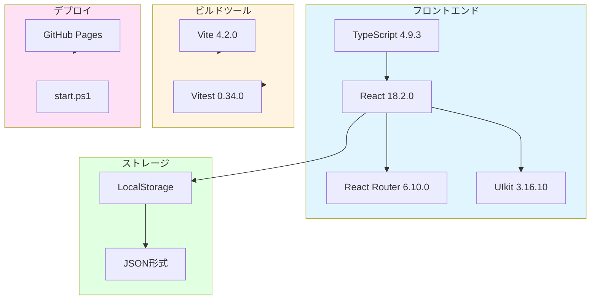
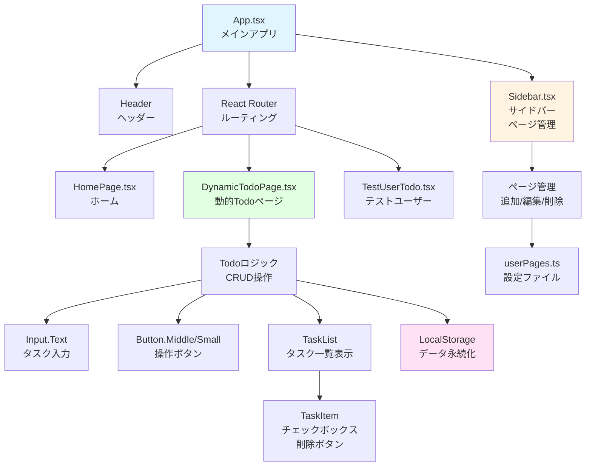
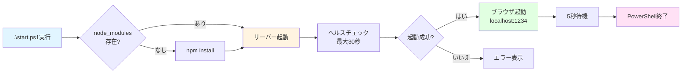

# 機能仕様書: Todo App - template-no-delete.tsx ベースアプリケーション

**機能ブランチ**: `001-todo-app-spec`  
**作成日**: 2025-11-13  
**ステータス**: Draft  
**入力**: AI_inputフォルダ内の全ドキュメントに基づく包括的なTodoアプリケーション仕様

## ユーザーシナリオ & テスト

### ユーザーストーリー1 - 個人用Todoページの作成と基本操作 (優先度: P1) 🎯 MVP

**概要**: 開発者が自分専用のTodoページを作成し、タスクの追加・完了切り替え・フィルタリングができる。

**この優先度の理由**: これが最も基本的な機能であり、すべての開発者がまず習得すべき機能です。他の機能はこの基盤の上に構築されます。

**独立テスト**: UIから新規ページを追加し、タスクを追加・完了切り替えできることで、完全に機能するMVPとして価値を提供します。

**受入シナリオ**:

1. **Given** 開発サーバーが起動している、**When** サイドバーの「➕ 新規ページ追加」ボタンをクリックし名前を入力して追加、**Then** サーバー再起動後、サイドバーに新しいページが表示される

2. **Given** 個人用Todoページが開いている、**When** タスクテキストを入力して「追加」ボタンをクリック、**Then** タスクがリストに追加され、LocalStorageに保存される

3. **Given** タスクが複数存在する、**When** タスクのチェックボックスをクリック、**Then** 完了状態が切り替わり、取り消し線とスタイルが適用される

4. **Given** タスクが未完了と完了済みの両方存在する、**When** フィルターボタン（すべて/進行中/完了済み）をクリック、**Then** 選択したフィルターに応じてタスクが表示される

5. **Given** タスクが追加・変更された状態、**When** ページをリロード、**Then** データがLocalStorageから復元され、すべてのタスクが保持される

---

### ユーザーストーリー2 - タスク削除機能の実装 (優先度: P2)

**概要**: 開発者がタスク削除機能を自分で実装し、配列操作とReact状態管理を学習する。

**この優先度の理由**: MVP機能の次に重要な学習課題であり、React開発者としての基礎スキルを身につけるために必須です。

**独立テスト**: 削除機能を実装し、個別削除と一括削除が正常に動作することで、完全なタスク管理機能を提供します。

**受入シナリオ**:

1. **Given** タスクリストに複数のタスクが存在する、**When** タスクの削除ボタンをクリック、**Then** 該当タスクがリストから削除され、LocalStorageからも削除される

2. **Given** 完了済みタスクと未完了タスクが混在する、**When** 「完了済みをクリア」ボタンをクリック、**Then** 完了済みタスクのみが削除され、未完了タスクは保持される

3. **Given** 完了済みタスクが1つも存在しない、**When** ページを表示、**Then** 「完了済みをクリア」ボタンは表示されない（条件レンダリング）

---

### ユーザーストーリー3 - ページ管理機能（編集・削除） (優先度: P3)

**概要**: ユーザーが作成したTodoページを編集・削除でき、削除時にはタスクデータも完全にクリーンアップされる。

**この優先度の理由**: ページ管理機能は便利だが、基本的なTodo機能が動作すれば価値を提供できるため、優先度は低めです。

**独立テスト**: ページの編集・削除機能が動作し、データクリーンアップが正しく行われることで、完全なページライフサイクル管理を提供します。

**受入シナリオ**:

1. **Given** サイドバーにページが表示されている、**When** ページの✏️ボタンをクリックして新しい名前を入力、**Then** ページ名が更新され、サーバー再起動後も反映される

2. **Given** ページにタスクデータが存在する、**When** ページの🗑️ボタンをクリックして削除、**Then** ページ情報とタスクデータ（LocalStorage）が完全に削除される

3. **Given** ページを削除した後、**When** 同じ名前で新しいページを追加、**Then** 以前のタスクデータは復元されず、クリーンな状態でスタートする

---

### ユーザーストーリー4 - ワンコマンド起動とGitHub Pagesデプロイ (優先度: P1)

**概要**: 開発者が`start.ps1`でワンコマンドで開発環境を起動でき、GitHub Pagesにデプロイできる。

**この優先度の理由**: 開発体験を大幅に向上させ、プロジェクトの再現性とアクセシビリティを確保するため、MVP レベルの重要性があります。

**独立テスト**: ワンコマンドで起動し、デプロイスクリプトで正常にGitHub Pagesに公開できることで、完全な開発フローを提供します。

**受入シナリオ**:

1. **Given** プロジェクトディレクトリで、**When** `.\start.ps1`を実行、**Then** 依存関係インストール、サーバー起動、ブラウザオープンが自動実行され、5秒後にPowerShellが終了する

2. **Given** アプリケーションがビルド済み、**When** `npm run deploy`を実行、**Then** GitHub Pagesにデプロイされ、公開URLでアクセス可能になる

3. **Given** GitHub Pagesでアプリを開く、**When** ページ操作を行う、**Then** ローカル環境と同様にすべての機能が動作する

---

### エッジケース

- **空のタスク追加**: 空文字列またはスペースのみの入力では、タスクが追加されない
- **LocalStorage制限**: データが5MBを超える場合、適切なエラーメッセージを表示（実装オプション）
- **重複ページ名**: 同じ名前のページを追加しようとした場合、エラーメッセージを表示
- **日本語文字対応**: ページ名とタスク名で日本語、絵文字、特殊文字が正しく保存・表示される
- **サーバー再起動**: ページ追加・編集・削除後、必ずサーバー再起動が必要であることをユーザーに通知

## 要件

### 機能要件

- **FR-001**: システムは、開発者がUIから新規Todoページを追加できる機能を提供しなければならない（名前入力、アイコン自動設定）
- **FR-002**: システムは、各Todoページでタスクの追加・完了切り替え・フィルタリング（すべて/進行中/完了済み）ができなければならない
- **FR-003**: システムは、すべてのタスクデータをLocalStorageに自動保存し、ページリロード後も復元しなければならない
- **FR-004**: システムは、タスク削除機能（個別削除と完了済み一括削除）を提供しなければならない
- **FR-005**: システムは、ページの編集（名前変更）と削除機能を提供しなければならない
- **FR-006**: システムは、ページ削除時にタスクデータ（LocalStorage）を完全にクリーンアップしなければならない
- **FR-007**: システムは、`start.ps1`スクリプトでワンコマンド起動（依存関係インストール、サーバー起動、ブラウザオープン、自動終了）を提供しなければならない
- **FR-008**: システムは、GitHub Pagesへのデプロイ機能（`npm run deploy`）を提供しなければならない
- **FR-009**: システムは、日本語文字（ページ名、タスク名）を正しく処理・保存・表示できなければならない
- **FR-010**: システムは、テストカバレッジ100%を維持しなければならない（106テスト）

### 主要エンティティ

#### TodoItem
- **id**: 一意識別子（タイムスタンプ）
- **text**: タスク内容
- **completed**: 完了状態（true/false）
- **createdAt**: 作成日時

#### UserPage
- **name**: ページ名（日本語対応）
- **icon**: アイコン（デフォルト📝）
- **path**: ルーティングパス
- **component**: 対応するReactコンポーネント

#### StorageKey
- **パターン**: `{ページ名}-todos`
- **例**: `浜崎秀寿-todos`, `TestUser-todos`

## 成功基準

### 測定可能な成果

- **SC-001**: 開発者が30分以内に自分専用のTodoページを作成し、タスク追加・完了切り替えができる
- **SC-002**: ページリロード後、100%のタスクデータが復元される（LocalStorage連携）
- **SC-003**: `start.ps1`実行からブラウザオープンまで30秒以内に完了する
- **SC-004**: テストスイート（106テスト）が12秒以内に完了し、すべてパスする
- **SC-005**: GitHub Pagesデプロイが5分以内に完了し、公開URLでアクセス可能になる
- **SC-006**: 日本語ページ名とタスク名が文字化けせず正しく表示される
- **SC-007**: ページ削除時、該当ページのLocalStorageデータが100%削除される（データリーク防止）
- **SC-008**: 初期ページ読み込みが2秒以内に完了する
- **SC-009**: タスク追加・削除操作の応答時間が100ms以内である
- **SC-010**: 10,000個のタスクを持つページでもフィルタリングが1秒以内に完了する（パフォーマンス目標）

## アーキテクチャ概要

### 技術スタック


### コンポーネント構造


### データフロー
```mermaid
sequenceDiagram
    participant User as 開発者
    participant UI as UIコンポーネント
    participant State as React State
    participant LS as LocalStorage
    participant Server as Dev Server
    
    User->>UI: 1. 新規ページ追加<br/>名前入力
    UI->>State: 2. userPages更新
    State->>LS: 3. page-info保存
    UI->>User: 4. サーバー再起動を促す
    User->>Server: 5. サーバー再起動
    Server->>UI: 6. ページ読み込み
    
    User->>UI: 7. タスク追加
    UI->>State: 8. todos配列更新
    State->>LS: 9. {name}-todos保存
    LS-->>State: 10. 自動同期
    
    User->>UI: 11. ページリロード
    LS->>State: 12. データ復元
    State->>UI: 13. タスク表示
    
    User->>UI: 14. ページ削除
    UI->>State: 15. userPages更新
    State->>LS: 16. page-info削除
    State->>LS: 17. {name}-todos削除
    UI->>User: 18. 削除完了通知
    
    style User fill:#e1f5ff
    style LS fill:#e1ffe1
    style State fill:#fff4e1
```

### ワンコマンド起動フロー


## 前提条件

- Node.js 16以上、npm 8以上がインストール済み
- Gitがインストール済み（GitHub Pagesデプロイ用）
- Windows環境（PowerShellスクリプト使用）
- ブラウザのLocalStorageが有効
- GitHub アカウント（デプロイ用）

## 依存関係

- React 18.2.0
- React DOM 18.2.0
- React Router DOM 6.10.0
- TypeScript 4.9.3
- Vite 4.2.0
- Vitest 0.34.0（テスト）
- UIkit 3.16.10（UIコンポーネント）
- gh-pages 6.3.0（デプロイ）
- @testing-library/react 14.1.2（テスト）
- happy-dom 12.10.3（テスト環境）

## 制約事項

- LocalStorageの容量制限（約5MB）
- ページ追加・編集・削除後は必ずサーバー再起動が必要
- 削除されたページのタスクデータは復元不可
- GitHub Pagesの無料プランの制限（100GB/月の帯域幅）
- template-no-delete.tsxは意図的に削除機能を省略（学習目的）

## セキュリティ考慮事項

- LocalStorageのデータは平文保存（機密情報は保存しない）
- XSS対策: Reactのデフォルトエスケープ機能に依存
- CSRF対策: 不要（APIサーバーなし）
- 入力バリデーション: 空文字チェック、trim()処理

## パフォーマンス要件

- 初期ページ読み込み: < 2秒
- タスク追加・削除応答: < 100ms
- フィルタリング処理: < 1秒（10,000タスクまで）
- LocalStorage読み書き: < 50ms
- テスト実行: < 12秒（106テスト）

## 想定される課題と回避策

### 課題1: LocalStorage容量制限
**回避策**: タスク数が1,000を超える場合、古いタスクのアーカイブ機能を実装（オプション）

### 課題2: ページ追加後のサーバー再起動
**回避策**: ホットリロード対応（将来的な改善課題）

### 課題3: 日本語文字化け
**回避策**: UTF-8エンコーディング徹底、start.ps1でエンコーディング設定

### 課題4: テストメンテナンス
**回避策**: Atomic Design原則に従い、テスト可能な小さいコンポーネントを作成

## 関連ドキュメント

- `AI_input/仕様書.md`: 2076行の詳細仕様書
- `AI_input/BASIC_TODO_GUIDE_JP.md`: 初級者向けガイド
- `AI_input/React開発研修.md`: 研修カリキュラム
- `AI_input/GitHubPagesデプロイ手順.md`: デプロイ手順
- `AI_input/template-no-delete.tsx`: ベーステンプレート
- `.specify/memory/constitution.md`: プロジェクト憲法

---

**バージョン**: 1.0.0  
**最終更新**: 2025-11-13  
**ステータス**: Draft（レビュー待ち）
