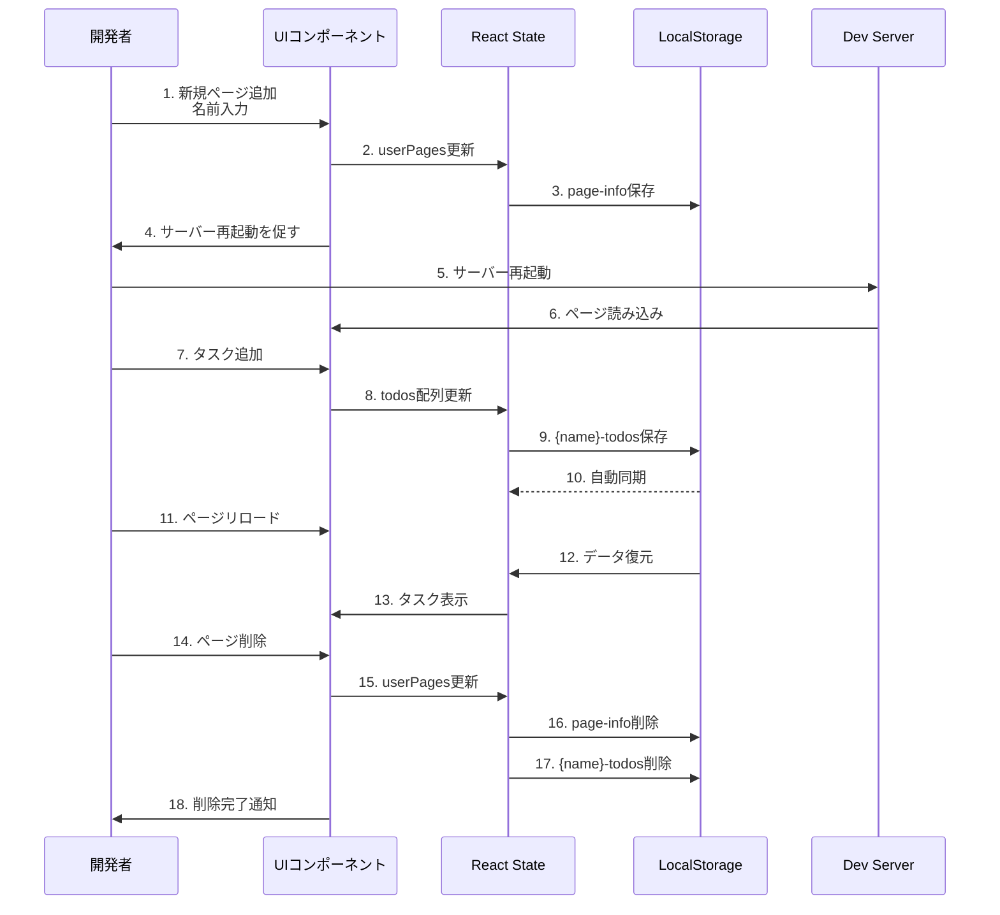
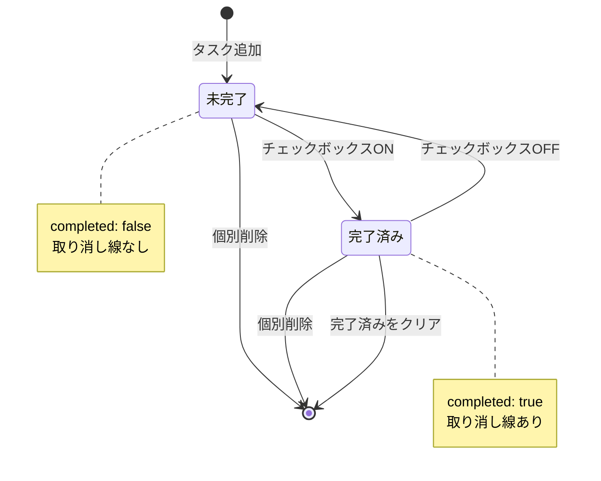
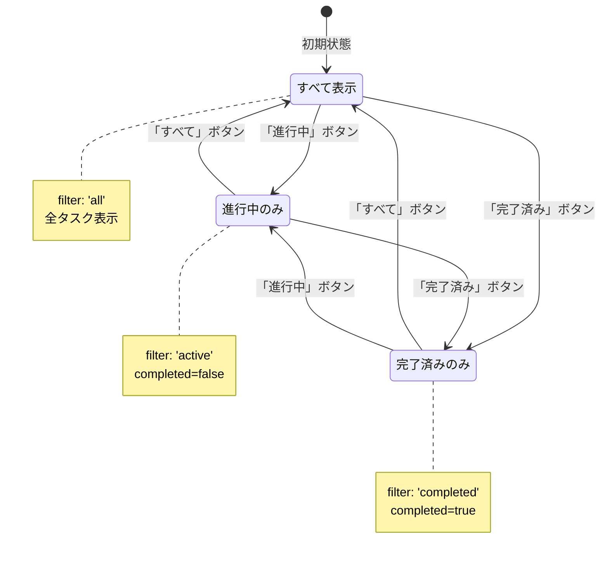

# 機能仕様書: Todo App - template-no-delete.tsx ベースアプリケーション

**機能ブランチ**: `001-todo-app-spec`  
**作成日**: 2025-11-13  
**ステータス**: Draft  
**入力**: AI_inputフォルダ内の全ドキュメントに基づく包括的なTodoアプリケーション仕様

## ユーザーシナリオ & テスト

### ユーザーストーリー1 - 個人用Todoページの作成と基本操作 (優先度: P1) 🎯 MVP

**概要**: 開発者が自分専用のTodoページを作成し、タスクの追加・完了切り替え・フィルタリングができる。

**この優先度の理由**: これが最も基本的な機能であり、すべての開発者がまず習得すべき機能です。他の機能はこの基盤の上に構築されます。

**独立テスト**: UIから新規ページを追加し、タスクを追加・完了切り替えできることで、完全に機能するMVPとして価値を提供します。

**受入シナリオ**:

1. **Given** 開発サーバーが起動している、**When** サイドバーの「➕ 新規ページ追加」ボタンをクリックし名前を入力して追加、**Then** サーバー再起動後、サイドバーに新しいページが表示される

2. **Given** 個人用Todoページが開いている、**When** タスクテキストを入力して「追加」ボタンをクリック、**Then** タスクがリストに追加され、LocalStorageに保存される

3. **Given** タスクが複数存在する、**When** タスクのチェックボックスをクリック、**Then** 完了状態が切り替わり、取り消し線とスタイルが適用される

4. **Given** タスクが未完了と完了済みの両方存在する、**When** フィルターボタン（すべて/進行中/完了済み）をクリック、**Then** 選択したフィルターに応じてタスクが表示される

5. **Given** タスクが追加・変更された状態、**When** ページをリロード、**Then** データがLocalStorageから復元され、すべてのタスクが保持される

---

### ユーザーストーリー2 - タスク削除機能の実装 (優先度: P2)

**概要**: 開発者がタスク削除機能を自分で実装し、配列操作とReact状態管理を学習する。

**この優先度の理由**: MVP機能の次に重要な学習課題であり、React開発者としての基礎スキルを身につけるために必須です。

**独立テスト**: 削除機能を実装し、個別削除と一括削除が正常に動作することで、完全なタスク管理機能を提供します。

**受入シナリオ**:

1. **Given** タスクリストに複数のタスクが存在する、**When** タスクの削除ボタンをクリック、**Then** 該当タスクがリストから削除され、LocalStorageからも削除される

2. **Given** 完了済みタスクと未完了タスクが混在する、**When** 「完了済みをクリア」ボタンをクリック、**Then** 完了済みタスクのみが削除され、未完了タスクは保持される

3. **Given** 完了済みタスクが1つも存在しない、**When** ページを表示、**Then** 「完了済みをクリア」ボタンは表示されない（条件レンダリング）

---

### ユーザーストーリー3 - ページ管理機能（編集・削除） (優先度: P3)

**概要**: ユーザーが作成したTodoページを編集・削除でき、削除時にはタスクデータも完全にクリーンアップされる。

**この優先度の理由**: ページ管理機能は便利だが、基本的なTodo機能が動作すれば価値を提供できるため、優先度は低めです。

**独立テスト**: ページの編集・削除機能が動作し、データクリーンアップが正しく行われることで、完全なページライフサイクル管理を提供します。

**受入シナリオ**:

1. **Given** サイドバーにページが表示されている、**When** ページの✏️ボタンをクリックして新しい名前を入力、**Then** ページ名が更新され、サーバー再起動後も反映される

2. **Given** ページにタスクデータが存在する、**When** ページの🗑️ボタンをクリックして削除、**Then** ページ情報とタスクデータ（LocalStorage）が完全に削除される

3. **Given** ページを削除した後、**When** 同じ名前で新しいページを追加、**Then** 以前のタスクデータは復元されず、クリーンな状態でスタートする

---

### ユーザーストーリー4 - ワンコマンド起動とGitHub Pagesデプロイ (優先度: P1)

**概要**: 開発者が`start.ps1`でワンコマンドで開発環境を起動でき、GitHub Pagesにデプロイできる。

**この優先度の理由**: 開発体験を大幅に向上させ、プロジェクトの再現性とアクセシビリティを確保するため、MVP レベルの重要性があります。

**独立テスト**: ワンコマンドで起動し、デプロイスクリプトで正常にGitHub Pagesに公開できることで、完全な開発フローを提供します。

**受入シナリオ**:

1. **Given** プロジェクトディレクトリで、**When** `.\start.ps1`を実行、**Then** 依存関係インストール、サーバー起動、ブラウザオープンが自動実行され、5秒後にPowerShellが終了する

2. **Given** アプリケーションがビルド済み、**When** `npm run deploy`を実行、**Then** GitHub Pagesにデプロイされ、公開URLでアクセス可能になる

3. **Given** GitHub Pagesでアプリを開く、**When** ページ操作を行う、**Then** ローカル環境と同様にすべての機能が動作する

---

### エッジケース

- **空のタスク追加**: 空文字列またはスペースのみの入力では、タスクが追加されない
- **LocalStorage制限**: データが5MBを超える場合、適切なエラーメッセージを表示（実装オプション）
- **重複ページ名**: 同じ名前のページを追加しようとした場合、エラーメッセージを表示
- **日本語文字対応**: ページ名とタスク名で日本語、絵文字、特殊文字が正しく保存・表示される
- **サーバー再起動**: ページ追加・編集・削除後、必ずサーバー再起動が必要であることをユーザーに通知
- **複数ブラウザタブ**: 同じページを複数タブで開いた場合、LocalStorageイベントで同期される
- **フィルター状態の保持**: ページリロード時にフィルター状態（すべて/進行中/完了済み）は初期状態（すべて）にリセットされる
- **タスクIDの一意性**: タイムスタンプベースのIDが同時追加で重複しないように、`Date.now()`を使用
- **ページ削除時の確認**: 削除操作は不可逆なため、確認ダイアログを表示してユーザーに警告する
- **ブラウザバック操作**: React Routerによるクライアントサイドルーティングで、ブラウザの戻る/進むボタンが正常に動作する

## 要件

### 機能要件

- **FR-001**: システムは、開発者がUIから新規Todoページを追加できる機能を提供しなければならない（名前入力、アイコン自動設定）
- **FR-002**: システムは、各Todoページでタスクの追加・完了切り替え・フィルタリング（すべて/進行中/完了済み）ができなければならない
- **FR-003**: システムは、すべてのタスクデータをLocalStorageに自動保存し、ページリロード後も復元しなければならない
- **FR-004**: システムは、タスク削除機能（個別削除と完了済み一括削除）を提供しなければならない
- **FR-005**: システムは、ページの編集（名前変更）と削除機能を提供しなければならない
- **FR-006**: システムは、ページ削除時にタスクデータ（LocalStorage）を完全にクリーンアップしなければならない
- **FR-007**: システムは、`start.ps1`スクリプトでワンコマンド起動（依存関係インストール、サーバー起動、ブラウザオープン、自動終了）を提供しなければならない
- **FR-008**: システムは、GitHub Pagesへのデプロイ機能（`npm run deploy`）を提供しなければならない
- **FR-009**: システムは、日本語文字（ページ名、タスク名）を正しく処理・保存・表示できなければならない
- **FR-010**: システムは、テストカバレッジ100%を維持しなければならない（106テスト）

### 主要エンティティ

#### TodoItem
- **id**: 一意識別子（タイムスタンプ）
- **text**: タスク内容
- **completed**: 完了状態（true/false）
- **createdAt**: 作成日時

#### UserPage
- **name**: ページ名（日本語対応）
- **icon**: アイコン（デフォルト📝）
- **path**: ルーティングパス
- **component**: 対応するReactコンポーネント

#### StorageKey
- **パターン**: `{ページ名}-todos`
- **例**: `浜崎秀寿-todos`, `TestUser-todos`

#### FilterType
- **型定義**: `'all' | 'active' | 'completed'`
- **初期値**: `'all'`
- **動作**: タスクリストの表示内容を制御

## 成功基準

### 測定可能な成果

- **SC-001**: 開発者が30分以内に自分専用のTodoページを作成し、タスク追加・完了切り替えができる
- **SC-002**: ページリロード後、100%のタスクデータが復元される（LocalStorage連携）
- **SC-003**: `start.ps1`実行からブラウザオープンまで30秒以内に完了する
- **SC-004**: テストスイート（106テスト）が12秒以内に完了し、すべてパスする
- **SC-005**: GitHub Pagesデプロイが5分以内に完了し、公開URLでアクセス可能になる
- **SC-006**: 日本語ページ名とタスク名が文字化けせず正しく表示される
- **SC-007**: ページ削除時、該当ページのLocalStorageデータが100%削除される（データリーク防止）
- **SC-008**: 初期ページ読み込みが2秒以内に完了する
- **SC-009**: タスク追加・削除操作の応答時間が100ms以内である
- **SC-010**: 10,000個のタスクを持つページでもフィルタリングが1秒以内に完了する（パフォーマンス目標）

## アーキテクチャ概要

### 技術スタック

### コンポーネント構造

### データフロー

### ワンコマンド起動フロー

### タスク状態遷移図

### フィルター状態遷移図

## 前提条件

- Node.js 16以上、npm 8以上がインストール済み
- Gitがインストール済み（GitHub Pagesデプロイ用）
- Windows環境（PowerShellスクリプト使用）
- ブラウザのLocalStorageが有効
- GitHub アカウント（デプロイ用）

## 依存関係

- React 18.2.0
- React DOM 18.2.0
- React Router DOM 6.10.0
- TypeScript 4.9.3
- Vite 4.2.0
- Vitest 0.34.0（テスト）
- UIkit 3.16.10（UIコンポーネント）
- gh-pages 6.3.0（デプロイ）
- @testing-library/react 14.1.2（テスト）
- happy-dom 12.10.3（テスト環境）

## 制約事項

- LocalStorageの容量制限（約5MB）
- ページ追加・編集・削除後は必ずサーバー再起動が必要
- 削除されたページのタスクデータは復元不可
- GitHub Pagesの無料プランの制限（100GB/月の帯域幅）
- template-no-delete.tsxは意図的に削除機能を省略（学習目的）

## セキュリティ考慮事項

### データ保護
- **LocalStorage平文保存**: 機密情報（パスワード、個人情報、クレジットカード番号など）は保存しない
- **データスコープ**: LocalStorageはオリジン（プロトコル+ドメイン+ポート）ごとに隔離されている
- **データ削除**: ページ削除時に関連するLocalStorageキーを完全にクリーンアップし、データリークを防止

### アプリケーションセキュリティ
- **XSS対策**: 
  - Reactのデフォルトエスケープ機能（`{}`内の変数は自動エスケープ）に依存
  - `dangerouslySetInnerHTML`は使用しない
  - ユーザー入力（タスク名、ページ名）はすべてエスケープ処理される
- **CSRF対策**: 不要（APIサーバーがなく、すべてクライアントサイド処理）
- **入力バリデーション**: 
  - 空文字チェック: `trim()`で前後空白削除後、長さ確認
  - 文字列長制限: タスク名最大500文字、ページ名最大50文字（推奨）
  - 特殊文字サニタイゼーション: LocalStorageキー名に使用する際、安全な文字のみ許可

### デプロイメントセキュリティ
- **HTTPS強制**: GitHub Pagesは自動的にHTTPSを提供
- **依存関係の脆弱性**: `npm audit`を定期的に実行し、脆弱性を修正
- **環境変数**: API キーなど機密情報は環境変数化（現状、外部APIなし）

## パフォーマンス要件

### レスポンスタイム目標
- **初期ページ読み込み**: < 2秒（ネットワーク速度に依存）
- **タスク追加操作**: < 100ms（ユーザー入力からUI更新まで）
- **タスク削除操作**: < 100ms（クリックからUI更新まで）
- **完了切り替え**: < 50ms（チェックボックス操作からUI更新まで）
- **フィルタリング処理**: < 1秒（10,000タスクでも許容範囲）
- **LocalStorage読み書き**: < 50ms（同期処理のためブロッキング）

### スケーラビリティ目標
- **最大タスク数**: 10,000タスク/ページで正常動作
- **最大ページ数**: 100ページまで管理可能
- **LocalStorage容量**: 合計5MB以内（ブラウザ制限）
- **メモリ使用量**: 10,000タスクで < 100MB（ブラウザメモリ）

### テスト実行パフォーマンス
- **テストスイート全体**: < 12秒（106テスト）
- **単体テスト**: < 5秒
- **統合テスト**: < 7秒
- **カバレッジレポート生成**: < 3秒

### ビルド・デプロイパフォーマンス
- **開発サーバー起動**: < 3秒（Vite HMR）
- **プロダクションビルド**: < 30秒（`npm run build`）
- **GitHub Pagesデプロイ**: < 5分（ビルド+プッシュ+公開）
- **ワンコマンド起動**: < 30秒（依存関係インストール済みの場合）

## 想定される課題と回避策

### 課題1: LocalStorage容量制限（5MB）
**症状**: タスク数が増加すると、LocalStorage容量超過エラーが発生する可能性  
**影響範囲**: 大量タスク（1,000件以上）を持つユーザー  
**回避策**: 
- タスク数が1,000を超える場合、警告メッセージを表示
- 完了済みタスクの自動アーカイブ機能を実装（オプション）
- データ圧縮（JSON.stringify時の最適化）
- 古いタスクの削除を促すUI表示

### 課題2: ページ追加後のサーバー再起動が必要
**症状**: `userPages.ts`を手動編集するため、サーバー再起動なしでは新ページが表示されない  
**影響範囲**: すべての開発者（初回ページ追加時）  
**回避策**: 
- UI上に明確な再起動指示を表示
- 将来的にはLocalStorageベースの動的ページ管理に移行（ホットリロード対応）
- `vite.config.ts`で自動リロード設定を追加（検討中）

### 課題3: 日本語文字化け
**症状**: Windows環境で日本語ページ名やタスク名が文字化けする  
**影響範囲**: 日本語を使用するすべてのユーザー  
**回避策**: 
- `start.ps1`でUTF-8エンコーディングを明示的に設定: `[Console]::OutputEncoding = [System.Text.Encoding]::UTF8`
- すべての`.tsx`ファイルをUTF-8 BOMなしで保存
- `tsconfig.json`で`"charset": "utf8"`を設定

### 課題4: テストメンテナンスコスト
**症状**: コンポーネント変更時にテストが壊れやすい  
**影響範囲**: 開発者全員  
**回避策**: 
- Atomic Design原則に従い、小さく再利用可能なコンポーネントを作成
- テストは実装詳細ではなく、ユーザー動作に焦点を当てる
- Testing Libraryの`getByRole`などアクセシビリティベースのセレクタを使用
- スナップショットテストを最小限に抑える

### 課題5: 複数タブ同期の不整合
**症状**: 同じページを複数タブで開いた場合、LocalStorage更新が即座に反映されない  
**影響範囲**: マルチタブ使用ユーザー  
**回避策**: 
- `window.addEventListener('storage', ...)`でLocalStorageイベントをリッスン
- イベント発火時に状態を同期（useEffect内で実装）
- 競合発生時は「最後の書き込みが優先」ポリシーを採用

### 課題6: GitHub Pagesのルーティング問題
**症状**: SPAでクライアントサイドルーティング使用時、直接URL入力で404エラー  
**影響範囲**: GitHub Pagesデプロイ後のすべてのユーザー  
**回避策**: 
- `HashRouter`を使用（`/#/page-name`形式）
- または`404.html`を`index.html`にリダイレクト設定
- `vite.config.ts`で`base: '/todo-app/'`を正しく設定

## 関連ドキュメント

### プロジェクトドキュメント
- `AI_input/仕様書.md`: 2076行の詳細仕様書（Todo App完全リファレンス）
- `AI_input/BASIC_TODO_GUIDE_JP.md`: 初級者向けページ作成ガイド
- `AI_input/React開発研修.md`: React開発研修カリキュラム
- `AI_input/GitHubPagesデプロイ手順.md`: デプロイ手順詳細
- `AI_input/template-no-delete.tsx`: ベーステンプレート（246行）
- `.specify/memory/constitution.md`: プロジェクト憲法 v1.0.0

### 技術ドキュメント
- [React 公式ドキュメント](https://react.dev/) - React 18の最新ガイド
- [TypeScript ハンドブック](https://www.typescriptlang.org/docs/) - TypeScript言語仕様
- [Vite ガイド](https://vitejs.dev/guide/) - Viteビルドツール
- [Vitest ドキュメント](https://vitest.dev/) - Vitestテストフレームワーク
- [UIkit ドキュメント](https://getuikit.com/docs/introduction) - UIコンポーネントライブラリ
- [React Router v6](https://reactrouter.com/en/main) - クライアントサイドルーティング

## 用語集

- **MVP (Minimum Viable Product)**: 最小限の機能で価値を提供できる製品
- **P1/P2/P3**: 優先度レベル（P1=最高、P2=中、P3=低）
- **LocalStorage**: ブラウザのクライアントサイドストレージ（5MB制限）
- **CRUD**: Create（作成）、Read（読取）、Update（更新）、Delete（削除）の4つの基本操作
- **HMR (Hot Module Replacement)**: コード変更時にページ全体をリロードせずに更新する機能
- **TDD (Test Driven Development)**: テスト駆動開発手法
- **XSS (Cross-Site Scripting)**: クロスサイトスクリプティング攻撃
- **CSRF (Cross-Site Request Forgery)**: クロスサイトリクエストフォージェリ攻撃
- **SPA (Single Page Application)**: 単一ページアプリケーション
- **Given-When-Then**: 受入テストの記述形式（前提条件-操作-期待結果）

## 改訂履歴

| バージョン | 日付 | 変更内容 | 作成者 |
|-----------|------|---------|--------|
| 1.0.0 | 2025-11-13 | 初版作成、AI_inputフォルダ全ファイル分析に基づく仕様書作成 | GitHub Copilot |
| 1.0.1 | 2025-11-13 | Mermaid構文エラー修正（sequenceDiagram styleディレクティブ削除） | GitHub Copilot |
| 1.0.2 | 2025-11-13 | エッジケース拡張（10ケース）、状態遷移図追加、セキュリティ・パフォーマンス詳細化 | GitHub Copilot |

---

**現行バージョン**: 1.0.2  
**最終更新**: 2025-11-13  
**ステータス**: Review Ready（レビュー準備完了）  
**承認待ち**: 実装ブランチ（feature/impl-001-todo-app）への移行準備完了
