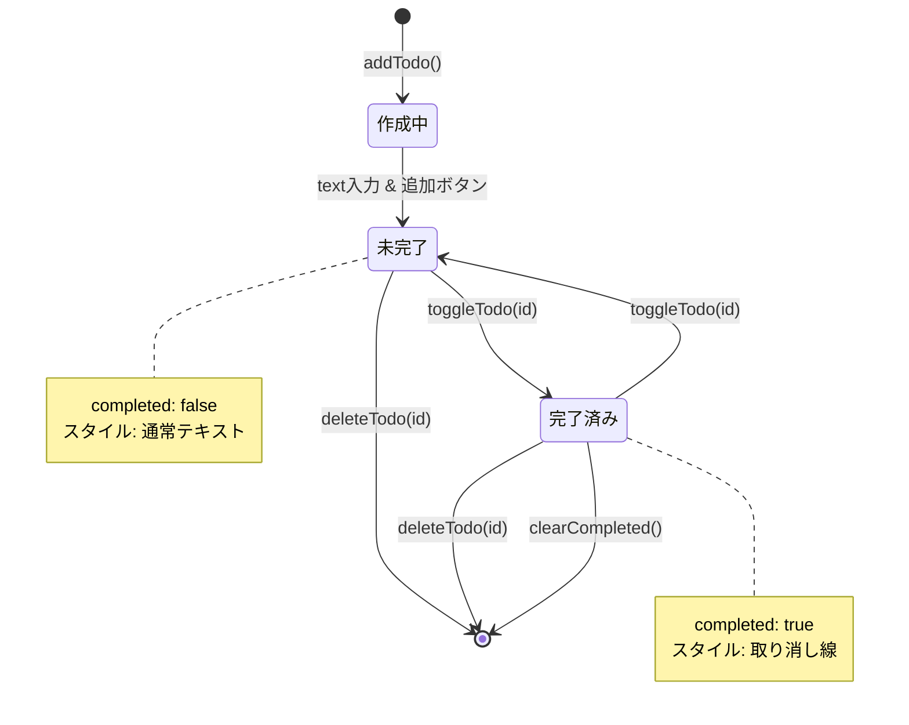
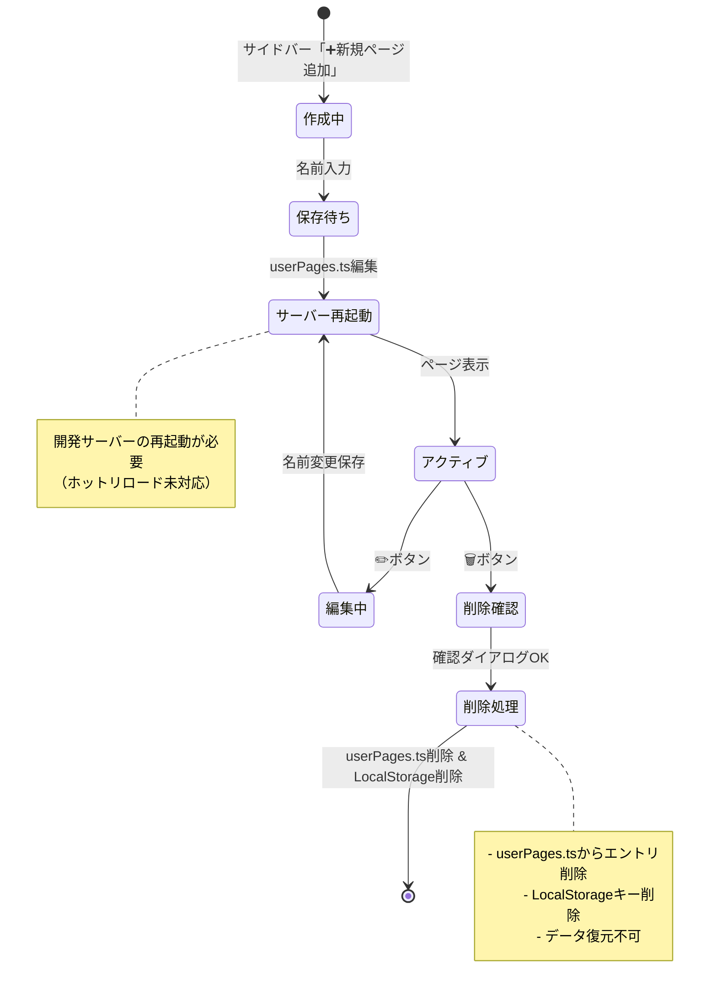
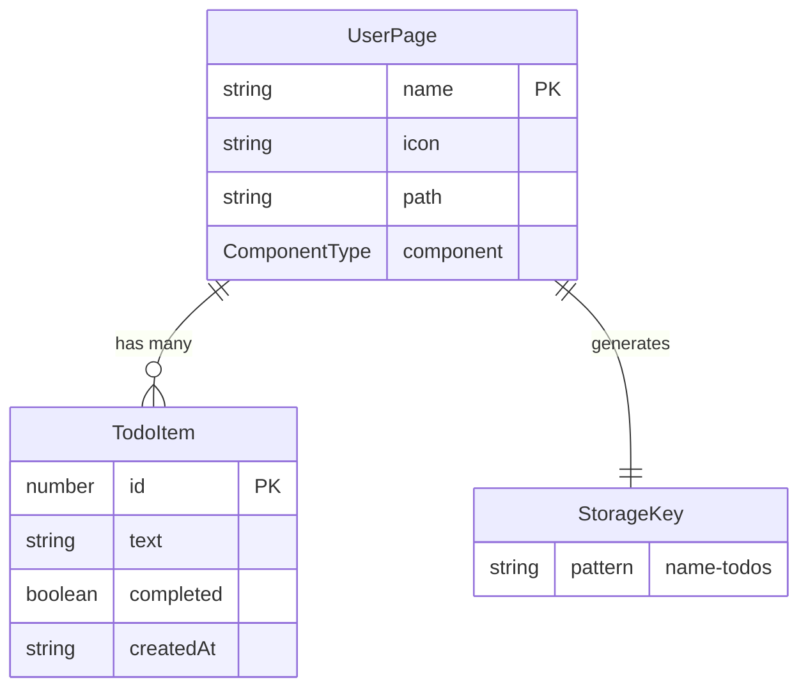
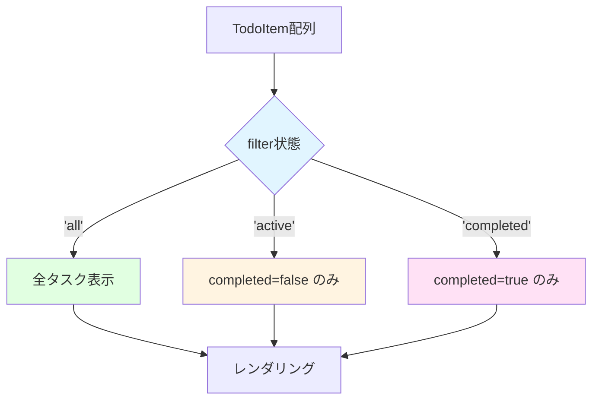

# データモデル仕様: Todo App

**作成日**: 2025-11-13  
**プロジェクト**: Todo App - template-no-delete.tsx ベースアプリケーション  
**目的**: エンティティ定義、フィールド、関係性、バリデーションルール、状態遷移を文書化

## 概要

Todo Appは3つの主要エンティティで構成されます：

1. **TodoItem**: 個別のタスクを表現
2. **UserPage**: ユーザーごとのTodoページを表現
3. **StorageKey**: LocalStorageのキー命名規則

LocalStorageベースのクライアントサイドアプリケーションのため、リレーショナルデータベースは使用せず、JSON形式でデータを永続化します。

---

## エンティティ定義

### 1. TodoItem（タスクアイテム）

**用途**: 個別のタスクを表現するコアエンティティ

#### TypeScript型定義

```typescript
interface TodoItem {
  id: number;
  text: string;
  completed: boolean;
  createdAt: string; // ISO 8601形式
}
```

#### フィールド詳細

| フィールド | 型 | 必須 | 説明 | 制約 |
|-----------|-----|-----|------|-----|
| `id` | `number` | ✅ | 一意識別子 | `Date.now()`によるタイムスタンプ、正の整数 |
| `text` | `string` | ✅ | タスク内容 | 1〜500文字、trim後空文字列禁止 |
| `completed` | `boolean` | ✅ | 完了状態 | `true`（完了）または `false`（未完了） |
| `createdAt` | `string` | ✅ | 作成日時 | ISO 8601形式（例: "2025-11-13T10:30:00.000Z"） |

#### バリデーションルール

```typescript
function validateTodoItem(item: unknown): item is TodoItem {
  if (typeof item !== 'object' || item === null) return false;
  
  const todo = item as Record<string, unknown>;
  
  // id: 正の整数
  if (typeof todo.id !== 'number' || !Number.isInteger(todo.id) || todo.id <= 0) {
    return false;
  }
  
  // text: 1〜500文字
  if (typeof todo.text !== 'string' || todo.text.trim().length === 0) {
    return false;
  }
  if (todo.text.length > 500) {
    return false;
  }
  
  // completed: boolean
  if (typeof todo.completed !== 'boolean') {
    return false;
  }
  
  // createdAt: ISO 8601形式
  if (typeof todo.createdAt !== 'string') {
    return false;
  }
  const date = new Date(todo.createdAt);
  if (isNaN(date.getTime())) {
    return false;
  }
  
  return true;
}
```

#### 状態遷移



#### 永続化形式

LocalStorageには以下のJSON配列として保存：

```json
[
  {
    "id": 1699876543210,
    "text": "Reactの学習",
    "completed": false,
    "createdAt": "2025-11-13T01:22:23.210Z"
  },
  {
    "id": 1699876600000,
    "text": "TypeScriptの学習",
    "completed": true,
    "createdAt": "2025-11-13T01:23:20.000Z"
  }
]
```

---

### 2. UserPage（ユーザーページ）

**用途**: ユーザーごとのTodoページ設定を表現

#### TypeScript型定義

```typescript
interface UserPage {
  name: string;
  icon: string;
  path: string;
  component: React.ComponentType;
}
```

#### フィールド詳細

| フィールド | 型 | 必須 | 説明 | 制約 |
|-----------|-----|-----|------|-----|
| `name` | `string` | ✅ | ページ名（日本語対応） | 1〜50文字、重複禁止、trim後空文字列禁止 |
| `icon` | `string` | ✅ | 絵文字アイコン | 1文字の絵文字、デフォルト "📝" |
| `path` | `string` | ✅ | ルーティングパス | `/`開始、英数字とハイフン、重複禁止 |
| `component` | `React.ComponentType` | ✅ | Reactコンポーネント | 有効なReactコンポーネント |

#### バリデーションルール

```typescript
function validateUserPage(page: unknown): page is Omit<UserPage, 'component'> {
  if (typeof page !== 'object' || page === null) return false;
  
  const p = page as Record<string, unknown>;
  
  // name: 1〜50文字
  if (typeof p.name !== 'string' || p.name.trim().length === 0) {
    return false;
  }
  if (p.name.length > 50) {
    return false;
  }
  
  // icon: 1文字の絵文字
  if (typeof p.icon !== 'string' || p.icon.length === 0) {
    return false;
  }
  
  // path: /開始、有効なパス
  if (typeof p.path !== 'string' || !p.path.startsWith('/')) {
    return false;
  }
  if (!/^\/[a-zA-Z0-9-]+$/.test(p.path)) {
    return false;
  }
  
  return true;
}
```

#### 設定ファイル形式

`src/config/userPages.ts`に以下の形式で定義：

```typescript
import { DynamicTodoPage } from '../pages/DynamicTodoPage';

export const userPages: UserPage[] = [
  {
    name: '浜崎秀寿',
    icon: '📝',
    path: '/hamasaki-todo',
    component: DynamicTodoPage
  },
  {
    name: 'TestUser',
    icon: '✅',
    path: '/testuser-todo',
    component: DynamicTodoPage
  }
];
```

#### ページライフサイクル



---

### 3. StorageKey（ストレージキー）

**用途**: LocalStorageのキー命名規則を標準化

#### 命名パターン

```typescript
type StorageKeyPattern = `${string}-todos`;

// 例
const key1: StorageKeyPattern = '浜崎秀寿-todos';
const key2: StorageKeyPattern = 'TestUser-todos';
const key3: StorageKeyPattern = 'page-info'; // メタデータ用
```

#### キー生成関数

```typescript
function getTodosKey(pageName: string): string {
  // エスケープ処理（特殊文字対策）
  const safeName = pageName.trim();
  return `${safeName}-todos`;
}

function getPageInfoKey(): string {
  return 'page-info';
}
```

#### LocalStorage構造

```json
{
  "浜崎秀寿-todos": "[{\"id\":1699876543210,\"text\":\"Reactの学習\",\"completed\":false,\"createdAt\":\"2025-11-13T01:22:23.210Z\"}]",
  "TestUser-todos": "[{\"id\":1699876600000,\"text\":\"TypeScriptの学習\",\"completed\":true,\"createdAt\":\"2025-11-13T01:23:20.000Z\"}]",
  "page-info": "{\"version\":\"1.0\",\"lastUpdated\":\"2025-11-13T10:00:00.000Z\"}"
}
```

#### クリーンアップルール

```typescript
function cleanupPageData(pageName: string): void {
  const key = getTodosKey(pageName);
  
  // LocalStorageからキー削除
  localStorage.removeItem(key);
  
  // userPages.tsから手動削除（サーバー再起動必要）
  // ※ 自動化は将来的な改善課題
}
```

---

## エンティティ関係図



**関係性**:
- 1つの`UserPage`は複数の`TodoItem`を持つ（1対多）
- 1つの`UserPage`は1つの`StorageKey`を生成する（1対1）
- `TodoItem`はLocalStorageに`StorageKey`で保存される

---

## FilterType（フィルタータイプ）

**用途**: タスク表示フィルターを制御

#### TypeScript型定義

```typescript
type FilterType = 'all' | 'active' | 'completed';
```

#### フィルター動作



#### フィルター関数

```typescript
function filterTodos(todos: TodoItem[], filter: FilterType): TodoItem[] {
  switch (filter) {
    case 'all':
      return todos;
    case 'active':
      return todos.filter(todo => !todo.completed);
    case 'completed':
      return todos.filter(todo => todo.completed);
    default:
      return todos;
  }
}
```

---

## データ整合性ルール

### 1. ID一意性保証

```typescript
function generateTodoId(existingTodos: TodoItem[]): number {
  const now = Date.now();
  const ids = new Set(existingTodos.map(todo => todo.id));
  
  // 同時追加でIDが重複する場合、+1
  let id = now;
  while (ids.has(id)) {
    id++;
  }
  
  return id;
}
```

### 2. LocalStorage同期

```typescript
// useEffectで自動同期
useEffect(() => {
  const key = getTodosKey(pageName);
  localStorage.setItem(key, JSON.stringify(todos));
}, [todos, pageName]);

// ページロード時に復元
useEffect(() => {
  const key = getTodosKey(pageName);
  const saved = localStorage.getItem(key);
  
  if (saved) {
    try {
      const parsed: unknown = JSON.parse(saved);
      if (Array.isArray(parsed)) {
        const validated = parsed.filter(validateTodoItem);
        setTodos(validated);
      }
    } catch (error) {
      console.error('LocalStorageデータ破損', error);
      setTodos([]);
    }
  }
}, [pageName]);
```

### 3. ページ名重複チェック

```typescript
function isPageNameUnique(name: string, existingPages: UserPage[]): boolean {
  return !existingPages.some(page => page.name === name);
}
```

---

## パフォーマンス考慮事項

### 1. LocalStorage容量管理

```typescript
function getStorageSize(): number {
  let total = 0;
  for (const key in localStorage) {
    if (localStorage.hasOwnProperty(key)) {
      total += localStorage[key].length + key.length;
    }
  }
  return total; // bytes
}

const STORAGE_LIMIT = 5 * 1024 * 1024; // 5MB

function checkStorageCapacity(): boolean {
  return getStorageSize() < STORAGE_LIMIT * 0.9; // 90%で警告
}
```

### 2. 大量タスク対策

```typescript
// 10,000タスクでもフィルタリング < 1秒を保証
function efficientFilter(todos: TodoItem[], filter: FilterType): TodoItem[] {
  if (todos.length > 1000) {
    // 大量データ時はメモ化を活用
    return useMemo(() => filterTodos(todos, filter), [todos, filter]);
  }
  return filterTodos(todos, filter);
}
```

---

## セキュリティ考慮事項

### 1. XSS対策

```typescript
// Reactのデフォルトエスケープに依存
function TaskItem({ todo }: { todo: TodoItem }) {
  return (
    <div>
      {/* 自動エスケープされる */}
      <span>{todo.text}</span>
      
      {/* 危険: 使用禁止 */}
      {/* <span dangerouslySetInnerHTML={{ __html: todo.text }} /> */}
    </div>
  );
}
```

### 2. 入力サニタイゼーション

```typescript
function sanitizeTaskText(text: string): string {
  return text
    .trim()
    .slice(0, 500) // 最大500文字
    .replace(/[\u0000-\u001F\u007F-\u009F]/g, ''); // 制御文字削除
}
```

---

**バージョン**: 1.0.0  
**作成者**: GitHub Copilot  
**最終更新**: 2025-11-13  
**ステータス**: Phase 1 データモデル定義完了
