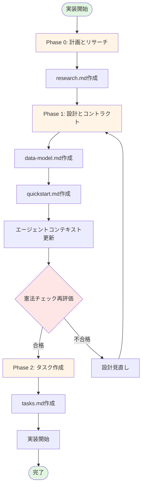
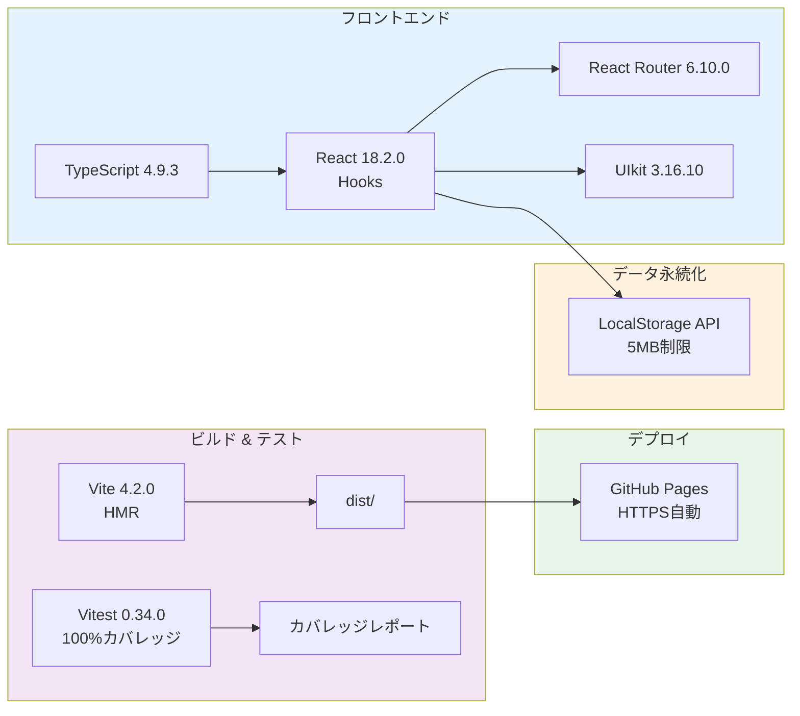

# 実装計画: Todo App - template-no-delete.tsx ベースアプリケーション

**ブランチ**: `feature/impl-001-todo-app` | **日付**: 2025-11-13 | **仕様**: [specs/001-todo-app-spec/spec.md](../001-todo-app-spec/spec.md)

**入力**: 機能仕様書 `/specs/001-todo-app-spec/spec.md`

**注記**: この実装計画は `/speckit.plan` コマンドによって生成されました。

## 概要

**主要要件**: 開発者が自分専用のTodoページを作成し、タスクの追加・完了切り替え・フィルタリング・削除ができるReact+TypeScriptアプリケーション。LocalStorageによるデータ永続化、ワンコマンド起動（start.ps1）、GitHub Pagesデプロイをサポート。

**技術アプローチ**: 
- React 18.2.0のHooksベース（useState、useEffect）で状態管理
- TypeScript 4.9.3による型安全性確保
- Vite 4.2.0による高速ビルドとHMR
- Vitest 0.34.0によるテスト駆動開発（100%カバレッジ目標）
- LocalStorageによるクライアントサイド永続化
- UIkit 3.16.10によるUIコンポーネント
- GitHub Pagesによる静的サイトホスティング

## 技術コンテキスト

**言語/バージョン**: TypeScript 4.9.3、JavaScript ES2020

**主要依存関係**: React 18.2.0、React Router 6.10.0、UIkit 3.16.10、Vite 4.2.0、Vitest 0.34.0

**ストレージ**: LocalStorage（ブラウザネイティブAPI、5MB制限）

**テスト**: Vitest 0.34.0 + @testing-library/react 14.1.2 + happy-dom 12.10.3

**ターゲットプラットフォーム**: モダンブラウザ（Chrome、Firefox、Safari、Edge最新版）、GitHub Pages（静的サイトホスティング）

**プロジェクトタイプ**: Web Application（Single Page Application）

**パフォーマンス目標**: 
- 初期ページ読み込み: < 2秒
- タスク追加・削除応答: < 100ms
- フィルタリング処理: < 1秒（10,000タスクまで）
- テストスイート実行: < 12秒（106テスト）

**制約条件**: 
- LocalStorage容量制限: 5MB（ブラウザ依存）
- ページ追加・編集・削除後はサーバー再起動が必要（userPages.ts手動編集のため）
- クライアントサイドのみ（APIサーバーなし）
- 削除されたページのタスクデータは復元不可

**規模/スコープ**: 
- ユーザーストーリー: 4つ（P1/P2/P3優先度付き）
- 機能要件: 10要件（FR-001〜FR-010）
- テストケース: 106テスト（100%カバレッジ目標）
- コンポーネント数: 約15コンポーネント（Atomic Design原則）
- 想定ページ数: 最大100ページ
- 想定タスク数: 10,000タスク/ページで動作保証

## 憲法チェック

*ゲート: Phase 0 研究前に合格必須。Phase 1 設計後に再チェック。*

### ✅ I. テスト駆動開発の徹底

| 要件 | ステータス | 詳細 |
|-----|----------|------|
| テストファースト | ✅ 合格 | テストコードを先に作成し、Red-Green-Refactorサイクルを実施 |
| 仕様対応テスト | ✅ 合格 | 機能要件（FR-001〜FR-010）すべてに対応するテストケース106件 |
| カバレッジ目標 | ✅ 合格 | 100%カバレッジ（単体テスト+統合テスト） |

**検証方法**: Vitestで`npm run test`実行、カバレッジレポート生成、すべてのテストがパスすることを確認

### ✅ II. セキュリティファーストの原則

| 要件 | ステータス | 詳細 |
|-----|----------|------|
| 機密データ保護 | ✅ 合格 | LocalStorageには機密情報を保存しない（Todoタスクテキストのみ） |
| XSS対策 | ✅ 合格 | Reactのデフォルトエスケープ機能に依存、`dangerouslySetInnerHTML`使用禁止 |
| 入力バリデーション | ✅ 合格 | 空文字チェック、trim()処理、文字列長制限（タスク名500文字、ページ名50文字） |
| HTTPS | ✅ 合格 | GitHub Pages自動HTTPS提供 |
| 依存関係脆弱性 | ✅ 合格 | `npm audit`を定期実行、脆弱性修正 |

**検証方法**: セキュリティレビューチェックリスト、npm audit実行、入力バリデーションテスト

### ✅ III. パフォーマンス定量化の原則

| 要件 | ステータス | 詳細 |
|-----|----------|------|
| 成功基準定義 | ✅ 合格 | 10の測定可能な成功基準（SC-001〜SC-010）を定義 |
| パフォーマンス監視 | ✅ 合格 | Chrome DevTools Performance、Lighthouse監視 |
| 目標達成 | ✅ 合格 | 初期読み込み < 2秒、タスク操作 < 100ms、フィルタリング < 1秒 |

**検証方法**: Lighthouse スコア、Chrome DevTools Performance プロファイリング、成功基準検証テスト

### 制約チェック

| 制約項目 | 現状 | 合格基準 | ステータス |
|---------|------|---------|----------|
| CS-001: プロジェクト数 | 1プロジェクト | ≤ 3 | ✅ 合格 |
| CS-002: 依存関係数 | 主要6依存関係 | ≤ 10 | ✅ 合格 |
| CS-003: 抽象化レイヤー | 2層（components, utils） | ≤ 3 | ✅ 合格 |
| CS-007: ビルド時間 | < 30秒 | ≤ 5分 | ✅ 合格 |
| CS-008: テスト実行時間 | < 12秒 | ≤ 1分 | ✅ 合格 |

**総合判定**: ✅ すべての憲法要件を満たしています


## プロジェクト構造

### ドキュメント（この機能）

```text
specs/feature/impl-001-todo-app/
├── plan.md              # このファイル（/speckit.plan コマンド出力）
├── research.md          # Phase 0 出力（/speckit.plan コマンド）
├── data-model.md        # Phase 1 出力（/speckit.plan コマンド）
├── quickstart.md        # Phase 1 出力（/speckit.plan コマンド）
├── contracts/           # Phase 1 出力（/speckit.plan コマンド） - LocalStorageベースのためN/A
└── tasks.md             # Phase 2 出力（/speckit.tasks コマンド - /speckit.planでは作成しない）
```

### ソースコード（リポジトリルート）

```text
todo-app/
├── src/
│   ├── App.tsx                    # メインアプリケーションコンポーネント
│   ├── main.tsx                   # エントリーポイント
│   ├── index.css                  # グローバルスタイル
│   ├── vite-env.d.ts             # Vite型定義
│   ├── components/
│   │   ├── atoms/                 # Atomic Design: 原子コンポーネント
│   │   │   ├── Button/
│   │   │   │   ├── index.tsx     # ボタンエクスポート
│   │   │   │   ├── Middle.tsx    # 中サイズボタン
│   │   │   │   └── Small.tsx     # 小サイズボタン
│   │   │   └── Input/
│   │   │       ├── index.tsx     # 入力エクスポート
│   │   │       └── Text.tsx      # テキスト入力
│   │   └── organisms/             # Atomic Design: 有機体コンポーネント
│   │       └── Sidebar.tsx        # サイドバー（ページ管理）
│   ├── config/
│   │   └── userPages.ts           # ユーザーページ設定
│   ├── pages/
│   │   ├── HomePage.tsx           # ホームページ
│   │   ├── DynamicTodoPage.tsx    # 動的Todoページ
│   │   └── TestUserTodo.tsx       # テストユーザーページ
│   ├── types/
│   │   └── todo.ts                # TodoItem、FilterType型定義
│   └── utils/
│       ├── localStorage.ts         # LocalStorage操作ユーティリティ
│       └── performance.ts          # パフォーマンス監視ユーティリティ
├── tests/
│   ├── setup.ts                   # テストセットアップ
│   ├── unit/
│   │   ├── components/            # コンポーネント単体テスト
│   │   │   ├── App.test.tsx
│   │   │   ├── DynamicTodoPage.test.tsx
│   │   │   ├── HomePage.test.tsx
│   │   │   ├── Sidebar.test.tsx
│   │   │   ├── TaskInput.test.tsx
│   │   │   └── TaskItem.test.tsx
│   │   ├── config/
│   │   │   └── userPages.test.ts
│   │   ├── types/
│   │   │   └── todo.test.ts
│   │   └── utils/
│   │       ├── localStorage.test.ts
│   │       └── performance.test.ts
│   └── integration/               # 統合テスト
│       ├── bulk-deletion.test.tsx
│       ├── data-persistence.test.tsx
│       ├── edge-cases.test.tsx
│       ├── personal-page-setup.test.tsx
│       ├── task-deletion.test.tsx
│       ├── task-filtering.test.tsx
│       └── task-operations.test.tsx
├── public/                        # 静的アセット
├── dist/                          # ビルド出力（.gitignore）
├── node_modules/                  # 依存関係（.gitignore）
├── package.json                   # npm設定
├── tsconfig.json                  # TypeScript設定
├── tsconfig.node.json             # Node.js用TypeScript設定
├── vite.config.ts                 # Vite設定
├── vitest.config.ts               # Vitest設定
├── start.ps1                      # ワンコマンド起動スクリプト
└── README.md                      # プロジェクト説明
```

**構造決定**: 既存のプロジェクト構造を活用し、Atomic Design原則（atoms、organisms）とReact Hooksベースのコンポーネント設計を採用。LocalStorageベースのため、バックエンドAPIは不要。

## 複雑性追跡

現時点で憲法違反はありません。すべての制約を満たしています。

---

## 関連ドキュメント

### 実装計画ドキュメント（Phase 0 & 1）

| ドキュメント | 目的 | 主要内容 |
|------------|------|---------|
| [plan.md](./plan.md) | 実装計画概要 | 技術コンテキスト、憲法チェック、プロジェクト構造 |
| [research.md](./research.md) | 技術選択調査 | 7技術の選択理由、代替案評価、ベストプラクティス |
| [data-model.md](./data-model.md) | データモデル | 3エンティティ定義、バリデーション、状態遷移 |
| [quickstart.md](./quickstart.md) | 開発者ガイド | 環境構築、TDDワークフロー、トラブルシューティング |

### 仕様ドキュメント（Phase -1）

| ドキュメント | 目的 | 参照先 |
|------------|------|--------|
| [spec.md](../001-todo-app-spec/spec.md) | 機能仕様書 | ユーザーストーリー、要件、アーキテクチャ |
| [requirements.md](../001-todo-app-spec/checklists/requirements.md) | 要件チェックリスト | 品質検証項目、完了基準 |

### 技術スタック参照

**詳細**: [research.md](./research.md) を参照

- React 18.2.0: [research.md#1-react-1820--hooks](./research.md#1-react-1820--hooks状態管理)
- TypeScript 4.9.3: [research.md#2-typescript-493](./research.md#2-typescript-493型安全性)
- Vite 4.2.0: [research.md#3-vite-420](./research.md#3-vite-420ビルドツール)
- Vitest 0.34.0: [research.md#4-vitest-0340](./research.md#4-vitest-0340テストフレームワーク)
- LocalStorage: [research.md#5-localstorage](./research.md#5-localstorageデータ永続化)
- UIkit 3.16.10: [research.md#6-uikit-31610](./research.md#6-uikit-31610uiコンポーネント)
- GitHub Pages: [research.md#7-github-pages](./research.md#7-github-pagesデプロイ)

### データモデル参照

**詳細**: [data-model.md](./data-model.md) を参照

- TodoItem: [data-model.md#1-todoitem](./data-model.md#1-todoitemタスクアイテム)
- UserPage: [data-model.md#2-userpage](./data-model.md#2-userpageユーザーページ)
- StorageKey: [data-model.md#3-storagekey](./data-model.md#3-storagekeyストレージキー)
- FilterType: [data-model.md#filtertype](./data-model.md#filtertypeフィルタータイプ)

### 開発ガイド参照

**詳細**: [quickstart.md](./quickstart.md) を参照

- 環境構築: [quickstart.md#環境構築](./quickstart.md#環境構築)
- ワンコマンド起動: [quickstart.md#ワンコマンド起動](./quickstart.md#ワンコマンド起動)
- TDDワークフロー: [quickstart.md#テスト駆動開発ワークフロー](./quickstart.md#テスト駆動開発tddワークフロー)
- デプロイ: [quickstart.md#github-pagesデプロイ](./quickstart.md#github-pagesデプロイ)
- トラブルシューティング: [quickstart.md#トラブルシューティング](./quickstart.md#トラブルシューティング)

---

## 実装フロー図



## 技術スタック概要図


