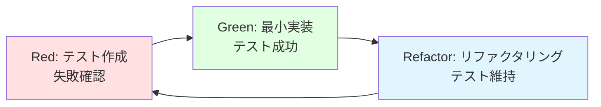
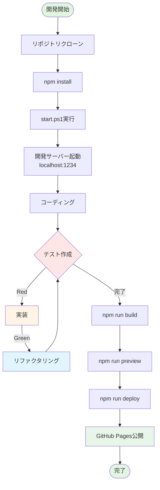

# クイックスタートガイド: Todo App

**対象者**: 開発者、コントリビューター、レビュアー  
**所要時間**: 初回セットアップ 5分、ビルド・テスト 2分  
**前提条件**: Node.js 16以上、npm 8以上、Git、Windows（PowerShellスクリプト使用）

---

## 関連ドキュメント

| ドキュメント | 参照先 | 関連セクション |
|------------|--------|-------------|
| 実装計画 | [plan.md](./plan.md) | 技術コンテキスト、パフォーマンス目標 |
| 技術調査 | [research.md](./research.md) | Vite、Vitest、GitHub Pages設定 |
| データモデル | [data-model.md](./data-model.md) | エンティティ定義、バリデーション |
| 機能仕様書 | [spec.md](../001-todo-app-spec/spec.md) | 機能要件、成功基準 |

**技術スタック詳細**: [research.md](./research.md) を参照  
**データモデル詳細**: [data-model.md](./data-model.md) を参照

---

## 📋 目次

1. [環境構築](#環境構築)
2. [ワンコマンド起動](#ワンコマンド起動)
3. [開発ワークフロー](#開発ワークフロー)
4. [テスト実行](#テスト実行)
5. [ビルド](#ビルド)
6. [GitHub Pagesデプロイ](#github-pagesデプロイ)
7. [トラブルシューティング](#トラブルシューティング)

---

## 環境構築

### 1. リポジトリクローン

```powershell
git clone https://github.com/J1921604/todo-app.git
cd todo-app
```

### 2. 依存関係インストール

```powershell
npm install
```

**インストールされる主要パッケージ**:
- React 18.2.0 + React DOM
- React Router 6.10.0
- TypeScript 4.9.3
- Vite 4.2.0
- Vitest 0.34.0
- UIkit 3.16.10
- @testing-library/react 14.1.2
- gh-pages 6.3.0

### 3. 環境確認

```powershell
# Node.jsバージョン確認
node --version  # v16以上

# npmバージョン確認
npm --version   # v8以上

# TypeScriptバージョン確認
npx tsc --version  # v4.9.3
```

---

## ワンコマンド起動

### 🚀 最速スタート

```powershell
.\start.ps1
```

**このコマンドで自動実行される処理**:
1. 依存関係の存在確認（なければ`npm install`）
2. 開発サーバー起動（`npm run dev`）
3. ヘルスチェック（最大30秒待機）
4. ブラウザ自動オープン（http://localhost:1234）
5. 5秒後にPowerShellウィンドウ自動終了

**start.ps1の内部動作**:
```powershell
# 依存関係チェック
if (-not (Test-Path "node_modules")) {
    Write-Host "依存関係をインストール中..."
    npm install
}

# サーバー起動（バックグラウンド）
Start-Process powershell -ArgumentList "-NoExit", "-Command", "npm run dev"

# ヘルスチェック（最大30秒）
$maxRetries = 30
$retries = 0
while ($retries -lt $maxRetries) {
    try {
        $response = Invoke-WebRequest -Uri "http://localhost:1234" -UseBasicParsing -TimeoutSec 1
        if ($response.StatusCode -eq 200) {
            Write-Host "サーバー起動完了"
            break
        }
    } catch {
        $retries++
        Start-Sleep -Seconds 1
    }
}

# ブラウザオープン
Start-Process "http://localhost:1234"

# 5秒後に終了
Start-Sleep -Seconds 5
exit
```

### 手動起動（デバッグ用）

```powershell
# 開発サーバー起動（ホットリロード有効）
npm run dev

# ブラウザで http://localhost:1234 を開く
```

---

## 開発ワークフロー

### プロジェクト構造

```
todo-app/
├── src/
│   ├── App.tsx              # メインアプリ
│   ├── main.tsx             # エントリーポイント
│   ├── components/          # Atomic Designコンポーネント
│   ├── pages/               # ページコンポーネント
│   ├── config/              # 設定（userPages.ts）
│   ├── types/               # TypeScript型定義
│   └── utils/               # ユーティリティ関数
├── tests/                   # テストコード
├── public/                  # 静的アセット
├── vite.config.ts           # Vite設定
├── vitest.config.ts         # Vitest設定
└── start.ps1                # ワンコマンド起動スクリプト
```

### 新規ページ追加

#### ステップ1: サイドバーからページ追加

1. アプリを起動（http://localhost:1234）
2. サイドバーの「➕ 新規ページ追加」ボタンをクリック
3. ページ名を入力（例: "山田太郎"）
4. 追加ボタンをクリック

#### ステップ2: 設定ファイル編集

`src/config/userPages.ts`が自動更新されます（手動編集の場合は以下）:

```typescript
import { DynamicTodoPage } from '../pages/DynamicTodoPage';

export const userPages: UserPage[] = [
  {
    name: '山田太郎',
    icon: '📝',
    path: '/yamada-todo',
    component: DynamicTodoPage
  }
];
```

#### ステップ3: サーバー再起動

```powershell
# Ctrl+C でサーバー停止
# 再起動
npm run dev
```

**注意**: 現在、ページ追加・編集・削除後は必ずサーバー再起動が必要です（ホットリロード未対応）。

### コーディング規約

#### TypeScript
- **厳格な型付け**: `tsconfig.json`で`strict: true`
- **明示的な型注釈**: 関数の引数と戻り値は必ず型指定
- **インターフェース優先**: `type`より`interface`を使用（拡張可能性）

```typescript
// Good
interface TodoItem {
  id: number;
  text: string;
  completed: boolean;
}

function addTodo(text: string): TodoItem {
  return {
    id: Date.now(),
    text: text.trim(),
    completed: false
  };
}

// Bad
function addTodo(text) {  // 型注釈なし
  return { id: Date.now(), text, completed: false };
}
```

#### React
- **Hooksベース**: クラスコンポーネント禁止
- **Atomic Design**: atoms（Button, Input）→ organisms（Sidebar）→ pages
- **Props型定義**: すべてのコンポーネントでProps interfaceを定義

```typescript
// Good
interface TaskItemProps {
  todo: TodoItem;
  onToggle: (id: number) => void;
  onDelete: (id: number) => void;
}

export function TaskItem({ todo, onToggle, onDelete }: TaskItemProps) {
  return (
    <li>
      <input
        type="checkbox"
        checked={todo.completed}
        onChange={() => onToggle(todo.id)}
      />
      <span style={{ textDecoration: todo.completed ? 'line-through' : 'none' }}>
        {todo.text}
      </span>
      <button onClick={() => onDelete(todo.id)}>削除</button>
    </li>
  );
}
```

---

## テスト実行

### すべてのテスト実行

```powershell
npm run test
```

**出力例**:
```
✓ tests/unit/components/App.test.tsx (5 tests) 234ms
✓ tests/unit/components/DynamicTodoPage.test.tsx (8 tests) 456ms
✓ tests/integration/task-operations.test.tsx (12 tests) 789ms
...
Test Files  20 passed (20)
     Tests  106 passed (106)
  Start at  10:30:00
  Duration  11.23s (transform 234ms, setup 123ms, collect 1.2s, tests 8.9s)
```

### カバレッジレポート生成

```powershell
npm run test:coverage
```

**出力例**:
```
---------------------|---------|----------|---------|---------|-------------------
File                 | % Stmts | % Branch | % Funcs | % Lines | Uncovered Line #s
---------------------|---------|----------|---------|---------|-------------------
All files            |     100 |      100 |     100 |     100 |
 src/                |     100 |      100 |     100 |     100 |
  App.tsx            |     100 |      100 |     100 |     100 |
  main.tsx           |     100 |      100 |     100 |     100 |
 src/components/     |     100 |      100 |     100 |     100 |
  ...
---------------------|---------|----------|---------|---------|-------------------
```

### 特定テストのみ実行

```powershell
# パターンマッチング
npm run test -- task-operations

# 特定ファイル
npm run test tests/unit/components/App.test.tsx

# ウォッチモード（変更検知）
npm run test:watch
```

### テスト駆動開発（TDD）ワークフロー



#### ステップ1: Red（失敗するテストを書く）

```typescript
// tests/unit/components/TaskItem.test.tsx
describe('TaskItem', () => {
  it('should display task text', () => {
    const todo = { id: 1, text: 'Test Task', completed: false, createdAt: new Date().toISOString() };
    render(<TaskItem todo={todo} onToggle={() => {}} onDelete={() => {}} />);
    
    expect(screen.getByText('Test Task')).toBeInTheDocument();
  });
});
```

実行: `npm run test` → **FAIL**（コンポーネント未実装）

#### ステップ2: Green（最小限の実装でテストを通す）

```typescript
// src/components/TaskItem.tsx
export function TaskItem({ todo }: TaskItemProps) {
  return <span>{todo.text}</span>;
}
```

実行: `npm run test` → **PASS**

#### ステップ3: Refactor（リファクタリング）

```typescript
// src/components/TaskItem.tsx
export function TaskItem({ todo, onToggle, onDelete }: TaskItemProps) {
  return (
    <li className="task-item">
      <input type="checkbox" checked={todo.completed} onChange={() => onToggle(todo.id)} />
      <span style={{ textDecoration: todo.completed ? 'line-through' : 'none' }}>
        {todo.text}
      </span>
      <button onClick={() => onDelete(todo.id)}>削除</button>
    </li>
  );
}
```

実行: `npm run test` → **PASS**（テスト維持）

---

## ビルド

### プロダクションビルド

```powershell
npm run build
```

**出力ディレクトリ**: `dist/`

**ビルド内容**:
- TypeScriptコンパイル
- JSXトランスパイル
- バンドル最適化（Rollup）
- コード分割（React.lazy）
- アセット最適化（画像圧縮、CSSミニファイ）

**ビルド成功例**:
```
vite v4.2.0 building for production...
✓ 234 modules transformed.
dist/index.html                   0.45 kB
dist/assets/index-a1b2c3d4.css    12.34 kB │ gzip: 3.21 kB
dist/assets/index-e5f6g7h8.js    145.67 kB │ gzip: 45.12 kB
✓ built in 2.34s
```

### ローカルでビルド確認

```powershell
# ビルド後、ローカルサーバーでプレビュー
npm run preview
```

ブラウザで http://localhost:4173 を開く

---

## GitHub Pagesデプロイ

### 前提条件
- GitHubリポジトリ: `https://github.com/J1921604/todo-app`
- GitHub Pagesが有効
- `package.json`で`homepage`設定済み

```json
{
  "homepage": "https://j1921604.github.io/todo-app"
}
```

### デプロイ実行

```powershell
npm run deploy
```

**内部動作**:
1. `npm run build`実行（`dist/`生成）
2. `gh-pages`パッケージで`dist/`を`gh-pages`ブランチにプッシュ
3. GitHub Actionsが自動デプロイ
4. 数分後、https://j1921604.github.io/todo-app で公開

**デプロイ成功例**:
```
> todo-app@1.0.0 predeploy
> npm run build

> todo-app@1.0.0 build
> tsc && vite build

vite v4.2.0 building for production...
✓ built in 2.34s

> todo-app@1.0.0 deploy
> gh-pages -d dist

Published
```

### デプロイ確認

1. ブラウザで https://j1921604.github.io/todo-app を開く
2. すべての機能が動作することを確認
3. LocalStorageデータ保存・復元を確認

---

## トラブルシューティング

### Q1: `npm install`でエラーが出る

**原因**: Node.jsバージョンが古い、npm キャッシュ破損

**解決策**:
```powershell
# Node.jsバージョン確認
node --version  # v16未満の場合はアップデート

# npmキャッシュクリア
npm cache clean --force

# 再インストール
Remove-Item -Recurse -Force node_modules
Remove-Item package-lock.json
npm install
```

### Q2: `start.ps1`でサーバーが起動しない

**原因**: PowerShell実行ポリシー、ポート1234が使用中

**解決策**:
```powershell
# 実行ポリシー確認
Get-ExecutionPolicy
# Restrictedの場合は変更（管理者権限）
Set-ExecutionPolicy RemoteSigned -Scope CurrentUser

# ポート確認
netstat -ano | findstr :1234
# プロセス終了
Stop-Process -Id <PID> -Force

# 再起動
.\start.ps1
```

### Q3: テストが失敗する

**原因**: 環境依存、テストデータ不整合

**解決策**:
```powershell
# LocalStorageクリア（ブラウザ）
localStorage.clear()

# テスト再実行
npm run test

# 特定テストのみデバッグ
npm run test -- --reporter=verbose task-operations
```

### Q4: ページ追加後にサイドバーに表示されない

**原因**: サーバー再起動忘れ、`userPages.ts`編集ミス

**解決策**:
```powershell
# サーバー再起動
# Ctrl+C で停止
npm run dev

# userPages.ts確認
cat src/config/userPages.ts
```

### Q5: GitHub Pagesデプロイでルーティングが404

**原因**: SPAルーティング設定不足、ベースパス不一致

**解決策**:
```typescript
// vite.config.ts確認
export default defineConfig({
  base: '/todo-app/', // リポジトリ名と一致
});

// HashRouter使用（代替案）
import { HashRouter } from 'react-router-dom';

function App() {
  return (
    <HashRouter>
      {/* ... */}
    </HashRouter>
  );
}
```

### Q6: LocalStorageデータが消える

**原因**: プライベートブラウジング、容量超過

**解決策**:
```typescript
// 容量チェック
function checkStorageCapacity() {
  let total = 0;
  for (const key in localStorage) {
    total += localStorage[key].length;
  }
  console.log(`LocalStorage使用量: ${(total / 1024 / 1024).toFixed(2)} MB / 5 MB`);
}

checkStorageCapacity();

// プライベートモード確認
if (typeof Storage === 'undefined') {
  alert('LocalStorageが使用できません。通常モードでブラウザを開いてください。');
}
```

---

## 開発プロセス全体図



---

## FAQ（よくある質問）

### Q1: ページを追加したのにサイドバーに表示されない

**A**: サーバー再起動が必要です。

```powershell
# 開発サーバーを停止（Ctrl+C）
# 再起動
npm run dev
```

`userPages.ts`の変更はホットリロード対象外のため、必ずサーバー再起動してください。

---

### Q2: LocalStorageのデータが消えた

**A**: 以下の原因が考えられます。

1. **プライベートブラウジングモード**: 通常モードで開いてください
2. **ブラウザキャッシュクリア**: LocalStorageも削除される場合があります
3. **異なるドメイン**: `localhost`と`127.0.0.1`は別ドメイン扱いです

**対策**: 定期的にエクスポート機能を実装（将来的な改善課題）

---

### Q3: テストが100%にならない

**A**: カバレッジ不足の箇所を特定します。

```powershell
# カバレッジレポート生成
npm run test:coverage

# HTMLレポート確認
Start-Process coverage/index.html
```

赤い箇所が未カバーなので、テストケース追加してください。

---

### Q4: ビルドは成功するがGitHub Pagesで404

**A**: ベースパス設定を確認してください。

```typescript
// vite.config.ts
export default defineConfig({
  base: '/todo-app/', // リポジトリ名と一致させる
});
```

```json
// package.json
{
  "homepage": "https://j1921604.github.io/todo-app"
}
```

不一致の場合、アセットのパスが壊れて404になります。

---

### Q5: TypeScriptエラーが消えない

**A**: VSCode TypeScriptサーバーを再起動します。

1. `Ctrl+Shift+P`
2. "TypeScript: Restart TS Server"を選択
3. 数秒待ってエラー再確認

それでも消えない場合は`npm run type-check`で詳細確認してください。

---

### Q6: 10,000タスクでUIがフリーズする

**A**: 仮想スクロールライブラリの導入を検討してください。

```powershell
npm install react-window
```

```typescript
import { FixedSizeList } from 'react-window';

function VirtualTodoList({ todos }: { todos: TodoItem[] }) {
  return (
    <FixedSizeList
      height={600}
      itemCount={todos.length}
      itemSize={50}
      width="100%"
    >
      {({ index, style }) => (
        <div style={style}>
          <TaskItem todo={todos[index]} />
        </div>
      )}
    </FixedSizeList>
  );
}
```

---

### Q7: npm auditで脆弱性が検出された

**A**: 以下の手順で対応します。

```powershell
# 脆弱性確認
npm audit

# 自動修正（メジャーバージョンアップなし）
npm audit fix

# 強制修正（破壊的変更あり）
npm audit fix --force

# 手動アップデート
npm update [パッケージ名]
```

重要: `npm audit fix --force`後は必ずテストを実行してください。

---

### Q8: start.ps1が"スクリプトの実行が無効"エラー

**A**: PowerShell実行ポリシーを変更します（管理者権限不要）。

```powershell
# 現在のポリシー確認
Get-ExecutionPolicy

# ユーザースコープで変更
Set-ExecutionPolicy RemoteSigned -Scope CurrentUser

# 再実行
.\start.ps1
```

---

### Q9: Vitestが遅い

**A**: 以下の最適化を試してください。

```typescript
// vitest.config.ts
export default defineConfig({
  test: {
    // 並列実行数を増やす
    maxConcurrency: 10,
    // ファイルウォッチャー無効化（CIで）
    watch: false,
    // グローバル設定削除（遅延読み込み）
    globals: false
  }
});
```

---

### Q10: デプロイ後にアセットが読み込めない

**A**: GitHub Pages設定を確認してください。

1. GitHubリポジトリ → **Settings** → **Pages**
2. **Source**: `gh-pages`ブランチ選択
3. **Custom domain**: 空白（デフォルトドメイン使用）
4. **Enforce HTTPS**: チェック

数分待ってから https://j1921604.github.io/todo-app にアクセスしてください。

---

## 開発Tips集

### Tip 1: VSCodeスニペット活用

`.vscode/react.code-snippets`:
```json
{
  "React Component": {
    "prefix": "rfc",
    "body": [
      "interface ${1:Component}Props {",
      "  $2",
      "}",
      "",
      "export function ${1:Component}({ $3 }: ${1:Component}Props) {",
      "  return (",
      "    <div>",
      "      $0",
      "    </div>",
      "  );",
      "}"
    ]
  }
}
```

使用: `rfc`入力 → Tab → コンポーネント名入力

---

### Tip 2: Chrome DevTools活用

**パフォーマンス計測**:
1. `F12` → **Performance**タブ
2. **Record**ボタン → タスク操作
3. **Stop** → フレームレート確認
4. 60fps未満の箇所を最適化

**LocalStorage確認**:
1. `F12` → **Application**タブ
2. **Storage** → **Local Storage** → `http://localhost:1234`
3. キーと値を直接編集可能

---

### Tip 3: Git フック活用

`.husky/pre-commit`:
```bash
#!/bin/sh
npm run lint
npm run type-check
npm run test
```

コミット前に自動チェック実行（エラーがあればコミット中断）。

---

### Tip 4: ESLintカスタムルール

`.eslintrc.json`:
```json
{
  "rules": {
    "no-console": "warn",
    "react/prop-types": "off",
    "@typescript-eslint/no-unused-vars": "error"
  }
}
```

---

## その他のコマンド

```powershell
# 型チェック
npm run type-check

# Lintチェック
npm run lint

# フォーマット
npm run format

# 依存関係の脆弱性チェック
npm audit

# 依存関係更新
npm update

# パッケージアウトデート確認
npx npm-check-updates
```

---
