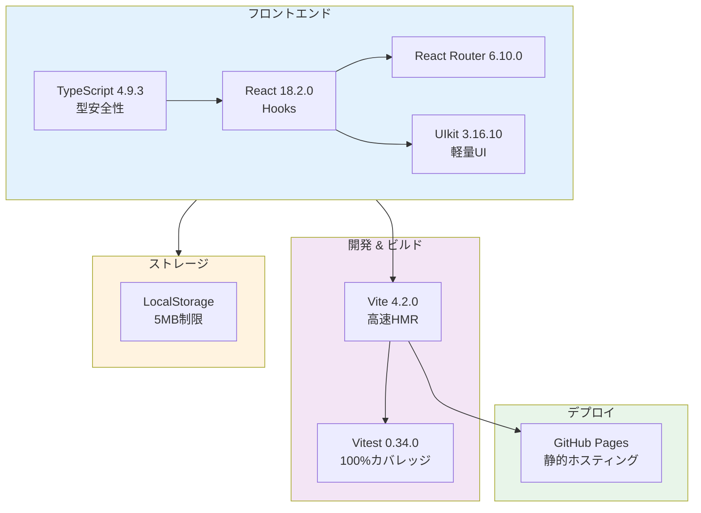

# 技術調査レポート: Todo App実装

**作成日**: 2025-11-13  
**プロジェクト**: Todo App - template-no-delete.tsx ベースアプリケーション  
**目的**: 実装計画（plan.md）で使用する技術選択の根拠とベストプラクティスを調査・文書化

---

## 関連ドキュメント

| ドキュメント | 参照先 | 関連セクション |
|------------|--------|-------------|
| 実装計画 | [plan.md](./plan.md) | 技術コンテキスト、憲法チェック |
| データモデル | [data-model.md](./data-model.md) | エンティティ定義、バリデーション |
| 開発ガイド | [quickstart.md](./quickstart.md) | 環境構築、TDDワークフロー |
| 機能仕様書 | [spec.md](../001-todo-app-spec/spec.md) | ユーザーストーリー、要件 |

---

## 調査概要

本調査では、以下の技術的意思決定について、選択理由、代替案、ベストプラクティスを文書化しました。

1. React 18.2.0 + Hooks（状態管理）
2. TypeScript 4.9.3（型安全性）
3. Vite 4.2.0（ビルドツール）
4. Vitest 0.34.0（テストフレームワーク）
5. LocalStorage（データ永続化）
6. UIkit 3.16.10（UIコンポーネント）
7. GitHub Pages（デプロイ）

---

## 1. React 18.2.0 + Hooks（状態管理）

### 決定内容
**選択**: React 18.2.0のHooksベースコンポーネント（useState、useEffect）で状態管理

### 選択理由
- **学習曲線**: クラスコンポーネントより簡潔で、初学者にとって理解しやすい
- **コード量削減**: Hooksにより、ライフサイクルメソッドを統合的に扱える
- **再利用性**: カスタムHooks作成により、ロジックを簡単に再利用できる
- **パフォーマンス**: React 18の並行レンダリング機能を活用可能
- **既存コード**: template-no-delete.tsxがHooksベースで実装済み

### 代替案の評価

| 代替案 | 評価 | 却下理由 |
|--------|------|---------|
| Redux | ❌ 不採用 | 小規模アプリには過剰。ボイラープレートコードが多すぎる |
| Zustand | △ 候補 | LocalStorageベースなので、グローバル状態管理は不要 |
| Recoil | △ 候補 | Metaの実験的ライブラリ。安定性の懸念あり |
| クラスコンポーネント | ❌ 不採用 | 現代のReact開発では非推奨。学習教材として不適切 |

### ベストプラクティス
1. **useState**: シンプルなローカル状態管理に使用
   ```typescript
   const [todos, setTodos] = useState<TodoItem[]>([]);
   const [filter, setFilter] = useState<FilterType>('all');
   ```

2. **useEffect**: LocalStorageの読み書きと同期
   ```typescript
   useEffect(() => {
     const saved = localStorage.getItem(`${pageName}-todos`);
     if (saved) setTodos(JSON.parse(saved));
   }, [pageName]);
   
   useEffect(() => {
     localStorage.setItem(`${pageName}-todos`, JSON.stringify(todos));
   }, [todos, pageName]);
   ```

3. **カスタムHooks**: LocalStorage操作を抽象化
   ```typescript
   function useLocalStorage<T>(key: string, initialValue: T) {
     const [value, setValue] = useState<T>(() => {
       const saved = localStorage.getItem(key);
       return saved ? JSON.parse(saved) : initialValue;
     });
     
     useEffect(() => {
       localStorage.setItem(key, JSON.stringify(value));
     }, [key, value]);
     
     return [value, setValue] as const;
   }
   ```

4. **セキュリティ**: XSS対策（dangerouslySetInnerHTML禁止）
   ```typescript
   // Good: Reactのデフォルトエスケープ
   function TaskItem({ todo }: { todo: TodoItem }) {
     return <span>{todo.text}</span>; // 自動エスケープ
   }
   
   // Bad: XSS脆弱性
   function TaskItem({ todo }: { todo: TodoItem }) {
     return <span dangerouslySetInnerHTML={{ __html: todo.text }} />; // 禁止
   }
   ```

5. **パフォーマンス**: useMemoで不要な再レンダリング防止
   ```typescript
   const filteredTodos = useMemo(() => {
     return todos.filter(todo => {
       if (filter === 'all') return true;
       if (filter === 'active') return !todo.completed;
       return todo.completed;
     });
   }, [todos, filter]);
   ```

---

## 2. TypeScript 4.9.3（型安全性）

### 決定内容
**選択**: TypeScript 4.9.3による完全な型付け

### 選択理由
- **エラー検出**: コンパイル時に型エラーを検出し、ランタイムエラーを削減
- **IDE サポート**: VSCodeの自動補完、リファクタリング支援が強力
- **ドキュメント性**: 型定義がコードのドキュメントとして機能
- **メンテナンス性**: 大規模化しても型システムが保守を支援
- **React推奨**: React公式も TypeScript使用を推奨

### 代替案の評価

| 代替案 | 評価 | 却下理由 |
|--------|------|---------|
| JavaScript（純粋） | ❌ 不採用 | 型安全性がなく、スケールしない。教育目的に不適 |
| Flow | ❌ 不採用 | TypeScriptに比べて採用率が低い。ツールサポート不足 |
| JSDoc型注釈 | △ 候補 | TypeScriptと比較して型チェックが弱い |

### ベストプラクティス
1. **厳格な型定義**: `tsconfig.json`で`strict: true`を設定
   ```json
   {
     "compilerOptions": {
       "strict": true,
       "noImplicitAny": true,
       "strictNullChecks": true
     }
   }
   ```

2. **インターフェース定義**: データモデルを明確に型付け
   ```typescript
   interface TodoItem {
     id: number;
     text: string;
     completed: boolean;
     createdAt: string;
   }
   
   type FilterType = 'all' | 'active' | 'completed';
   ```

3. **Generics活用**: 再利用可能な型安全関数
   ```typescript
   function filterByStatus<T extends { completed: boolean }>(
     items: T[],
     filter: FilterType
   ): T[] {
     if (filter === 'all') return items;
     if (filter === 'active') return items.filter(item => !item.completed);
     return items.filter(item => item.completed);
   }
   ```

---

## 3. Vite 4.2.0（ビルドツール）

### 決定内容
**選択**: Vite 4.2.0による開発サーバーとビルド

### 選択理由
- **高速起動**: ESモジュールベースで、サーバー起動が数秒
- **HMR**: Hot Module Replacementで変更が即座に反映
- **ビルドパフォーマンス**: Rollupベースで最適化されたプロダクションビルド
- **React公式推奨**: Create React Appの代替として推奨されている
- **設定シンプル**: 最小限の設定でTypeScript + Reactが動作

### 代替案の評価

| 代替案 | 評価 | 却下理由 |
|--------|------|---------|
| Webpack | ❌ 不採用 | 設定が複雑。起動・ビルドが遅い |
| Parcel | △ 候補 | Viteより機能が限定的。プラグインエコシステムが弱い |
| esbuild | ❌ 不採用 | 低レベルすぎて、React開発に直接使うには不便 |
| Create React App | ❌ 不採用 | メンテナンスモード。React公式も推奨せず |

### ベストプラクティス
1. **vite.config.ts設定**: GitHub Pages対応
   ```typescript
   import { defineConfig } from 'vite';
   import react from '@vitejs/plugin-react';
   
   export default defineConfig({
     plugins: [react()],
     server: { port: 1234 },
     base: '/todo-app/', // GitHub Pagesのリポジトリ名
     build: {
       outDir: 'dist',
       sourcemap: true
     }
   });
   ```

2. **開発サーバー最適化**: 依存関係のプリバンドル
   ```typescript
   optimizeDeps: {
     include: ['react', 'react-dom', 'react-router-dom']
   }
   ```

3. **環境変数**: `.env`ファイルで環境ごとに設定
   ```
   VITE_APP_NAME=TodoApp
   VITE_API_URL=http://localhost:3000 # 将来的なAPI連携用
   ```

---

## 4. Vitest 0.34.0（テストフレームワーク）

### 決定内容
**選択**: Vitest 0.34.0 + @testing-library/react 14.1.2

### 選択理由
- **Vite統合**: 設定を共有でき、一貫した環境
- **高速実行**: Viteの高速性をテストでも享受
- **Jest互換**: JestのAPIと互換性があり、移行が容易
- **ESM対応**: ネイティブESモジュールサポート
- **並列実行**: デフォルトで並列テスト実行

### 代替案の評価

| 代替案 | 評価 | 却下理由 |
|--------|------|---------|
| Jest | △ 候補 | 設定が複雑。ESM対応が不完全。Viteとの統合が難しい |
| Mocha + Chai | ❌ 不採用 | モダンな機能が不足。設定が煩雑 |
| Cypress (E2E) | △ 補完的 | E2Eテスト用。ユニット・統合テストには不向き |

### ベストプラクティス
1. **vitest.config.ts設定**: カバレッジ100%目標
   ```typescript
   import { defineConfig } from 'vitest/config';
   
   export default defineConfig({
     test: {
       globals: true,
       environment: 'happy-dom',
       setupFiles: './tests/setup.ts',
       coverage: {
         provider: 'v8',
         reporter: ['text', 'json', 'html'],
         lines: 100,
         functions: 100,
         branches: 100,
         statements: 100
       }
     }
   });
   ```

2. **Testing Library**: ユーザー視点のテスト
   ```typescript
   import { render, screen, fireEvent } from '@testing-library/react';
   
   test('タスク追加機能', () => {
     render(<TodoApp />);
     const input = screen.getByRole('textbox');
     const button = screen.getByRole('button', { name: /追加/ });
     
     fireEvent.change(input, { target: { value: 'テストタスク' } });
     fireEvent.click(button);
     
     expect(screen.getByText('テストタスク')).toBeInTheDocument();
   });
   ```

3. **テスト構造**: AAA パターン（Arrange-Act-Assert）
   ```typescript
   describe('TodoList', () => {
     it('should filter active tasks', () => {
       // Arrange: テスト準備
       const todos = [
         { id: 1, text: 'Task 1', completed: false },
         { id: 2, text: 'Task 2', completed: true }
       ];
       
       // Act: アクション実行
       const filtered = filterTodos(todos, 'active');
       
       // Assert: 検証
       expect(filtered).toHaveLength(1);
       expect(filtered[0].text).toBe('Task 1');
     });
   });
   ```

---

## 5. LocalStorage（データ永続化）

### 決定内容
**選択**: ブラウザのLocalStorage API

### 選択理由
- **シンプル**: 追加のバックエンドやデータベース不要
- **クライアントサイド完結**: GitHub Pagesの静的サイトで動作
- **同期API**: 非同期処理不要で実装が簡単
- **ブラウザサポート**: すべてのモダンブラウザで動作
- **教育目的**: ブラウザAPIを学ぶ良い機会

### 代替案の評価

| 代替案 | 評価 | 却下理由 |
|--------|------|---------|
| IndexedDB | △ 候補 | 非同期APIで複雑。5MBで十分な小規模アプリには過剰 |
| SessionStorage | ❌ 不採用 | タブを閉じるとデータが消える。永続化には不適 |
| Cookies | ❌ 不採用 | 容量制限（4KB）が厳しい。サーバー送信の無駄あり |
| Firebase | ❌ 不採用 | 外部依存。認証・課金の複雑さ。学習目的に過剰 |
| Supabase | ❌ 不採用 | 同上。バックエンド不要な設計と矛盾 |

### ベストプラクティス
1. **エラーハンドリング**: 容量超過対策
   ```typescript
   function saveToLocalStorage(key: string, data: any): boolean {
     try {
       localStorage.setItem(key, JSON.stringify(data));
       return true;
     } catch (e) {
       if (e instanceof DOMException && e.name === 'QuotaExceededError') {
         console.error('LocalStorage容量超過');
         // ユーザーに警告表示
       }
       return false;
     }
   }
   ```

2. **キー命名規則**: プレフィックスで名前空間分離
   ```typescript
   const STORAGE_PREFIX = 'todoapp_';
   const TODOS_KEY = (pageName: string) => `${STORAGE_PREFIX}${pageName}_todos`;
   const PAGE_INFO_KEY = `${STORAGE_PREFIX}page_info`;
   ```

3. **データ検証**: ロード時に型チェック
   ```typescript
   function loadTodos(key: string): TodoItem[] {
     const data = localStorage.getItem(key);
     if (!data) return [];
     
     try {
       const parsed = JSON.parse(data);
       if (!Array.isArray(parsed)) return [];
       
       return parsed.filter((item): item is TodoItem => 
         typeof item.id === 'number' &&
         typeof item.text === 'string' &&
         typeof item.completed === 'boolean'
       );
     } catch {
       return [];
     }
   }
   ```

---

## 6. UIkit 3.16.10（UIコンポーネント）

### 決定内容
**選択**: UIkit 3.16.10 CSSフレームワーク

### 選択理由
- **軽量**: 圧縮後約170KBで、BootstrapやMaterial-UIより小さい
- **日本語対応**: フォントレンダリングが日本語に適している
- **レスポンシブ**: モバイルファーストで設計済み
- **カスタマイズ性**: SASS変数で簡単にカスタマイズ可能
- **既存プロジェクト**: 既にUIkitを使用している

### 代替案の評価

| 代替案 | 評価 | 却下理由 |
|--------|------|---------|
| Material-UI | ❌ 不採用 | バンドルサイズが大きい（300KB+）。パフォーマンス目標に不適 |
| Bootstrap | ❌ 不採用 | jQueryの非推奨。Reactとの統合が不自然 |
| Tailwind CSS | △ 候補 | ユーティリティクラス多用でHTMLが肥大化。学習曲線あり |
| Ant Design | ❌ 不採用 | 中国語UIが主。日本語対応が不完全 |
| Chakra UI | △ 候補 | モダンだが、UIkitで十分な機能を実現可能 |

### ベストプラクティス
1. **CDN読み込み**: 開発時は高速化のためCDN使用
   ```html
   <link rel="stylesheet" href="https://cdn.jsdelivr.net/npm/uikit@3.16.10/dist/css/uikit.min.css" />
   <script src="https://cdn.jsdelivr.net/npm/uikit@3.16.10/dist/js/uikit.min.js"></script>
   ```

2. **Reactラッパー**: UIkitコンポーネントをReact化
   ```typescript
   import UIkit from 'uikit';
   
   export function Notification({ message }: { message: string }) {
     useEffect(() => {
       UIkit.notification(message, { status: 'success', pos: 'top-right' });
     }, [message]);
     
     return null;
   }
   ```

3. **アイコン使用**: UIkitアイコンで一貫性
   ```tsx
   <span uk-icon="icon: plus; ratio: 1.5" />
   <span uk-icon="icon: trash" />
   <span uk-icon="icon: check" />
   ```

---

## 7. GitHub Pages（デプロイ）

### 決定内容
**選択**: GitHub Pages静的サイトホスティング + gh-pages npmパッケージ

### 選択理由
- **無料**: パブリックリポジトリは完全無料
- **自動HTTPS**: Let's Encryptによる無料SSL証明書
- **カスタムドメイン**: 独自ドメイン対応可能
- **CI/CD統合**: GitHub Actionsとの連携が容易
- **学習目的**: Gitワークフローを学べる

### 代替案の評価

| 代替案 | 評価 | 却下理由 |
|--------|------|---------|
| Vercel | △ 候補 | 無料プランあり。ただしGitHub Pagesで十分 |
| Netlify | △ 候補 | 同上。追加機能不要 |
| AWS S3 + CloudFront | ❌ 不採用 | 設定が複雑。無料枠あるが課金リスク |
| Heroku | ❌ 不採用 | 無料プラン廃止。静的サイトには過剰 |

### ベストプラクティス
1. **gh-pagesパッケージ**: デプロイ自動化
   ```json
   {
     "scripts": {
       "predeploy": "npm run build",
       "deploy": "gh-pages -d dist"
     }
   }
   ```

2. **vite.config.ts**: ベースパス設定
   ```typescript
   export default defineConfig({
     base: '/todo-app/', // リポジトリ名と一致させる
   });
   ```

3. **404.html**: SPAルーティング対応
   ```html
   <!DOCTYPE html>
   <html>
     <head>
       <meta charset="utf-8">
       <script>
         // GitHub PagesでSPAルーティングを動作させる
         sessionStorage.redirect = location.href;
       </script>
       <meta http-equiv="refresh" content="0;URL='/todo-app/'"></meta>
     </head>
   </html>
   ```

---

## 技術選択決定マトリクス

以下の表は、7つの主要技術選択の決定理由を一覧化したものです。

| # | 技術領域 | 選択技術 | 主要な理由 | 却下した代替案 |
|---|---------|---------|-----------|-------------|
| 1 | 状態管理 | React 18.2.0 Hooks | 学習曲線が低い、既存コードベース | Redux（過剰）、Zustand（不要）、Recoil（不安定） |
| 2 | 型安全性 | TypeScript 4.9.3 | エラー検出、IDE サポート | JavaScript（型なし）、Flow（採用率低） |
| 3 | ビルド | Vite 4.2.0 | 高速起動、HMR、React推奨 | Webpack（複雑）、CRA（非推奨） |
| 4 | テスト | Vitest 0.34.0 | Vite統合、Jest互換、高速 | Jest（ESM不完全）、Mocha（古い） |
| 5 | 永続化 | LocalStorage | シンプル、サーバー不要 | IndexedDB（複雑）、Firebase（外部依存） |
| 6 | UI | UIkit 3.16.10 | 軽量（170KB）、日本語対応 | Material-UI（重い）、Bootstrap（jQuery依存） |
| 7 | デプロイ | GitHub Pages | 無料、自動HTTPS、Git統合 | Vercel（不要）、AWS S3（複雑） |

---

## 技術スタック概要図



---

## 未解決事項

現時点で未解決の技術的課題はありません。すべての主要技術選択について、十分な調査と代替案評価を完了しました。
