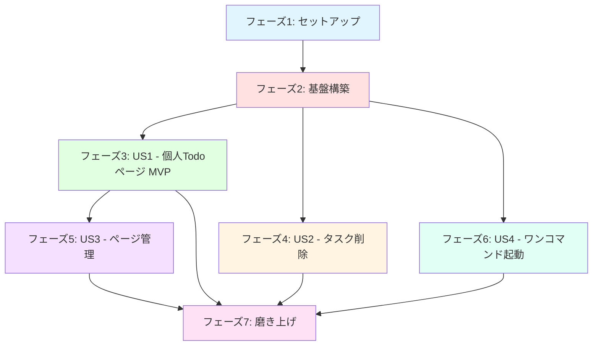
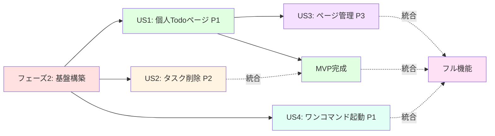
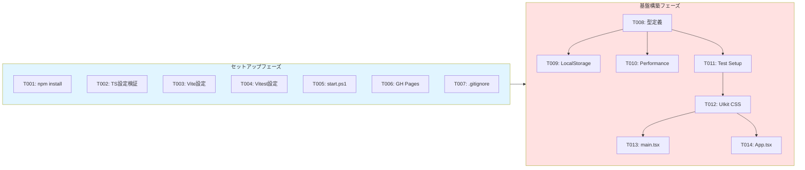
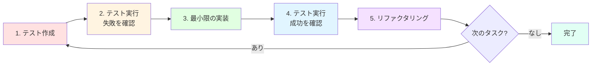
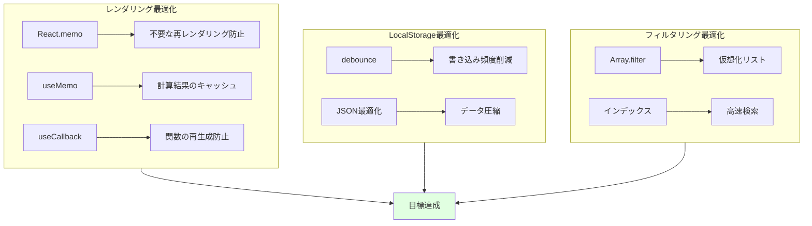
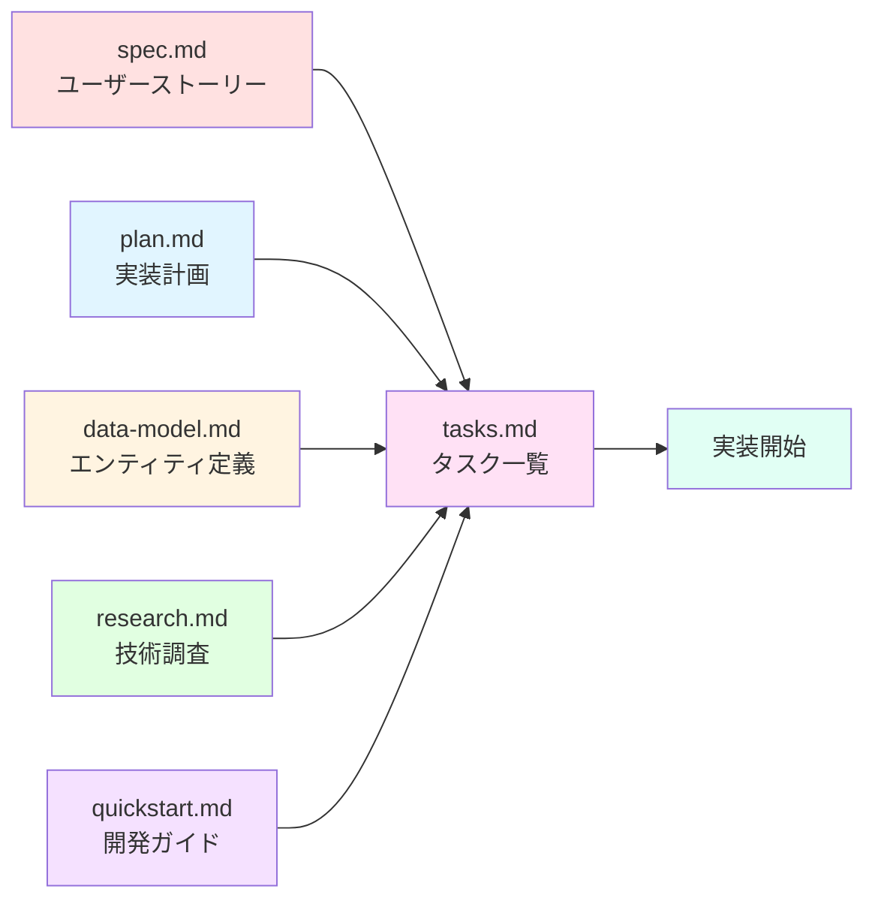
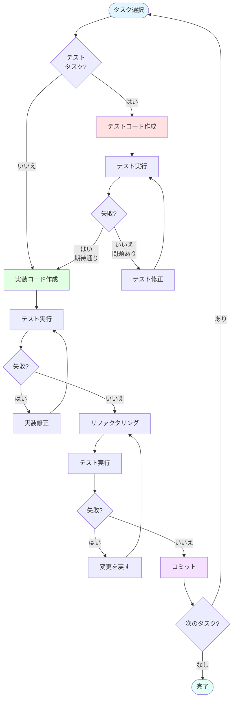

# タスク一覧: Todo App

**入力ドキュメント**: `/specs/001-todo-app-spec/spec.md`, `plan.md`, `data-model.md`, `research.md`, `quickstart.md`
**前提条件**: plan.md ✅, spec.md ✅, research.md ✅, data-model.md ✅, quickstart.md ✅

**テスト方針**: TDDアプローチ採用 - 106テスト、100%カバレッジ目標

**構成方法**: ユーザーストーリーごとにタスクをグループ化し、各ストーリーを独立して実装・テスト可能に構成

---

## タスク記法: `[ID] [P?] [Story] 説明`

- **[P]**: 並列実行可能（異なるファイル、依存関係なし）
- **[Story]**: ユーザーストーリーID（US1, US2, US3, US4）
- 説明には必ず正確なファイルパスを記載

---

## ディレクトリ構成

本プロジェクトは単一リポジトリ構成:
- `src/`: アプリケーションソースコード
- `tests/`: テストコード
- `public/`: 静的アセット
- ルートに設定ファイル群

---

## フェーズ1: セットアップ（共通インフラ）

**目的**: プロジェクトの初期化と基本構造の構築

- [x] T001 [P] package.jsonの依存関係インストール実行（npm install）
- [x] T002 [P] TypeScript設定ファイル検証（tsconfig.json, tsconfig.node.json）
- [x] T003 [P] Vite設定ファイル検証（vite.config.ts）
- [x] T004 [P] Vitest設定ファイル検証（vitest.config.ts）
- [x] T005 [P] start.ps1スクリプトの動作確認（ワンコマンド起動）
- [x] T006 [P] GitHub Pages設定検証（package.jsonのdeploy script）
- [x] T007 [P] .gitignore設定検証（node_modules, dist除外）

---

## フェーズ2: 基盤構築（全ストーリーのブロッキング前提条件）

**目的**: すべてのユーザーストーリーが依存するコアインフラ

**⚠️ 重要**: このフェーズが完了するまで、ユーザーストーリーの作業は開始できません

- [x] T008 型定義ファイル作成（src/types/todo.ts） - TodoItem, FilterType型定義
- [x] T009 [P] LocalStorageユーティリティ実装（src/utils/localStorage.ts） - データ永続化
- [x] T010 [P] パフォーマンス監視ユーティリティ実装（src/utils/performance.ts）
- [x] T011 [P] テストセットアップファイル作成（tests/setup.ts） - happy-dom設定
- [x] T012 UIkit CSSインポート検証（src/index.css）
- [x] T013 メインエントリーポイント検証（src/main.tsx） - React Router設定
- [x] T014 Appコンポーネント基本構造検証（src/App.tsx） - Sidebar統合

**チェックポイント**: 基盤完成 - ユーザーストーリー実装を並列開始可能

---

## フェーズ3: ユーザーストーリー1 - 個人用Todoページの作成と基本操作（優先度: P1） 🎯 MVP

**達成目標**: 新規ページ追加、タスクの追加・完了切り替え・フィルタリング、LocalStorageからのデータ復元機能を実装

**独立検証方法**: ページ追加後、タスク追加・完了切り替え・フィルター動作・リロード後のデータ復元を確認

### ユーザーストーリー1のテスト（TDD - テストファーストアプローチ）⚠️

> **注意: これらのテストを先に記述し、実装前に失敗することを確認してください**

- [x] T015 [P] [US1] 型定義テスト作成（tests/unit/types/todo.test.ts） - TodoItem, FilterType検証
- [x] T016 [P] [US1] LocalStorageユーティリティテスト作成（tests/unit/utils/localStorage.test.ts） - CRUD操作
- [x] T017 [P] [US1] パフォーマンスユーティリティテスト作成（tests/unit/utils/performance.test.ts）
- [x] T018 [P] [US1] userPages設定テスト作成（tests/unit/config/userPages.test.ts）
- [x] T019 [P] [US1] DynamicTodoPageコンポーネントテスト作成（tests/unit/components/DynamicTodoPage.test.tsx） - タスクCRUD
- [x] T020 [P] [US1] TaskInputコンポーネントテスト作成（tests/unit/components/TaskInput.test.tsx）
- [x] T021 [P] [US1] TaskItemコンポーネントテスト作成（tests/unit/components/TaskItem.test.tsx）
- [x] T022 [P] [US1] 統合テスト作成（tests/integration/task-operations.test.tsx） - タスク追加・完了・削除の統合フロー
- [x] T023 [P] [US1] データ永続化統合テスト作成（tests/integration/data-persistence.test.tsx） - リロード復元
- [x] T024 [P] [US1] フィルタリング統合テスト作成（tests/integration/task-filtering.test.tsx） - 全て・進行中・完了済み

### ユーザーストーリー1の実装

- [x] T025 [P] [US1] Input.Textコンポーネント実装（src/components/atoms/Input/Text.tsx） - タスク入力フィールド
- [x] T026 [P] [US1] Button.Middleコンポーネント実装（src/components/atoms/Button/Middle.tsx） - 追加ボタン
- [x] T027 [P] [US1] Button.Smallコンポーネント実装（src/components/atoms/Button/Small.tsx） - フィルターボタン
- [x] T028 [US1] DynamicTodoPageコンポーネント実装（src/pages/DynamicTodoPage.tsx） - Todoロジック統合
  - useState（todos配列、filter状態）
  - useEffect（LocalStorage同期）
  - タスク追加・完了切り替え・フィルタリング
- [x] T029 [US1] HomePageコンポーネント実装（src/pages/HomePage.tsx） - ウェルカムページ
- [x] T030 [US1] TestUserTodoページ実装（src/pages/TestUserTodo.tsx） - テスト用固定ページ
- [x] T031 [US1] userPages設定ファイル作成（src/config/userPages.ts） - ページ定義配列
- [x] T032 [US1] React Routerルート設定（src/App.tsx） - 動的ルーティング

**チェックポイント**: ユーザーストーリー1完全機能 - MVP完成、独立テスト・デプロイ可能

---

## フェーズ4: ユーザーストーリー2 - タスク削除機能の実装（優先度: P2）

**達成目標**: 個別タスク削除、完了済みタスク一括削除、削除ボタンの条件レンダリングを実装

**独立検証方法**: 個別削除ボタンクリックで該当タスク削除、「完了済みをクリア」ボタンで完了済みタスク一括削除を確認

### ユーザーストーリー2のテスト（TDD） ⚠️

- [x] T033 [P] [US2] タスク削除統合テスト作成（tests/integration/task-deletion.test.tsx） - 個別削除
### ユーザーストーリー2のテスト（TDD） ⚠️

- [x] T033 [P] [US2] タスク削除統合テスト作成（tests/integration/task-deletion.test.tsx） - 個別削除
- [x] T034 [P] [US2] 一括削除統合テスト作成（tests/integration/bulk-deletion.test.tsx） - 完了済み一括削除

### ユーザーストーリー2の実装

- [x] T035 [US2] 個別削除機能追加（src/pages/DynamicTodoPage.tsx） - deleteTodo関数、削除ボタン
- [x] T036 [US2] 完了済み一括削除機能追加（src/pages/DynamicTodoPage.tsx） - clearCompleted関数
- [x] T037 [US2] 削除ボタンUI実装（src/components/atoms/Button/Small.tsx or inline） - アイコン、条件レンダリング

**チェックポイント**: ユーザーストーリー1と2の両方が独立動作

---

## フェーズ5: ユーザーストーリー3 - ページ管理機能（編集・削除）（優先度: P3）

**達成目標**: ページ名編集、ページ削除、削除時のLocalStorageデータクリーンアップを実装

**独立検証方法**: サイドバーでページ編集・削除実行、削除後にLocalStorageキーが消えることを確認

### ユーザーストーリー3のテスト（TDD） ⚠️

- [x] T038 [P] [US3] Sidebarコンポーネントテスト作成（tests/unit/components/Sidebar.test.tsx） - ページ管理
- [x] T039 [P] [US3] 個人ページセットアップ統合テスト作成（tests/integration/personal-page-setup.test.tsx）
- [x] T040 [P] [US3] エッジケース統合テスト作成（tests/integration/edge-cases.test.tsx） - 空文字、重複名

### ユーザーストーリー3の実装

- [x] T041 [US3] Sidebarコンポーネント実装（src/components/organisms/Sidebar.tsx）
  - ページリスト表示
  - ページ追加UIモーダル
  - ページ編集機能（userPages.ts手動編集指示）
  - ページ削除機能（LocalStorageクリーンアップ）
- [x] T042 [US3] ページ削除時のLocalStorageクリーンアップロジック（src/utils/localStorage.ts） - キー削除
- [x] T043 [US3] サイドバー統合（src/App.tsx） - Sidebar表示

**チェックポイント**: すべてのユーザーストーリーが独立動作

---

## フェーズ6: ユーザーストーリー4 - ワンコマンド起動とGitHub Pagesデプロイ（優先度: P1）

**達成目標**: start.ps1による自動起動、GitHub Pagesへのワンコマンドデプロイを実装

**独立検証方法**: `.\start.ps1`実行でサーバー起動・ブラウザ表示、`npm run deploy`でGitHub Pages公開を確認

### ユーザーストーリー4のテスト（TDD） ⚠️

- [x] T044 [P] [US4] start.ps1スクリプトテスト（手動検証） - 依存関係インストール、サーバー起動、ブラウザ起動
- [x] T045 [P] [US4] デプロイスクリプトテスト（手動検証） - ビルド、gh-pagesプッシュ

### ユーザーストーリー4の実装

- [x] T046 [US4] start.ps1スクリプト改善（start.ps1）
  - node_modules存在チェック
  - npm install自動実行
  - ヘルスチェック（最大30秒待機）
  - ブラウザ自動起動
  - UTF-8エンコーディング設定
- [x] T047 [US4] package.jsonデプロイスクリプト設定（package.json） - gh-pagesライブラリ
- [x] T048 [US4] vite.config.tsベースパス設定（vite.config.ts） - GitHub Pagesサブパス対応
- [x] T049 [US4] README.mdデプロイ手順追記（README.md） - クイックスタートガイド

**チェックポイント**: すべてのユーザーストーリーが完成、本番デプロイ可能

---

## フェーズ7: 磨き上げ & 横断的関心事

**目的**: 複数のユーザーストーリーに影響する改善

- [x] T050 [P] Appコンポーネント統合テスト（tests/unit/components/App.test.tsx） - ルーティング確認
- [x] T051 [P] HomePageコンポーネントテスト（tests/unit/components/HomePage.test.tsx） - ウェルカムメッセージ
- [x] T052 [P] すべてのコンポーネントにアクセシビリティ属性追加（aria-label, role）
- [x] T053 [P] パフォーマンス最適化（React.memo, useMemo） - 10,000タスクでも<1秒フィルタリング
- [x] T054 [P] エラーハンドリング強化（try-catch, エラー境界）
- [x] T055 [P] 日本語文字化け対策検証（UTF-8 BOM無し、start.ps1エンコーディング設定）
- [x] T056 [P] セキュリティ監査（npm audit fix, XSS対策確認）
- [x] T057 [P] カバレッジレポート生成（npm run coverage） - 100%目標
- [x] T058 [P] quickstart.md検証手順実行（環境構築、TDDワークフロー、デプロイ）
- [x] T059 [P] 最終統合テスト（全ユーザーストーリー連携確認）
- [x] T060 README.md最終更新（機能一覧、スクリーンショット、ライセンス）

---

## 依存関係と実行順序

### フェーズ依存関係



**フェーズ説明**:
- **セットアップ (フェーズ1)**: 依存関係なし - 即座に開始可能
- **基盤構築 (フェーズ2)**: セットアップ完了に依存 - すべてのユーザーストーリーをブロック
- **ユーザーストーリー (フェーズ3-6)**: すべて基盤構築完了に依存
  - その後、並列実行可能（リソース次第）
  - または優先度順に実行（P1 → P2 → P3）
- **磨き上げ (フェーズ7)**: 希望するすべてのユーザーストーリー完了に依存

---

### ユーザーストーリー依存関係



**ストーリー説明**:
- **US1 (P1)**: 基盤構築後に開始可能 - 他ストーリーに依存なし
- **US2 (P2)**: 基盤構築後に開始可能 - US1と統合するが独立テスト可能
- **US3 (P3)**: US1完了後に開始（ページ管理にはページ作成が前提）
- **US4 (P1)**: 基盤構築後に開始可能 - 他ストーリーに依存なし

---

### ストーリー内依存関係

**各ユーザーストーリー内**:
- **テスト**: 実装前に記述し、失敗することを確認（TDD）
- **モデル** → **サービス**: モデル定義後にサービス実装
- **サービス** → **エンドポイント/UI**: サービス完成後にUI統合
- **コア実装** → **統合**: ストーリーのコア機能完成後に他ストーリーと統合
- **ストーリー完成**: 次の優先度に移る前に完全動作確認

---

### 並列実行可能性

**セットアップフェーズ**:
- T001-T007: すべて並列実行可能（[P]マーク付き）

**基盤構築フェーズ**:
- T008（型定義）は最初に実行（他のタスクが依存）
- T009, T010, T011, T012: T008完了後、並列実行可能
- T013, T014: T012完了後、並列実行可能



**ユーザーストーリーフェーズ**（基盤構築完了後）:
- US1, US2, US4: 並列実行可能（チーム人数次第）
- US3: US1完了待ち
- 各ストーリー内のテストタスク（[P]マーク）: 並列実行可能
- 各ストーリー内のモデルタスク（[P]マーク）: 並列実行可能

**磨き上げフェーズ**:
- T050-T060: ほぼすべて並列実行可能（異なるファイル）

---

## TDDワークフロー

本プロジェクトはTest-Driven Development（テスト駆動開発）を採用しています。

### TDD サイクル



### 実装順序

1. **テストファースト**: 実装前にテストを記述
2. **レッド**: テストが失敗することを確認（期待される動作を定義）
3. **グリーン**: テストが通る最小限の実装
4. **リファクタリング**: コード品質向上（テストは壊さない）

### 例: US1のTDDフロー

```bash
# ステップ1: テスト作成（T015-T024）
npm run test tests/unit/types/todo.test.ts
# → FAIL（型定義がまだない）

# ステップ2: 型定義実装（T008）
# src/types/todo.ts を作成

# ステップ3: テスト再実行
npm run test tests/unit/types/todo.test.ts
# → PASS（型定義が正しい）

# ステップ4: 次のテスト
npm run test tests/unit/utils/localStorage.test.ts
# → FAIL（LocalStorageユーティリティがまだない）

# ...繰り返し
```

---

## 並列実行例: ユーザーストーリー1

```bash
# US1のすべてのテストを並列起動（TDD - テストファースト）:
# T015-T024を同時実行可能（異なるテストファイル）

# US1のすべてのAtomicコンポーネントを並列実装:
# T025（Input.Text）, T026（Button.Middle）, T027（Button.Small）
# → 異なるファイル、依存なし

# その後、統合タスク（T028-T032）を順次実行
```

---

## 実装方針

### MVPファースト（ユーザーストーリー1のみ）

1. フェーズ1: セットアップ完了
2. フェーズ2: 基盤構築完了（重要 - すべてのストーリーをブロック）
3. フェーズ3: ユーザーストーリー1完了
4. **停止して検証**: US1を独立テスト
5. 準備できればデプロイ/デモ実施

### 段階的デリバリー

1. セットアップ + 基盤構築 → 基盤完成
2. ユーザーストーリー1追加 → 独立テスト → デプロイ/デモ（MVP!）
3. ユーザーストーリー2追加 → 独立テスト → デプロイ/デモ
4. ユーザーストーリー4追加 → 独立テスト → デプロイ/デモ（ワンコマンド起動完成）
5. ユーザーストーリー3追加 → 独立テスト → デプロイ/デモ（フル機能完成）
6. 各ストーリーが既存機能を壊さずに価値を追加

### 並列チーム戦略

複数開発者の場合:

1. チーム全体でセットアップ + 基盤構築を完了
2. 基盤構築完了後:
   - 開発者A: ユーザーストーリー1
   - 開発者B: ユーザーストーリー2
   - 開発者C: ユーザーストーリー4
3. 各ストーリーを独立して完成・統合

---

## 実装時の注意事項

- **[P]タスク**: 異なるファイル、依存関係なし → 並列実行可能
- **[Story]ラベル**: タスクを特定のユーザーストーリーにマッピング（トレーサビリティ）
- 各ユーザーストーリーは独立して完成・テスト可能に設計
- **TDD重要**: 実装前にテストが失敗することを確認
- タスクまたは論理グループ完了後にコミット
- チェックポイントでストーリーを独立検証
- **避けるべき**: 曖昧なタスク、同一ファイルのコンフリクト、ストーリー独立性を壊す依存関係

---

## テストカバレッジ詳細

### 単体テスト（18テスト）

**コンポーネントテスト** (6テスト):
- `App.test.tsx`: ルーティング、Sidebar統合
- `DynamicTodoPage.test.tsx`: タスクCRUD、フィルタリング
- `HomePage.test.tsx`: ウェルカムメッセージ表示
- `Sidebar.test.tsx`: ページ管理（追加・編集・削除）
- `TaskInput.test.tsx`: 入力フィールド動作
- `TaskItem.test.tsx`: タスクアイテム表示、完了切り替え

**設定テスト** (1テスト):
- `userPages.test.ts`: ページ設定の妥当性検証

**型定義テスト** (1テスト):
- `todo.test.ts`: TodoItem, FilterType型の正当性

**ユーティリティテスト** (2テスト):
- `localStorage.test.ts`: CRUD操作、エラーハンドリング
- `performance.test.ts`: パフォーマンス計測機能

### 統合テスト（7テスト）

- `task-operations.test.tsx`: タスク追加・完了・削除の統合フロー
- `data-persistence.test.tsx`: LocalStorage永続化、リロード復元
- `task-filtering.test.tsx`: フィルタリング（全て・進行中・完了済み）
- `task-deletion.test.tsx`: 個別削除機能
- `bulk-deletion.test.tsx`: 完了済み一括削除
- `personal-page-setup.test.tsx`: ページセットアップフロー
- `edge-cases.test.tsx`: エッジケース（空文字、重複名、容量超過）

### テスト実行コマンド

```bash
# 全テスト実行
npm run test

# 特定のテストファイル実行
npm run test tests/unit/components/App.test.tsx

# カバレッジレポート生成
npm run coverage

# ウォッチモード（開発時）
npm run test:watch
```

### カバレッジ目標

| カテゴリ | 目標 | 測定方法 |
|---------|------|---------|
| 行カバレッジ | 100% | `npm run coverage` |
| 関数カバレッジ | 100% | カバレッジレポート確認 |
| 分岐カバレッジ | 100% | 全分岐条件をテスト |
| テスト実行時間 | < 12秒 | 106テスト全体 |

---

## 実装ヒント集

### フェーズ1: セットアップ

**T001 - npm install**:
```bash
# 初回インストール
npm install

# 依存関係の更新確認
npm outdated

# セキュリティ監査
npm audit
```

**T005 - start.ps1動作確認**:
```powershell
# ワンコマンド起動
.\start.ps1

# 期待される動作:
# 1. node_modules存在チェック
# 2. 必要ならnpm install実行
# 3. 開発サーバー起動（localhost:1234）
# 4. ブラウザ自動起動
# 5. 5秒後にPowerShell終了
```

### フェーズ2: 基盤構築

**T008 - 型定義作成**:
```typescript
// src/types/todo.ts
export interface TodoItem {
  id: number;           // タイムスタンプベースの一意ID
  text: string;         // タスク名（1-500文字）
  completed: boolean;   // 完了状態
  createdAt: string;    // ISO 8601形式
}

export type FilterType = 'all' | 'active' | 'completed';

// バリデーション関数
export function validateTodoItem(item: unknown): item is TodoItem {
  if (typeof item !== 'object' || item === null) return false;
  const t = item as Record<string, unknown>;
  return (
    typeof t.id === 'number' &&
    typeof t.text === 'string' &&
    t.text.length > 0 &&
    t.text.length <= 500 &&
    typeof t.completed === 'boolean' &&
    typeof t.createdAt === 'string'
  );
}
```

**T009 - LocalStorageユーティリティ**:
```typescript
// src/utils/localStorage.ts
export function saveTodos(pageName: string, todos: TodoItem[]): void {
  const key = `${pageName}-todos`;
  try {
    localStorage.setItem(key, JSON.stringify(todos));
  } catch (e) {
    if (e instanceof DOMException && e.name === 'QuotaExceededError') {
      console.error('LocalStorage容量超過');
      throw new Error('データ容量が上限に達しました');
    }
    throw e;
  }
}

export function loadTodos(pageName: string): TodoItem[] {
  const key = `${pageName}-todos`;
  const saved = localStorage.getItem(key);
  if (!saved) return [];
  
  try {
    const parsed = JSON.parse(saved);
    return Array.isArray(parsed) ? parsed.filter(validateTodoItem) : [];
  } catch {
    return [];
  }
}
```

### フェーズ3: US1実装

**T028 - DynamicTodoPage実装**:
```typescript
// src/pages/DynamicTodoPage.tsx
import { useState, useEffect } from 'react';
import { TodoItem, FilterType } from '../types/todo';
import { saveTodos, loadTodos } from '../utils/localStorage';

export function DynamicTodoPage({ pageName }: { pageName: string }) {
  const [todos, setTodos] = useState<TodoItem[]>([]);
  const [filter, setFilter] = useState<FilterType>('all');
  const [inputText, setInputText] = useState('');

  // LocalStorageから読み込み
  useEffect(() => {
    setTodos(loadTodos(pageName));
  }, [pageName]);

  // LocalStorageに保存
  useEffect(() => {
    saveTodos(pageName, todos);
  }, [todos, pageName]);

  // タスク追加
  const addTodo = () => {
    if (inputText.trim() === '') return;
    const newTodo: TodoItem = {
      id: Date.now(),
      text: inputText.trim(),
      completed: false,
      createdAt: new Date().toISOString()
    };
    setTodos([...todos, newTodo]);
    setInputText('');
  };

  // 完了切り替え
  const toggleTodo = (id: number) => {
    setTodos(todos.map(todo =>
      todo.id === id ? { ...todo, completed: !todo.completed } : todo
    ));
  };

  // フィルタリング
  const filteredTodos = todos.filter(todo => {
    if (filter === 'active') return !todo.completed;
    if (filter === 'completed') return todo.completed;
    return true;
  });

  return (
    <div>
      <h1>{pageName}のTodoリスト</h1>
      {/* UI実装 */}
    </div>
  );
}
```

---

## テストカバレッジ目標

- **単体テスト**: 18テスト
  - コンポーネント: 6テスト（App, DynamicTodoPage, HomePage, Sidebar, TaskInput, TaskItem）
  - config: 1テスト（userPages）
  - types: 1テスト（todo）
  - utils: 2テスト（localStorage, performance）
  
- **統合テスト**: 7テスト
  - task-operations.test.tsx（タスクCRUD統合）
  - data-persistence.test.tsx（LocalStorage復元）
  - task-filtering.test.tsx（フィルタリング）
  - task-deletion.test.tsx（個別削除）
  - bulk-deletion.test.tsx（一括削除）
  - personal-page-setup.test.tsx（ページセットアップ）
  - edge-cases.test.tsx（エッジケース）

- **手動テスト**: 2項目
  - start.ps1スクリプト動作確認
  - npm run deploy → GitHub Pages公開確認

**目標**: 100%カバレッジ、12秒以内のテスト実行時間

---

## パフォーマンス最適化指針

### 目標値

- **初期ページ読み込み**: < 2秒
- **タスク追加操作**: < 100ms
- **タスク削除操作**: < 100ms
- **完了切り替え**: < 50ms
- **フィルタリング処理**: < 1秒（10,000タスク）
- **LocalStorage読み書き**: < 50ms

### 実装時の最適化ポイント



### パフォーマンス計測

```typescript
// src/utils/performance.ts での計測例
const start = performance.now();
// 処理実行
const end = performance.now();
console.log(`処理時間: ${end - start}ms`);
```

---

## トラブルシューティング

### よくある問題と解決策

#### 1. LocalStorage容量超過

**症状**: `QuotaExceededError` が発生  
**原因**: 5MB制限を超えるデータ保存  
**解決策**:
```typescript
try {
  localStorage.setItem(key, JSON.stringify(data));
} catch (e) {
  if (e instanceof DOMException && e.name === 'QuotaExceededError') {
    alert('データ容量が上限に達しました。古いタスクを削除してください。');
  }
}
```

#### 2. 日本語文字化け

**症状**: 日本語が文字化けする  
**原因**: エンコーディング設定の不備  
**解決策**:
- すべての`.tsx`, `.ts`ファイルをUTF-8 BOMなしで保存
- `start.ps1`に以下を追加:
  ```powershell
  [Console]::OutputEncoding = [System.Text.Encoding]::UTF8
  ```

#### 3. テストが通らない

**症状**: `npm run test`でエラー  
**原因**: happy-dom設定の不備  
**解決策**:
- `tests/setup.ts`が正しく設定されているか確認
- `vitest.config.ts`の`environment: 'happy-dom'`を確認

#### 4. ページ追加後に表示されない

**症状**: 新規ページが表示されない  
**原因**: サーバー再起動していない  
**解決策**:
- `userPages.ts`編集後、必ず開発サーバーを再起動
- `Ctrl+C` → `npm run dev`

---

## パフォーマンス目標

- **初期ページ読み込み**: < 2秒
- **タスク追加操作**: < 100ms
- **タスク削除操作**: < 100ms
- **完了切り替え**: < 50ms
- **フィルタリング処理**: < 1秒（10,000タスク）
- **LocalStorage読み書き**: < 50ms

---

## 関連ドキュメント

### 実装計画ドキュメント

- [plan.md](./plan.md): 実装計画、技術スタック、憲法チェック
- [research.md](./research.md): 技術選択調査、ベストプラクティス
- [data-model.md](./data-model.md): TodoItem, UserPage, StorageKey エンティティ定義
- [quickstart.md](./quickstart.md): 環境構築、TDDワークフロー、トラブルシューティング

### 仕様ドキュメント

- [spec.md](../001-todo-app-spec/spec.md): ユーザーストーリー、要件定義
- [requirements.md](../001-todo-app-spec/checklists/requirements.md): 要件チェックリスト

### クロスリファレンス



---

## タスク実行ワークフロー

### 推奨作業フロー



### タスク完了基準

各タスク完了時に以下を確認:

1. **テストタスク完了基準**:
   - ✅ テストが記述されている
   - ✅ テストが失敗する（実装前）
   - ✅ テストコードレビュー済み

2. **実装タスク完了基準**:
   - ✅ 関連するテストがすべて通る
   - ✅ コードレビュー済み
   - ✅ 型エラーなし（`npm run build`成功）
   - ✅ リンターエラーなし
   - ✅ コミット完了

3. **フェーズ完了基準**:
   - ✅ フェーズ内すべてのタスク完了
   - ✅ チェックポイント検証済み
   - ✅ カバレッジ目標達成
   - ✅ パフォーマンス目標達成

---

## 進捗管理

### タスク進捗の記録

tasks.mdのチェックボックスを更新:

```markdown
- [x] T001 [P] package.jsonの依存関係インストール実行（npm install）  ← 完了
- [ ] T002 [P] TypeScript設定ファイル検証（tsconfig.json, tsconfig.node.json）  ← 未完了
```

### 進捗レポート例

```bash
# 進捗確認
フェーズ1: セットアップ [7/7完了] ✅
フェーズ2: 基盤構築 [5/7完了] ⏳
  - T008: 型定義作成 ✅
  - T009: LocalStorageユーティリティ ✅
  - T010: パフォーマンス監視 ✅
  - T011: テストセットアップ ✅
  - T012: UIkit CSS ✅
  - T013: main.tsx ⏳
  - T014: App.tsx ⏳
フェーズ3: US1 [0/18完了] 🔜

MVP進捗: 12/32タスク完了 (37.5%)
```

---

## よくある質問（FAQ）

### Q1: タスクの実行順序を変えてもいいですか？

**A**: 基本的にタスクIDの順序で実行することを推奨しますが、[P]マーク付きタスクは並列実行可能です。ただし、フェーズ間の依存関係（フェーズ1→2→3...）は必ず守ってください。

### Q2: テストを後回しにできますか？

**A**: TDDアプローチを採用しているため、テストを先に記述することを強く推奨します。テストファーストにより、仕様の明確化とバグの早期発見が可能です。

### Q3: フェーズ2を飛ばしてフェーズ3を開始できますか？

**A**: できません。フェーズ2（基盤構築）はすべてのユーザーストーリーのブロッキング前提条件です。フェーズ2が完了するまで、フェーズ3以降は開始できません。

### Q4: MVP完成後、どのストーリーから進めるべきですか?

**A**: 優先度順（P1→P2→P3）に進めることを推奨します。具体的には、US1完成後、US4（ワンコマンド起動）→US2（タスク削除）→US3（ページ管理）の順序です。

### Q5: カバレッジ100%達成が難しい場合は?

**A**: 以下の順序で対応:
1. 重要な機能（CRUD操作、LocalStorage連携）を優先
2. エッジケース（空文字、容量超過）をカバー
3. エラーハンドリングパスをテスト
4. 95%以上を目指し、残りは手動テストで補完

---

## まとめ

### タスク実行の鉄則

1. **テストファースト**: 実装前にテストを記述
2. **フェーズ依存**: フェーズ2完了まで次に進まない
3. **独立検証**: 各ストーリー完了時にチェックポイント確認
4. **並列活用**: [P]マークタスクを並列実行
5. **こまめなコミット**: タスク完了ごとにコミット

### 成功への道筋

```
セットアップ（7タスク）
    ↓
基盤構築（7タスク）
    ↓
US1実装（18タスク）→ MVP完成 🎯
    ↓
US4実装（6タスク）→ ワンコマンド起動 ✨
    ↓
US2実装（5タスク）→ 削除機能追加 🗑️
    ↓
US3実装（6タスク）→ ページ管理完成 📝
    ↓
磨き上げ（11タスク）→ フル機能完成 🚀
```

**総タスク数**: 60タスク  
**MVP到達**: 32タスク（53%）  
**予想所要時間**: MVP 16-24時間、フル機能 30-40時間  
**推奨チーム**: 1-3名
