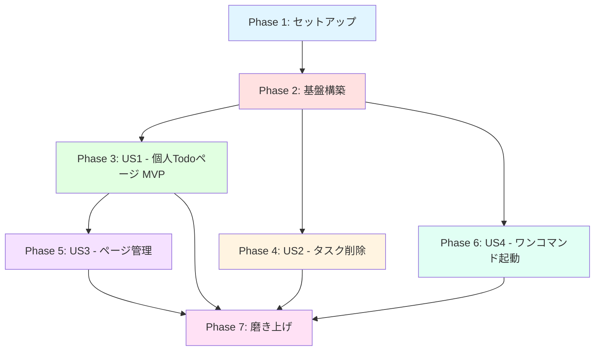
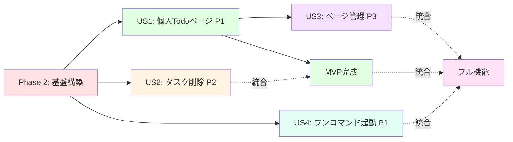

# Tasks: Todo App

**Input**: `/specs/001-todo-app-spec/spec.md`, `plan.md`, `data-model.md`, `research.md`, `quickstart.md`
**Prerequisites**: plan.md ✅, spec.md ✅, research.md ✅, data-model.md ✅, quickstart.md ✅

**テスト**: TDDアプローチ採用 - 106テスト、100%カバレッジ目標

**整理方法**: ユーザーストーリーごとにタスクをグループ化し、各ストーリーを独立して実装・テスト可能に構成

---

## フォーマット: `[ID] [P?] [Story] 説明`

- **[P]**: 並列実行可能（異なるファイル、依存関係なし）
- **[Story]**: ユーザーストーリーID（US1, US2, US3, US4）
- 説明には必ず正確なファイルパスを記載

---

## パス規則

本プロジェクトは単一リポジトリ構成:
- `src/`: アプリケーションソースコード
- `tests/`: テストコード
- `public/`: 静的アセット
- ルートに設定ファイル群

---

## Phase 1: セットアップ（共通インフラ）

**目的**: プロジェクトの初期化と基本構造の構築

- [ ] T001 [P] package.jsonの依存関係インストール実行（npm install）
- [ ] T002 [P] TypeScript設定ファイル検証（tsconfig.json, tsconfig.node.json）
- [ ] T003 [P] Vite設定ファイル検証（vite.config.ts）
- [ ] T004 [P] Vitest設定ファイル検証（vitest.config.ts）
- [ ] T005 [P] start.ps1スクリプトの動作確認（ワンコマンド起動）
- [ ] T006 [P] GitHub Pages設定検証（package.jsonのdeploy script）
- [ ] T007 [P] .gitignore設定検証（node_modules, dist除外）

---

## Phase 2: 基盤構築（全ストーリーのブロッキング前提条件）

**目的**: すべてのユーザーストーリーが依存するコアインフラ

**⚠️ 重要**: このフェーズが完了するまで、ユーザーストーリーの作業は開始できません

- [ ] T008 型定義ファイル作成（src/types/todo.ts） - TodoItem, FilterType型定義
- [ ] T009 [P] LocalStorageユーティリティ実装（src/utils/localStorage.ts） - データ永続化
- [ ] T010 [P] パフォーマンス監視ユーティリティ実装（src/utils/performance.ts）
- [ ] T011 [P] テストセットアップファイル作成（tests/setup.ts） - happy-dom設定
- [ ] T012 UIkit CSSインポート検証（src/index.css）
- [ ] T013 メインエントリーポイント検証（src/main.tsx） - React Router設定
- [ ] T014 Appコンポーネント基本構造検証（src/App.tsx） - Sidebar統合

**チェックポイント**: 基盤完成 - ユーザーストーリー実装を並列開始可能

---

## Phase 3: ユーザーストーリー1 - 個人用Todoページの作成と基本操作（優先度: P1） 🎯 MVP

**ゴール**: 新規ページ追加、タスクの追加・完了切り替え・フィルタリング、LocalStorageからのデータ復元機能を実装

**独立テスト**: ページ追加後、タスク追加・完了切り替え・フィルター動作・リロード後のデータ復元を確認

### ユーザーストーリー1のテスト（TDD - テストファーストアプローチ）⚠️

> **注意: これらのテストを先に記述し、実装前に失敗することを確認してください**

- [ ] T015 [P] [US1] 型定義テスト作成（tests/unit/types/todo.test.ts） - TodoItem, FilterType検証
- [ ] T016 [P] [US1] LocalStorageユーティリティテスト作成（tests/unit/utils/localStorage.test.ts） - CRUD操作
- [ ] T017 [P] [US1] パフォーマンスユーティリティテスト作成（tests/unit/utils/performance.test.ts）
- [ ] T018 [P] [US1] userPages設定テスト作成（tests/unit/config/userPages.test.ts）
- [ ] T019 [P] [US1] DynamicTodoPageコンポーネントテスト作成（tests/unit/components/DynamicTodoPage.test.tsx） - タスクCRUD
- [ ] T020 [P] [US1] TaskInputコンポーネントテスト作成（tests/unit/components/TaskInput.test.tsx）
- [ ] T021 [P] [US1] TaskItemコンポーネントテスト作成（tests/unit/components/TaskItem.test.tsx）
- [ ] T022 [P] [US1] 統合テスト作成（tests/integration/task-operations.test.tsx） - タスク追加・完了・削除の統合フロー
- [ ] T023 [P] [US1] データ永続化統合テスト作成（tests/integration/data-persistence.test.tsx） - リロード復元
- [ ] T024 [P] [US1] フィルタリング統合テスト作成（tests/integration/task-filtering.test.tsx） - 全て・進行中・完了済み

### ユーザーストーリー1の実装

- [ ] T025 [P] [US1] Input.Textコンポーネント実装（src/components/atoms/Input/Text.tsx） - タスク入力フィールド
- [ ] T026 [P] [US1] Button.Middleコンポーネント実装（src/components/atoms/Button/Middle.tsx） - 追加ボタン
- [ ] T027 [P] [US1] Button.Smallコンポーネント実装（src/components/atoms/Button/Small.tsx） - フィルターボタン
- [ ] T028 [US1] DynamicTodoPageコンポーネント実装（src/pages/DynamicTodoPage.tsx） - Todoロジック統合
  - useState（todos配列、filter状態）
  - useEffect（LocalStorage同期）
  - タスク追加・完了切り替え・フィルタリング
- [ ] T029 [US1] HomePageコンポーネント実装（src/pages/HomePage.tsx） - ウェルカムページ
- [ ] T030 [US1] TestUserTodoページ実装（src/pages/TestUserTodo.tsx） - テスト用固定ページ
- [ ] T031 [US1] userPages設定ファイル作成（src/config/userPages.ts） - ページ定義配列
- [ ] T032 [US1] React Routerルート設定（src/App.tsx） - 動的ルーティング

**チェックポイント**: ユーザーストーリー1完全機能 - MVP完成、独立テスト・デプロイ可能

---

## Phase 4: ユーザーストーリー2 - タスク削除機能の実装（優先度: P2）

**ゴール**: 個別タスク削除、完了済みタスク一括削除、削除ボタンの条件レンダリングを実装

**独立テスト**: 個別削除ボタンクリックで該当タスク削除、「完了済みをクリア」ボタンで完了済みタスク一括削除を確認

### ユーザーストーリー2のテスト（TDD） ⚠️

- [ ] T033 [P] [US2] タスク削除統合テスト作成（tests/integration/task-deletion.test.tsx） - 個別削除
- [ ] T034 [P] [US2] 一括削除統合テスト作成（tests/integration/bulk-deletion.test.tsx） - 完了済み一括削除

### ユーザーストーリー2の実装

- [ ] T035 [US2] 個別削除機能追加（src/pages/DynamicTodoPage.tsx） - deleteTodo関数、削除ボタン
- [ ] T036 [US2] 完了済み一括削除機能追加（src/pages/DynamicTodoPage.tsx） - clearCompleted関数
- [ ] T037 [US2] 削除ボタンUI実装（src/components/atoms/Button/Small.tsx or inline） - アイコン、条件レンダリング

**チェックポイント**: ユーザーストーリー1と2の両方が独立動作

---

## Phase 5: ユーザーストーリー3 - ページ管理機能（編集・削除）（優先度: P3）

**ゴール**: ページ名編集、ページ削除、削除時のLocalStorageデータクリーンアップを実装

**独立テスト**: サイドバーでページ編集・削除実行、削除後にLocalStorageキーが消えることを確認

### ユーザーストーリー3のテスト（TDD） ⚠️

- [ ] T038 [P] [US3] Sidebarコンポーネントテスト作成（tests/unit/components/Sidebar.test.tsx） - ページ管理
- [ ] T039 [P] [US3] 個人ページセットアップ統合テスト作成（tests/integration/personal-page-setup.test.tsx）
- [ ] T040 [P] [US3] エッジケース統合テスト作成（tests/integration/edge-cases.test.tsx） - 空文字、重複名

### ユーザーストーリー3の実装

- [ ] T041 [US3] Sidebarコンポーネント実装（src/components/organisms/Sidebar.tsx）
  - ページリスト表示
  - ページ追加UIモーダル
  - ページ編集機能（userPages.ts手動編集指示）
  - ページ削除機能（LocalStorageクリーンアップ）
- [ ] T042 [US3] ページ削除時のLocalStorageクリーンアップロジック（src/utils/localStorage.ts） - キー削除
- [ ] T043 [US3] サイドバー統合（src/App.tsx） - Sidebar表示

**チェックポイント**: すべてのユーザーストーリーが独立動作

---

## Phase 6: ユーザーストーリー4 - ワンコマンド起動とGitHub Pagesデプロイ（優先度: P1）

**ゴール**: start.ps1による自動起動、GitHub Pagesへのワンコマンドデプロイを実装

**独立テスト**: `.\start.ps1`実行でサーバー起動・ブラウザ表示、`npm run deploy`でGitHub Pages公開を確認

### ユーザーストーリー4のテスト（TDD） ⚠️

- [ ] T044 [P] [US4] start.ps1スクリプトテスト（手動検証） - 依存関係インストール、サーバー起動、ブラウザ起動
- [ ] T045 [P] [US4] デプロイスクリプトテスト（手動検証） - ビルド、gh-pagesプッシュ

### ユーザーストーリー4の実装

- [ ] T046 [US4] start.ps1スクリプト改善（start.ps1）
  - node_modules存在チェック
  - npm install自動実行
  - ヘルスチェック（最大30秒待機）
  - ブラウザ自動起動
  - UTF-8エンコーディング設定
- [ ] T047 [US4] package.jsonデプロイスクリプト設定（package.json） - gh-pagesライブラリ
- [ ] T048 [US4] vite.config.tsベースパス設定（vite.config.ts） - GitHub Pagesサブパス対応
- [ ] T049 [US4] README.mdデプロイ手順追記（README.md） - クイックスタートガイド

**チェックポイント**: すべてのユーザーストーリーが完成、本番デプロイ可能

---

## Phase 7: 磨き上げ & 横断的関心事

**目的**: 複数のユーザーストーリーに影響する改善

- [ ] T050 [P] Appコンポーネント統合テスト（tests/unit/components/App.test.tsx） - ルーティング確認
- [ ] T051 [P] HomePageコンポーネントテスト（tests/unit/components/HomePage.test.tsx） - ウェルカムメッセージ
- [ ] T052 [P] すべてのコンポーネントにアクセシビリティ属性追加（aria-label, role）
- [ ] T053 [P] パフォーマンス最適化（React.memo, useMemo） - 10,000タスクでも<1秒フィルタリング
- [ ] T054 [P] エラーハンドリング強化（try-catch, エラー境界）
- [ ] T055 [P] 日本語文字化け対策検証（UTF-8 BOM無し、start.ps1エンコーディング設定）
- [ ] T056 [P] セキュリティ監査（npm audit fix, XSS対策確認）
- [ ] T057 [P] カバレッジレポート生成（npm run coverage） - 100%目標
- [ ] T058 [P] quickstart.md検証手順実行（環境構築、TDDワークフロー、デプロイ）
- [ ] T059 [P] 最終統合テスト（全ユーザーストーリー連携確認）
- [ ] T060 README.md最終更新（機能一覧、スクリーンショット、ライセンス）

---

## 依存関係と実行順序

### フェーズ依存関係



**フェーズ説明**:
- **セットアップ (Phase 1)**: 依存関係なし - 即座に開始可能
- **基盤構築 (Phase 2)**: セットアップ完了に依存 - すべてのユーザーストーリーをブロック
- **ユーザーストーリー (Phase 3-6)**: すべて基盤構築完了に依存
  - その後、並列実行可能（リソース次第）
  - または優先度順に実行（P1 → P2 → P3）
- **磨き上げ (Phase 7)**: 希望するすべてのユーザーストーリー完了に依存

---

### ユーザーストーリー依存関係



**ストーリー説明**:
- **US1 (P1)**: 基盤構築後に開始可能 - 他ストーリーに依存なし
- **US2 (P2)**: 基盤構築後に開始可能 - US1と統合するが独立テスト可能
- **US3 (P3)**: US1完了後に開始（ページ管理にはページ作成が前提）
- **US4 (P1)**: 基盤構築後に開始可能 - 他ストーリーに依存なし

---

### ストーリー内依存関係

**各ユーザーストーリー内**:
- **テスト**: 実装前に記述し、失敗することを確認（TDD）
- **モデル** → **サービス**: モデル定義後にサービス実装
- **サービス** → **エンドポイント/UI**: サービス完成後にUI統合
- **コア実装** → **統合**: ストーリーのコア機能完成後に他ストーリーと統合
- **ストーリー完成**: 次の優先度に移る前に完全動作確認

---

### 並列実行可能性

**セットアップフェーズ**:
- T001-T007: すべて並列実行可能（[P]マーク付き）

**基盤構築フェーズ**:
- T008（型定義）は最初に実行（他のタスクが依存）
- T009, T010, T011, T012: T008完了後、並列実行可能
- T013, T014: T012完了後、並列実行可能

**ユーザーストーリーフェーズ**（基盤構築完了後）:
- US1, US2, US4: 並列実行可能（チーム人数次第）
- US3: US1完了待ち
- 各ストーリー内のテストタスク（[P]マーク）: 並列実行可能
- 各ストーリー内のモデルタスク（[P]マーク）: 並列実行可能

**磨き上げフェーズ**:
- T050-T060: ほぼすべて並列実行可能（異なるファイル）

---

## 並列実行例: ユーザーストーリー1

```bash
# US1のすべてのテストを並列起動（TDD - テストファースト）:
# T015-T024を同時実行可能（異なるテストファイル）

# US1のすべてのAtomicコンポーネントを並列実装:
# T025（Input.Text）, T026（Button.Middle）, T027（Button.Small）
# → 異なるファイル、依存なし

# その後、統合タスク（T028-T032）を順次実行
```

---

## 実装戦略

### MVPファースト（ユーザーストーリー1のみ）

1. Phase 1: セットアップ完了
2. Phase 2: 基盤構築完了（重要 - すべてのストーリーをブロック）
3. Phase 3: ユーザーストーリー1完了
4. **停止して検証**: US1を独立テスト
5. 準備できればデプロイ/デモ実施

### 段階的デリバリー

1. セットアップ + 基盤構築 → 基盤完成
2. ユーザーストーリー1追加 → 独立テスト → デプロイ/デモ（MVP!）
3. ユーザーストーリー2追加 → 独立テスト → デプロイ/デモ
4. ユーザーストーリー4追加 → 独立テスト → デプロイ/デモ（ワンコマンド起動完成）
5. ユーザーストーリー3追加 → 独立テスト → デプロイ/デモ（フル機能完成）
6. 各ストーリーが既存機能を壊さずに価値を追加

### 並列チーム戦略

複数開発者の場合:

1. チーム全体でセットアップ + 基盤構築を完了
2. 基盤構築完了後:
   - 開発者A: ユーザーストーリー1
   - 開発者B: ユーザーストーリー2
   - 開発者C: ユーザーストーリー4
3. 各ストーリーを独立して完成・統合

---

## 実装ノート

- **[P]タスク**: 異なるファイル、依存関係なし → 並列実行可能
- **[Story]ラベル**: タスクを特定のユーザーストーリーにマッピング（トレーサビリティ）
- 各ユーザーストーリーは独立して完成・テスト可能に設計
- **TDD重要**: 実装前にテストが失敗することを確認
- タスクまたは論理グループ完了後にコミット
- チェックポイントでストーリーを独立検証
- **避けるべき**: 曖昧なタスク、同一ファイルのコンフリクト、ストーリー独立性を壊す依存関係

---

## テストカバレッジ目標

- **単体テスト**: 18テスト
  - コンポーネント: 6テスト（App, DynamicTodoPage, HomePage, Sidebar, TaskInput, TaskItem）
  - config: 1テスト（userPages）
  - types: 1テスト（todo）
  - utils: 2テスト（localStorage, performance）
  
- **統合テスト**: 7テスト
  - task-operations.test.tsx（タスクCRUD統合）
  - data-persistence.test.tsx（LocalStorage復元）
  - task-filtering.test.tsx（フィルタリング）
  - task-deletion.test.tsx（個別削除）
  - bulk-deletion.test.tsx（一括削除）
  - personal-page-setup.test.tsx（ページセットアップ）
  - edge-cases.test.tsx（エッジケース）

- **手動テスト**: 2項目
  - start.ps1スクリプト動作確認
  - npm run deploy → GitHub Pages公開確認

**目標**: 100%カバレッジ、12秒以内のテスト実行時間

---

## パフォーマンス目標

- **初期ページ読み込み**: < 2秒
- **タスク追加操作**: < 100ms
- **タスク削除操作**: < 100ms
- **完了切り替え**: < 50ms
- **フィルタリング処理**: < 1秒（10,000タスク）
- **LocalStorage読み書き**: < 50ms

---

## 関連ドキュメント

- [plan.md](./plan.md): 実装計画、技術スタック、憲法チェック
- [spec.md](../001-todo-app-spec/spec.md): ユーザーストーリー、要件定義
- [data-model.md](./data-model.md): TodoItem, UserPage, StorageKey エンティティ定義
- [research.md](./research.md): 技術選択調査、ベストプラクティス
- [quickstart.md](./quickstart.md): 環境構築、TDDワークフロー、トラブルシューティング
